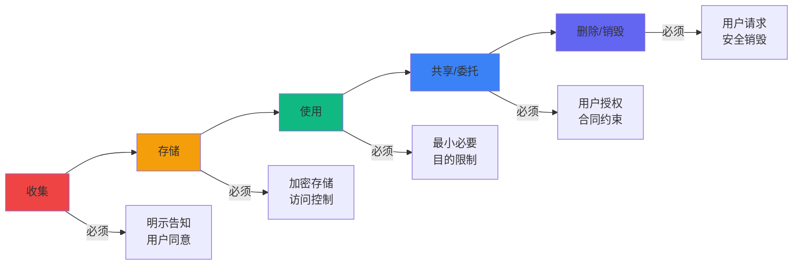
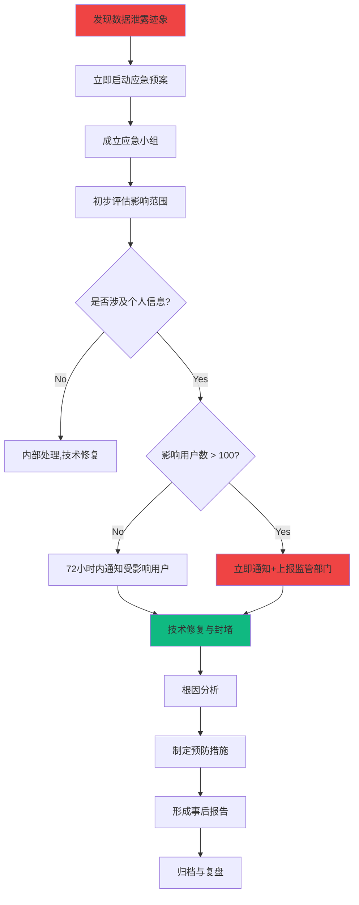

# 第十章：数据隐私与合规规范 (Data Privacy & Compliance)

---

## **10.1 合规框架概述 (Compliance Framework Overview)**

### **10.1.1 为什么合规至关重要**

```yaml
合规的三重意义：

1. 法律义务（Legal Obligation）
   - 违规代价：罚款、下架、刑事责任
   - 示例：违反《个人信息保护法》最高罚款¥5000万或年营业额5%

2. 用户信任（User Trust）
   - 用户数据是语音、截图等高度敏感信息
   - 一次泄露 = 品牌毁灭 + 用户流失
   - 竞争优势：合规做得好 = 差异化卖点

3. 商业价值（Business Value）
   - 融资必备：投资人DD（尽职调查）的核心环节
   - 出海基础：符合GDPR等国际标准
   - 企业客户：B端销售的准入门槛

结论：合规不是成本，而是护城河
```

### **10.1.2 Weave面临的合规挑战**

```yaml
数据敏感性高：
  ✗ 用户语音：包含声纹、语音内容
  ✗ 用户截图：可能包含聊天记录、隐私照片
  ✗ 用户笔记：个人思想、工作机密
  ✗ 复习数据：用户行为轨迹、记忆曲线
  
  → 任何泄露都是灾难性的

AI服务依赖：
  ✗ 数据传输给第三方（阿里云、百度、智谱）
  ✗ 如何确保第三方不滥用数据？
  ✗ 数据是否出境？（OpenAI等海外服务）
  
  → 需要严格的供应商管理

用户期待高：
  ✗ 知识管理工具的用户，对隐私更敏感
  ✗ 一旦发生泄露，舆论反噬强烈
  
  → 需要超越法律最低要求的自律
```

---

## **10.2 适用法律法规梳理 (Applicable Laws & Regulations)**

### **10.2.1 中国法律法规**

| 法律法规                                 | 生效时间  | 核心要求                                       | 对Weave的影响 |
| ---------------------------------------- | --------- | ---------------------------------------------- | ------------- |
| **《个人信息保护法》**                   | 2021.11.1 | 个人信息处理需遵循"合法、正当、必要、诚信"原则 | 🔴 核心法规    |
| **《数据安全法》**                       | 2021.9.1  | 数据分类分级保护、重要数据出境管理             | 🔴 核心法规    |
| **《网络安全法》**                       | 2017.6.1  | 网络运营者收集、使用个人信息需明示并取得同意   | 🔴 核心法规    |
| **《民法典》**                           | 2021.1.1  | 个人信息受法律保护，信息处理需征得同意         | 🟡 基础法规    |
| **《电信和互联网用户个人信息保护规定》** | 2013.9.1  | 用户个人信息保护具体规定                       | 🟡 行业规范    |

### **10.2.2 微信小程序平台规范**

```yaml
《微信小程序平台服务条款》：
  - 必须提供《隐私政策》和《用户协议》
  - 收集个人信息需最小必要原则
  - 不得超范围使用用户数据
  - 不得将数据用于推送广告（未经同意）

《微信小程序运营规范》：
  - 禁止收集用户密码
  - 敏感信息（语音、位置等）需明确告知
  - 必须提供注销账号功能
  - 数据泄露需24小时内报告

违规后果：
  - 轻则：警告、限制部分功能
  - 重则：下架、封禁、列入黑名单
```

### **10.2.3 AI服务相关规范**

```yaml
《生成式人工智能服务管理暂行办法》（2023.8.15生效）：
  - 第7条：提供者应依法开展个人信息处理活动
  - 第9条：不得生成违法违规内容
  - 第16条：提供者应对用户输入信息和使用记录进行记录

影响：
  - LLM生成的内容需要审核机制
  - 用户输入数据需要记录（至少60天）
  - 需建立违法内容过滤系统

《互联网信息服务算法推荐管理规定》：
  - 第17条：算法推荐需尊重用户选择权
  - 第22条：用户有权关闭算法推荐

影响：
  - "思想共鸣"功能需提供关闭选项
  - 复习推送需允许用户自定义
```

---

## **10.3 用户数据分类与处理 (Data Classification & Processing)**

### **10.3.1 个人信息分类**

根据《个人信息保护法》和《信息安全技术 个人信息安全规范》（GB/T 35273-2020）：

| 分类             | 定义                                                                       | Weave涉及的数据                                                                                | 保护等级   |
| ---------------- | -------------------------------------------------------------------------- | ---------------------------------------------------------------------------------------------- | ---------- |
| **敏感个人信息** | 一旦泄露或非法使用，容易导致自然人人格尊严受到侵害或人身、财产安全受到危害 | • 生物识别信息（声纹）<br>• 具体身份信息（如截图中的身份证号）<br>• 私密信息（日记、私人想法） | 🔴 **最高** |
| **一般个人信息** | 可识别特定自然人身份或反映特定自然人活动情况                               | • 微信OpenID<br>• 昵称、头像<br>• 笔记内容<br>• 复习数据                                       | 🟡 **高**   |
| **匿名化信息**   | 经过处理后无法识别特定自然人且不能复原                                     | • 聚合统计数据<br>• 脱敏后的行为数据                                                           | 🟢 **低**   |

### **10.3.2 数据全生命周期管理**



**阶段1：收集（Collection）**

```yaml
合规要点：

1. 告知义务（第17条）
   必须告知：
   - ✅ 收集者的名称和联系方式
   - ✅ 处理目的、方式、范围
   - ✅ 存储期限
   - ✅ 用户权利及行使方式
   - ✅ 拒绝同意的后果

2. 同意原则（第13-15条）
   - ✅ 明示同意（不能默认勾选）
   - ✅ 单独同意（敏感信息需单独勾选框）
   - ✅ 可撤回（用户有权随时撤回同意）

3. 最小必要原则（第6条）
   - ✅ 只收集业务必需的信息
   - ❌ 不收集与功能无关的信息

Weave实施：
  收集的信息：
    - 微信OpenID（必需，用户识别）✅
    - 昵称、头像（必需，用户体验）✅
    - 语音数据（必需，核心功能）✅
    - 截图数据（必需，核心功能）✅
    - 设备信息（必需，兼容性和故障排查）✅
    
  不收集的信息：
    - 手机号 ❌（非必需）
    - 地理位置 ❌（功能不需要）
    - 通讯录 ❌（功能不需要）
    - 相册（仅在用户主动选择图片时临时访问）
```

**阶段2：存储（Storage）**

```yaml
合规要点：

1. 安全存储（第51条）
   - ✅ 加密存储敏感信息
   - ✅ 访问权限控制
   - ✅ 定期安全评估

2. 境内存储（第40条）
   - ✅ 关键信息基础设施运营者收集的个人信息应在境内存储
   - ⚠️ Weave暂不属于"关键信息基础设施"，但应优先境内存储

3. 存储期限（第19条）
   - ✅ 不得超出实现处理目的所必需的期限
   - ✅ 到期后应删除或匿名化

Weave实施：
  存储位置：
    - 数据库：阿里云RDS（北京/上海节点）✅ 境内
    - 文件存储：阿里云OSS（北京节点）✅ 境内
    - 备份：阿里云OSS（深圳节点）✅ 境内
    
  存储期限：
    - 活跃用户数据：永久（用户主动保留）
    - 注销用户数据：30天后删除
    - 软删除数据：30天后永久删除
    - 访问日志：180天后删除
    
  安全措施：见10.5节
```

**阶段3：使用（Usage）**

```yaml
合规要点：

1. 目的限制（第16条）
   - ✅ 仅用于告知的处理目的
   - ❌ 不得超范围使用
   - ⚠️ 变更目的需重新取得同意

2. 自动化决策（第24条）
   - ✅ 应保证决策透明度和结果公平
   - ✅ 不得对个人权益产生重大影响（如价格歧视）

Weave实施：
  允许用途：
    - AI处理（ASR、OCR、LLM）✅ 已告知
    - 复习推送 ✅ 已告知
    - 关联推荐（思想共鸣）✅ 已告知
    - 产品改进（匿名化后）✅ 需明确说明
    
  禁止用途：
    - 商业营销 ❌（未经同意）
    - 出售给第三方 ❌
    - 训练通用AI模型 ❌（未经同意）
```

**阶段4：共享/委托（Sharing/Entrustment）**

```yaml
合规要点：

1. 委托处理（第21条）
   - ✅ 与受托方签订委托协议
   - ✅ 约定处理目的、方式、范围
   - ✅ 受托方不得超范围处理
   - ✅ 委托关系解除后，受托方应删除数据

2. 第三方提供（第23条）
   - ✅ 需取得用户单独同意
   - ✅ 告知第三方的身份、处理目的等

Weave实施：
  第三方服务商：
    - 阿里云ASR：委托处理 ✅ 已签协议
    - 百度OCR：委托处理 ✅ 已签协议
    - 智谱GLM：委托处理 ✅ 已签协议
    
  协议关键条款：
    - 数据仅用于提供ASR/OCR/LLM服务
    - 不得保留用户数据（处理完即删除）
    - 不得用于训练模型（需明确约定）
    - 数据泄露由服务商承担责任
    
  详见10.6节
```

**阶段5：删除（Deletion）**

```yaml
合规要点：

1. 主动删除义务（第47条）
   触发条件：
   - ✅ 存储期限届满
   - ✅ 处理目的已实现
   - ✅ 用户撤回同意
   - ✅ 用户请求删除
   - ✅ 用户注销账号

2. 删除方式：
   - ✅ 删除（物理删除）
   - ✅ 匿名化（不可逆）

Weave实施：
  用户主动删除：
    - 删除节点：软删除，30天后永久删除
    - 注销账号：见10.7.4节
    
  自动删除：
    - 软删除超30天的节点
    - 注销超30天的用户所有数据
    
  删除验证：
    - 定期审计（每季度）
    - 确保数据真实删除（不能仅标记）
```

---

## **10.4 隐私政策与用户协议 (Privacy Policy & Terms of Service)**

### **10.4.1 隐私政策（必备文档）**

**《Weave隐私政策》（简化版示例）**

```markdown
# Weave（织念）隐私政策

**生效日期：2025年10月20日**
**更新日期：2025年10月20日**

欢迎使用Weave（以下简称"我们"）。我们深知个人信息对您的重要性，
您的信任对我们非常重要，我们将严格遵守法律法规，采取相应的安全措施，
保护您的个人信息安全。

本隐私政策将帮助您了解：
1. 我们如何收集和使用您的个人信息
2. 我们如何共享、转让、公开披露您的个人信息
3. 我们如何保护您的个人信息
4. 您如何管理您的个人信息
5. 我们如何处理未成年人的个人信息

## 一、我们如何收集和使用您的个人信息

### 1.1 账号注册与登录

**收集的信息：**
- 微信授权信息：OpenID、昵称、头像
- 设备信息：设备型号、操作系统版本、微信版本

**使用目的：**
- 创建您的Weave账号
- 提供个性化服务
- 保障账号安全

**法律依据：**
- 《个人信息保护法》第13条（用户同意）

### 1.2 核心功能服务

#### (1) 语音输入功能

**收集的信息：**
- 语音数据（通过麦克风录制）
- 录音时长、时间戳

**使用目的：**
- 通过AI技术（自动语音识别ASR）将语音转为文字
- 通过AI技术（大语言模型LLM）精炼内容

**第三方服务商：**
- ASR服务：阿里云智能语音
- LLM服务：智谱AI（GLM-4）

**重要提示：**
⚠️ 您的语音数据将被发送至上述第三方服务商进行处理。
我们已与服务商签订严格的数据处理协议，要求其：
  - 仅用于提供ASR/LLM服务
  - 处理完成后立即删除，不得保留
  - 不得用于训练通用AI模型
  - 不得向任何第三方提供

**您的权利：**
- 您可以随时停止使用语音输入功能
- 您可以删除已创建的语音节点（软删除30天后永久删除）

#### (2) 截图输入功能

**收集的信息：**
- 图片数据（您从相册选择或拍摄的照片）
- 图片元数据（拍摄时间、尺寸等）

**使用目的：**
- 通过OCR技术识别图片中的文字
- 通过LLM技术精炼内容

**第三方服务商：**
- OCR服务：百度智能云OCR
- LLM服务：智谱AI（GLM-4）

**重要提示：**
⚠️ 请勿上传包含敏感信息的图片（如身份证、银行卡、私密照片等）。
如您上传此类图片，我们将尽力保护，但仍存在风险。

#### (3) 记忆复习功能

**收集的信息：**
- 您的复习记录（复习时间、评分）
- 记忆参数（复习次数、间隔天数等）

**使用目的：**
- 通过间隔重复算法计算最佳复习时间
- 发送复习提醒（需您授权订阅消息）

**数据存储：**
- 所有数据存储在阿里云（中国境内服务器）
- 加密存储，严格访问控制

### 1.3 产品改进与分析

**收集的信息（匿名化）：**
- 使用统计（功能使用频率、停留时长等）
- 崩溃日志（错误堆栈、设备信息）

**使用目的：**
- 分析产品性能，修复Bug
- 优化用户体验
- 统计分析（聚合数据，不包含个人身份信息）

**重要说明：**
✅ 用于分析的数据已完全匿名化处理，无法识别您的身份。

## 二、我们如何共享、转让、公开披露您的个人信息

### 2.1 共享

我们不会与任何公司、组织和个人共享您的个人信息，除以下情况：

**1. 经您明确同意**
**2. 法定情形：**
   - 根据法律法规要求
   - 根据法院判决、裁定或其他法律程序
   - 根据政府机关要求

**3. 委托处理（第三方服务商）：**

| 服务商     | 处理的信息 | 处理目的   | 数据保留       |
| ---------- | ---------- | ---------- | -------------- |
| 阿里云     | 语音数据   | ASR识别    | 处理完立即删除 |
| 百度智能云 | 图片数据   | OCR识别    | 处理完立即删除 |
| 智谱AI     | 文本数据   | LLM精炼    | 处理完立即删除 |
| 阿里云     | 所有数据   | 云存储服务 | 按您的保留期限 |

✅ 我们已与上述服务商签订严格的《数据处理协议》。

### 2.2 转让

我们不会将您的个人信息转让给任何公司、组织和个人，除以下情况：
- 经您明确同意
- 涉及合并、收购或破产清算时，我们会要求新的持有主体继续受本隐私政策约束

### 2.3 公开披露

我们不会公开披露您的个人信息，除非：
- 经您明确同意
- 基于法律法规、法律程序、诉讼或政府主管部门强制性要求

## 三、我们如何保护您的个人信息

我们非常重视个人信息安全，采取以下措施保护您的信息：

### 3.1 技术措施

✅ **数据加密：**
   - 传输加密：全程HTTPS（TLS 1.2+）
   - 存储加密：AES-256加密算法

✅ **访问控制：**
   - 严格的权限管理，遵循最小权限原则
   - 仅授权人员可访问数据库

✅ **安全监控：**
   - 7×24小时安全监控
   - 异常访问自动告警

### 3.2 管理措施

✅ **人员管理：**
   - 所有员工签署保密协议
   - 定期安全培训

✅ **应急响应：**
   - 制定数据泄露应急预案
   - 72小时内通知受影响用户

### 3.3 数据备份与恢复

✅ 每日自动备份，异地存储
✅ 备份数据同样加密存储

**但请您理解：**
⚠️ 互联网并非绝对安全的环境，我们将尽力保护您的信息安全，
但无法保证100%不会发生泄露。

## 四、您如何管理您的个人信息

您拥有以下权利：

### 4.1 访问权
您可以随时在Weave中查看您的所有节点和数据。

### 4.2 更正权
您可以随时编辑您的节点内容。

### 4.3 删除权
您可以：
- 删除单个节点（软删除，30天后永久删除）
- 注销账号，删除所有数据（见4.6）

### 4.4 撤回同意权
您可以：
- 关闭麦克风权限，停止使用语音输入
- 关闭相机权限，停止使用截图输入
- 关闭订阅消息，停止接收复习提醒

### 4.5 导出权
您可以在【设置 - 数据与隐私 - 导出我的数据】中导出所有数据。

### 4.6 注销账号
您可以在【设置 - 账号管理 - 注销账号】中申请注销。
注销后：
- 您将无法再登录和使用Weave
- 您的所有数据将在30天后永久删除
- ⚠️ 此操作不可撤销，请谨慎操作

### 4.7 获取隐私政策副本
您可以通过support@weave.com获取本政策的副本。

## 五、我们如何处理未成年人的个人信息

Weave主要面向成年用户。

如果您是未满14周岁的未成年人，请在监护人的陪同下阅读本政策，
并在监护人同意后使用我们的服务。

如果我们发现在未获监护人同意的情况下收集了未成年人的个人信息，
我们将尽快删除相关数据。

## 六、本政策如何更新

我们可能会适时修订本隐私政策。

**重大变更时：**
- 我们将通过小程序内弹窗通知您
- 您需重新同意后方可继续使用

**非重大变更时：**
- 我们将在本页面更新
- 建议您定期查看

## 七、如何联系我们

如您对本隐私政策有任何疑问、意见或建议，请通过以下方式联系我们：

**邮箱：** privacy@weave.com
**个人信息保护负责人：** 张三（Chief Privacy Officer）
**地址：** 北京市朝阳区XXX路XXX号

我们将在15个工作日内回复您的请求。

---

**最后更新：2025年10月20日**
```

---

### **10.4.2 用户协议（必备文档）**

**《Weave用户服务协议》（关键条款）**

```markdown
# Weave用户服务协议（简要版）

## 第一条 服务内容

Weave为您提供AI驱动的知识管理服务，包括但不限于：
- 语音/图片输入并AI智能处理
- 智慧节点管理
- 基于记忆算法的复习提醒

## 第二条 用户义务

2.1 您承诺遵守法律法规，不得利用Weave从事违法活动。

2.2 您保证：
- 您输入的内容不侵犯他人知识产权
- 您输入的内容不包含违法违规信息
- 您不会利用Weave生成违法违规内容

2.3 禁止行为：
- ❌ 利用技术手段攻击、破坏Weave服务
- ❌ 批量注册账号、恶意刷量
- ❌ 将Weave用于商业用途（未经授权）

## 第三条 知识产权

3.1 您输入的原始内容，知识产权归您所有。

3.2 AI生成的内容（如精炼后的节点）：
- 您拥有使用权
- Weave不主张知识产权
- 但您需对AI生成内容的使用后果负责

3.3 Weave的软件、算法、设计等知识产权归Weave所有。

## 第四条 免责声明

4.1 AI生成内容的准确性：
- Weave使用AI技术处理您的内容
- AI可能产生错误、遗漏或不准确的结果
- **您应自行判断AI生成内容的准确性**
- Weave不对AI生成内容的准确性、完整性、适用性做任何保证

4.2 数据安全：
- 我们将尽最大努力保护您的数据安全
- 但互联网环境存在固有风险
- **请您定期导出备份重要数据**

4.3 第三方服务：
- Weave依赖第三方AI服务（阿里云、百度、智谱）
- 第三方服务中断可能影响Weave功能
- Weave不对第三方服务承担责任

## 第五条 服务变更、中断或终止

5.1 我们可能因以下原因暂停或终止服务：
- 系统维护、升级
- 不可抗力（如自然灾害、政府管制）
- 第三方服务中断

5.2 账号封禁：
如您违反本协议或法律法规，我们有权：
- 警告
- 限制功能
- 暂停账号
- 永久封禁并删除数据

## 第六条 争议解决

因本协议引起的争议，双方应友好协商解决。
协商不成的，任何一方可向Weave所在地人民法院提起诉讼。

## 第七条 其他

本协议自您同意之日起生效。
Weave保留在法律允许范围内修改本协议的权利。

---
**生效日期：2025年10月20日**
```

---

### **10.4.3 隐私政策展示与同意机制**

**技术实施（代码示例）：**

```javascript
// 小程序 Onboarding 流程中的隐私授权

Page({
  data: {
    showPrivacyModal: true,
    privacyAgreed: false,
    termsAgreed: false
  },
  
  onLoad() {
    // 检查用户是否已同意隐私政策
    const privacyVersion = wx.getStorageSync('privacy_policy_version');
    const currentVersion = '2025-10-20';  // 隐私政策版本号
    
    if (privacyVersion === currentVersion) {
      // 已同意当前版本，跳过
      this.setData({ showPrivacyModal: false });
    }
  },
  
  onPrivacyCheckboxChange(e) {
    this.setData({
      privacyAgreed: e.detail.value.includes('privacy')
    });
  },
  
  onTermsCheckboxChange(e) {
    this.setData({
      termsAgreed: e.detail.value.includes('terms')
    });
  },
  
  viewPrivacyPolicy() {
    // 跳转到隐私政策完整页面
    wx.navigateTo({
      url: '/pages/privacy/policy'
    });
  },
  
  viewTermsOfService() {
    // 跳转到用户协议完整页面
    wx.navigateTo({
      url: '/pages/privacy/terms'
    });
  },
  
  async agreeAndContinue() {
    if (!this.data.privacyAgreed || !this.data.termsAgreed) {
      wx.showToast({
        title: '请先阅读并同意隐私政策和用户协议',
        icon: 'none'
      });
      return;
    }
    
    // 记录用户同意
    const currentVersion = '2025-10-20';
    wx.setStorageSync('privacy_policy_version', currentVersion);
    
    // 调用后端API记录同意（审计追踪）
    await this.logPrivacyConsent(currentVersion);
    
    // 继续Onboarding流程
    this.setData({ showPrivacyModal: false });
  },
  
  async logPrivacyConsent(version) {
    /**
     * 记录用户隐私同意（用于审计）
     */
    try {
      await wx.request({
        url: API_BASE + '/privacy/consent',
        method: 'POST',
        header: {
          'Authorization': 'Bearer ' + getToken()
        },
        data: {
          privacy_policy_version: version,
          terms_of_service_version: version,
          consent_timestamp: new Date().toISOString(),
          consent_method: 'explicit_checkbox'  // 明示同意
        }
      });
    } catch (error) {
      console.error('Failed to log privacy consent:', error);
    }
  },
  
  disagreeAndExit() {
    // 用户拒绝同意，无法使用产品
    wx.showModal({
      title: '提示',
      content: '很遗憾，没有您的同意，我们无法为您提供服务。',
      showCancel: false,
      success: () => {
        // 关闭小程序（小程序无法主动关闭，只能提示）
        wx.showToast({
          title: '请手动关闭小程序',
          icon: 'none'
        });
      }
    });
  }
});
```

**界面设计（WXML）：**

```xml
<!-- 隐私政策授权弹窗 -->
<view class="privacy-modal" wx:if="{{ showPrivacyModal }}">
  <view class="modal-mask"></view>
  <view class="modal-container">
    <view class="modal-header">
      <text class="modal-title">欢迎使用Weave</text>
    </view>
    
    <view class="modal-body">
      <text class="modal-intro">
        在开始之前，请您仔细阅读并同意以下协议：
      </text>
      
      <view class="agreement-item">
        <checkbox-group bindchange="onPrivacyCheckboxChange">
          <label class="checkbox-label">
            <checkbox value="privacy" color="#6366F1" />
            <text>我已阅读并同意</text>
            <text class="link" bindtap="viewPrivacyPolicy">《隐私政策》</text>
          </label>
        </checkbox-group>
      </view>
      
      <view class="agreement-item">
        <checkbox-group bindchange="onTermsCheckboxChange">
          <label class="checkbox-label">
            <checkbox value="terms" color="#6366F1" />
            <text>我已阅读并同意</text>
            <text class="link" bindtap="viewTermsOfService">《用户服务协议》</text>
          </label>
        </checkbox-group>
      </view>
      
      <view class="important-notice">
        <text class="notice-icon">⚠️</text>
        <text class="notice-text">
          我们将收集您的语音、图片等信息，并通过第三方AI服务处理。
          请仔细阅读隐私政策了解详情。
        </text>
      </view>
    </view>
    
    <view class="modal-footer">
      <button class="btn btn-secondary" bindtap="disagreeAndExit">
        不同意
      </button>
      <button 
        class="btn btn-primary" 
        bindtap="agreeAndContinue"
        disabled="{{ !privacyAgreed || !termsAgreed }}"
      >
        同意并继续
      </button>
    </view>
  </view>
</view>
```

---

# **第十章：数据隐私与合规规范** - 续

---

## **10.5 数据安全技术措施 (Data Security Technical Measures)**

### **10.5.1 传输层安全**

**HTTPS/TLS加密：**

```yaml
配置要求（Nginx）:

server {
    listen 443 ssl http2;
    server_name api.weave.com;
    
    # SSL证书配置
    ssl_certificate /etc/nginx/ssl/weave.crt;
    ssl_certificate_key /etc/nginx/ssl/weave.key;
    
    # 强制使用TLS 1.2及以上
    ssl_protocols TLSv1.2 TLSv1.3;
    ssl_prefer_server_ciphers on;
    
    # 推荐的加密套件（Mozilla现代兼容性配置）
    ssl_ciphers 'ECDHE-ECDSA-AES128-GCM-SHA256:ECDHE-RSA-AES128-GCM-SHA256:ECDHE-ECDSA-AES256-GCM-SHA384:ECDHE-RSA-AES256-GCM-SHA384';
    
    # HSTS（强制HTTPS）
    add_header Strict-Transport-Security "max-age=31536000; includeSubDomains; preload" always;
    
    # 防止点击劫持
    add_header X-Frame-Options "DENY" always;
    add_header X-Content-Type-Options "nosniff" always;
    add_header X-XSS-Protection "1; mode=block" always;
    
    # CSP（内容安全策略）
    add_header Content-Security-Policy "default-src 'self'; script-src 'self' 'unsafe-inline'; style-src 'self' 'unsafe-inline';" always;
}

# 强制HTTP跳转HTTPS
server {
    listen 80;
    server_name api.weave.com;
    return 301 https://$server_name$request_uri;
}

合规检查：
✅ TLS版本 ≥ 1.2（符合《网络安全法》要求）
✅ 使用强加密算法（AES-128-GCM及以上）
✅ 启用HSTS（防止降级攻击）
✅ 证书有效期内，定期更新
```

**API请求签名（防篡改）：**

```python
import hmac
import hashlib
import time

class APISignature:
    """API请求签名验证"""
    
    def __init__(self, secret_key: str):
        self.secret_key = secret_key
    
    def generate_signature(self, method: str, path: str, body: str, timestamp: int) -> str:
        """
        生成API签名
        
        签名算法：HMAC-SHA256
        签名内容：HTTP方法 + 路径 + 请求体 + 时间戳
        """
        message = f"{method}\n{path}\n{body}\n{timestamp}"
        signature = hmac.new(
            self.secret_key.encode(),
            message.encode(),
            hashlib.sha256
        ).hexdigest()
        
        return signature
    
    def verify_signature(self, request_signature: str, method: str, path: str, body: str, timestamp: int) -> bool:
        """验证签名"""
        
        # 1. 检查时间戳（防重放攻击）
        current_time = int(time.time())
        if abs(current_time - timestamp) > 300:  # 5分钟有效期
            return False
        
        # 2. 计算期望签名
        expected_signature = self.generate_signature(method, path, body, timestamp)
        
        # 3. 比较签名
        return hmac.compare_digest(request_signature, expected_signature)

# FastAPI中间件示例
from fastapi import Request, HTTPException

async def signature_verification_middleware(request: Request, call_next):
    """签名验证中间件"""
    
    # 敏感接口需要签名验证
    if request.url.path.startswith('/api/v1/sensitive'):
        
        # 获取签名相关header
        signature = request.headers.get('X-Weave-Signature')
        timestamp = request.headers.get('X-Weave-Timestamp')
        
        if not signature or not timestamp:
            raise HTTPException(status_code=401, detail="Missing signature")
        
        # 读取请求体
        body = await request.body()
        
        # 验证签名
        verifier = APISignature(secret_key=SECRET_KEY)
        if not verifier.verify_signature(
            signature, 
            request.method, 
            request.url.path, 
            body.decode(), 
            int(timestamp)
        ):
            raise HTTPException(status_code=401, detail="Invalid signature")
    
    response = await call_next(request)
    return response
```

---

### **10.5.2 存储层安全**

**数据库加密：**

```yaml
阿里云RDS MySQL加密配置：

1. 透明数据加密（TDE）：
   - 自动加密数据文件和备份文件
   - 使用AES-256算法
   - 密钥由云服务商KMS托管
   
   启用方式：
   ```sql
   -- 启用TDE（需要在RDS控制台操作）
   ALTER INSTANCE ROTATE INNODB MASTER KEY;
   
   -- 对敏感表启用加密
   ALTER TABLE users ENCRYPTION='Y';
   ALTER TABLE nodes ENCRYPTION='Y';
```

2. 列级加密（敏感字段）：
   对于特别敏感的字段（如未来可能的手机号），应用层加密

   ```python
   from cryptography.fernet import Fernet
   
   class FieldEncryption:
       """字段级加密"""
       
       def __init__(self, key: bytes):
           self.cipher = Fernet(key)
       
       def encrypt(self, plaintext: str) -> str:
           """加密"""
           return self.cipher.encrypt(plaintext.encode()).decode()
       
       def decrypt(self, ciphertext: str) -> str:
           """解密"""
           return self.cipher.decrypt(ciphertext.encode()).decode()
   
   # 使用示例
   encryptor = FieldEncryption(key=ENCRYPTION_KEY)
   
   # 存储时加密
   encrypted_phone = encryptor.encrypt("13800138000")
   await db.execute(
       "INSERT INTO users (phone_encrypted) VALUES (%s)",
       encrypted_phone
   )
   
   # 读取时解密
   row = await db.fetchone("SELECT phone_encrypted FROM users WHERE user_id = %s", user_id)
   phone = encryptor.decrypt(row['phone_encrypted'])
   ```

3. 备份加密：

   - RDS自动备份默认加密
   - 手动导出备份需使用加密工具

   ```bash
   # 备份时加密
   mysqldump -u root -p weave_production | \
   openssl enc -aes-256-cbc -salt -out backup_$(date +%Y%m%d).sql.enc
   
   # 恢复时解密
   openssl enc -d -aes-256-cbc -in backup_20251020.sql.enc | \
   mysql -u root -p weave_production
   ```

```
**对象存储加密（OSS）：**

```python
import oss2
from oss2.headers import OSS_SERVER_SIDE_ENCRYPTION

class SecureFileStorage:
    """安全文件存储"""
    
    def __init__(self, access_key_id, access_key_secret, bucket_name):
        auth = oss2.Auth(access_key_id, access_key_secret)
        self.bucket = oss2.Bucket(auth, 'https://oss-cn-beijing.aliyuncs.com', bucket_name)
    
    async def upload_audio(self, file_path: str, object_name: str) -> str:
        """上传音频文件（服务端加密）"""
        
        # 设置服务端加密（SSE-KMS）
        headers = {
            OSS_SERVER_SIDE_ENCRYPTION: 'KMS',
            'x-oss-server-side-encryption-key-id': KMS_KEY_ID  # 可选，使用自定义KMS密钥
        }
        
        # 上传
        result = self.bucket.put_object_from_file(
            object_name,
            file_path,
            headers=headers
        )
        
        # 返回URL（带过期时间的签名URL）
        url = self.bucket.sign_url(
            'GET',
            object_name,
            expires=3600,  # 1小时过期
            slash_safe=True
        )
        
        return url
    
    async def upload_image(self, image_data: bytes, object_name: str) -> str:
        """上传图片（服务端加密 + 访问控制）"""
        
        headers = {
            OSS_SERVER_SIDE_ENCRYPTION: 'AES256',
            'x-oss-object-acl': 'private'  # 私有读写
        }
        
        result = self.bucket.put_object(
            object_name,
            image_data,
            headers=headers
        )
        
        return self.bucket.sign_url('GET', object_name, expires=3600)

# 安全检查清单：
# ✅ 服务端加密（SSE-KMS或AES256）
# ✅ 访问控制（private ACL，禁止公开访问）
# ✅ 签名URL（临时访问，自动过期）
# ✅ 防盗链（Referer白名单）
# ✅ 定期清理过期文件
```

---

### **10.5.3 访问控制**

**基于角色的访问控制（RBAC）：**

```python
from enum import Enum
from typing import List

class Role(Enum):
    """角色定义"""
    USER = "user"                    # 普通用户
    ADMIN = "admin"                  # 管理员
    DATA_ANALYST = "data_analyst"    # 数据分析师（仅访问匿名数据）
    CS_AGENT = "cs_agent"            # 客服（仅查看，不可修改）

class Permission(Enum):
    """权限定义"""
    READ_OWN_DATA = "read:own_data"
    WRITE_OWN_DATA = "write:own_data"
    DELETE_OWN_DATA = "delete:own_data"
    
    READ_ALL_DATA = "read:all_data"           # 管理员
    WRITE_ALL_DATA = "write:all_data"         # 管理员
    
    READ_ANONYMOUS_DATA = "read:anonymous"    # 数据分析师
    EXPORT_ANONYMOUS_DATA = "export:anonymous"

# 角色权限映射
ROLE_PERMISSIONS = {
    Role.USER: [
        Permission.READ_OWN_DATA,
        Permission.WRITE_OWN_DATA,
        Permission.DELETE_OWN_DATA,
    ],
    Role.ADMIN: [
        Permission.READ_OWN_DATA,
        Permission.WRITE_OWN_DATA,
        Permission.DELETE_OWN_DATA,
        Permission.READ_ALL_DATA,
        Permission.WRITE_ALL_DATA,
    ],
    Role.DATA_ANALYST: [
        Permission.READ_ANONYMOUS_DATA,
        Permission.EXPORT_ANONYMOUS_DATA,
    ],
    Role.CS_AGENT: [
        Permission.READ_OWN_DATA,  # 仅当用户授权时
    ],
}

class AccessControl:
    """访问控制"""
    
    def has_permission(self, user_role: Role, required_permission: Permission) -> bool:
        """检查用户是否有指定权限"""
        return required_permission in ROLE_PERMISSIONS.get(user_role, [])
    
    def require_permission(self, required_permission: Permission):
        """权限检查装饰器"""
        def decorator(func):
            async def wrapper(*args, current_user=None, **kwargs):
                if not current_user:
                    raise HTTPException(status_code=401, detail="Unauthorized")
                
                if not self.has_permission(current_user.role, required_permission):
                    raise HTTPException(status_code=403, detail="Forbidden")
                
                return await func(*args, current_user=current_user, **kwargs)
            return wrapper
        return decorator

# 使用示例
ac = AccessControl()

@router.get("/api/v1/admin/users")
@ac.require_permission(Permission.READ_ALL_DATA)
async def get_all_users(current_user: User = Depends(get_current_user)):
    """仅管理员可访问"""
    return await db.get_all_users()

@router.get("/api/v1/analytics/anonymous")
@ac.require_permission(Permission.READ_ANONYMOUS_DATA)
async def get_anonymous_analytics(current_user: User = Depends(get_current_user)):
    """数据分析师可访问匿名数据"""
    return await db.get_anonymous_analytics()
```

**数据库访问审计：**

```python
class DatabaseAuditLog:
    """数据库访问审计日志"""
    
    async def log_data_access(
        self,
        user_id: str,
        user_role: str,
        action: str,  # SELECT/INSERT/UPDATE/DELETE
        table: str,
        record_id: str = None,
        ip_address: str = None
    ):
        """记录数据访问"""
        
        await db.execute("""
            INSERT INTO audit_logs (
                user_id, user_role, action, table_name, record_id, 
                ip_address, timestamp
            ) VALUES (%s, %s, %s, %s, %s, %s, NOW())
        """, (user_id, user_role, action, table, record_id, ip_address))
    
    async def get_sensitive_data_access_log(self, days: int = 7):
        """获取敏感数据访问日志"""
        
        return await db.query("""
            SELECT 
                user_id,
                user_role,
                action,
                table_name,
                COUNT(*) as access_count,
                MAX(timestamp) as last_access
            FROM audit_logs
            WHERE 
                table_name IN ('users', 'nodes', 'review_logs')
                AND timestamp >= NOW() - INTERVAL %s DAY
            GROUP BY user_id, user_role, action, table_name
            ORDER BY access_count DESC
        """, (days,))

# 审计触发器（数据库层面）
CREATE TRIGGER audit_nodes_delete
AFTER DELETE ON nodes
FOR EACH ROW
BEGIN
    INSERT INTO audit_logs (
        user_id, action, table_name, record_id, 
        old_data, timestamp
    ) VALUES (
        OLD.user_id, 'DELETE', 'nodes', OLD.node_id,
        JSON_OBJECT('title', OLD.title, 'content', OLD.content),
        NOW()
    );
END;

# 合规要求：
# ✅ 敏感操作必须记录审计日志
# ✅ 审计日志保留至少180天
# ✅ 审计日志不可篡改（只追加）
# ✅ 定期review异常访问行为
```

---

### **10.5.4 数据脱敏与匿名化**

**脱敏策略：**

```python
import hashlib
import re

class DataMasking:
    """数据脱敏工具"""
    
    @staticmethod
    def mask_openid(openid: str) -> str:
        """脱敏OpenID（用于日志）"""
        if len(openid) <= 8:
            return '***'
        return openid[:4] + '****' + openid[-4:]
    
    @staticmethod
    def mask_phone(phone: str) -> str:
        """脱敏手机号"""
        if len(phone) == 11:
            return phone[:3] + '****' + phone[-4:]
        return '***'
    
    @staticmethod
    def anonymize_content(content: str) -> str:
        """匿名化用户内容（移除PII）"""
        
        # 1. 移除手机号
        content = re.sub(r'1[3-9]\d{9}', '[PHONE]', content)
        
        # 2. 移除邮箱
        content = re.sub(r'[\w\.-]+@[\w\.-]+\.\w+', '[EMAIL]', content)
        
        # 3. 移除身份证号
        content = re.sub(r'\d{17}[\dXx]', '[ID_CARD]', content)
        
        # 4. 移除银行卡号
        content = re.sub(r'\d{16,19}', '[BANK_CARD]', content)
        
        return content
    
    @staticmethod
    def hash_user_id(user_id: str, salt: str) -> str:
        """单向哈希用户ID（用于数据分析）"""
        return hashlib.sha256(
            (user_id + salt).encode()
        ).hexdigest()[:16]

# 使用场景

# 场景1：日志记录
logger.info(f"User {DataMasking.mask_openid(openid)} created node")

# 场景2：数据分析导出
anonymous_data = {
    'user_id': DataMasking.hash_user_id(user_id, SALT),
    'node_count': 10,
    'avg_review_score': 4.5
}

# 场景3：训练数据准备（如果未来需要）
training_content = DataMasking.anonymize_content(original_content)
```

**K-匿名化（用于统计分析）：**

```python
class KAnonymization:
    """K-匿名化（确保至少K个用户具有相同的准标识符）"""
    
    async def export_anonymous_cohort_data(self, k: int = 5):
        """
        导出K-匿名化的用户群组数据
        
        准标识符：注册时间（按周聚合）、设备类型
        """
        
        data = await db.query("""
            SELECT 
                DATE_FORMAT(created_at, '%Y-W%u') as cohort_week,
                device_type,
                COUNT(DISTINCT user_id) as user_count,
                AVG(node_count) as avg_nodes,
                AVG(review_completion_rate) as avg_review_rate
            FROM user_stats
            GROUP BY cohort_week, device_type
            HAVING user_count >= %s  -- K-匿名化：至少K个用户
            ORDER BY cohort_week DESC
        """, (k,))
        
        return data

# 合规说明：
# ✅ 导出的数据完全匿名化，不包含任何可识别个人的信息
# ✅ 符合《个人信息保护法》第73条（匿名化信息不适用本法）
# ✅ 可用于产品改进、学术研究等用途
```

---

## **10.6 第三方服务商管理 (Third-Party Vendor Management)**

### **10.6.1 第三方服务商清单**

| 服务商         | 服务类型         | 处理的数据 | 数据流向 | 合规文档  |
| -------------- | ---------------- | ---------- | -------- | --------- |
| **阿里云**     | ASR              | 用户语音   | 中国境内 | ✅ 已签DPA |
| **百度智能云** | OCR              | 用户截图   | 中国境内 | ✅ 已签DPA |
| **智谱AI**     | LLM              | 用户文本   | 中国境内 | ✅ 已签DPA |
| **阿里云**     | RDS/OSS          | 所有数据   | 中国境内 | ✅ 已签DPA |
| **腾讯云**     | 内容审核（备用） | 用户内容   | 中国境内 | ✅ 已签DPA |

DPA = Data Processing Agreement（数据处理协议）

---

### **10.6.2 数据处理协议（DPA）核心条款**

**《Weave与[服务商]数据处理协议》（模板）**

```markdown
# 数据处理协议（DPA）

**甲方：** Weave（北京）科技有限公司（数据控制者）
**乙方：** [服务商名称]（数据处理者）

## 第一条 定义

1.1 "个人信息"：指以电子或者其他方式记录的与已识别或者可识别的自然人有关的各种信息，不包括匿名化处理后的信息。

1.2 "处理"：包括个人信息的收集、存储、使用、加工、传输、提供、公开、删除等。

## 第二条 处理目的与范围

2.1 乙方仅为以下目的处理甲方提供的个人信息：
    - [ASR服务]：将音频转换为文本
    - [处理完成后立即删除原始音频数据]

2.2 乙方处理的个人信息类型：
    - 音频数据
    - 音频时长、格式等元数据

2.3 乙方**不得**将个人信息用于以下用途：
    ❌ 训练通用AI模型
    ❌ 向任何第三方提供
    ❌ 用于广告或营销
    ❌ 超出本协议约定的任何用途

## 第三条 数据安全保障

3.1 乙方应采取以下安全措施：
    ✅ 传输加密（TLS 1.2+）
    ✅ 存储加密（AES-256）
    ✅ 访问控制（最小权限原则）
    ✅ 安全审计（定期渗透测试）

3.2 乙方应**在处理完成后立即删除**甲方提供的个人信息，
    保留时间不得超过**24小时**。

3.3 乙方应每年向甲方提供独立第三方的安全审计报告。

## 第四条 数据存储与跨境传输

4.1 乙方应将个人信息存储在**中国境内**的服务器。

4.2 如因技术原因需要临时跨境处理，乙方应：
    - 提前书面通知甲方并获得同意
    - 采取额外的安全措施（如加密、去标识化）
    - 处理完成后立即删除境外副本

## 第五条 分包限制

5.1 乙方**不得**将个人信息处理业务分包给第三方，除非：
    - 提前书面通知甲方
    - 甲方明确书面同意
    - 分包方同意受本协议约束

## 第六条 数据主体权利保障

6.1 乙方应协助甲方响应数据主体的权利请求（访问、更正、删除等）。

6.2 响应时间：收到甲方通知后**3个工作日**内。

## 第七条 数据泄露通知

7.1 如发生个人信息泄露，乙方应：
    - 立即（不超过**2小时**）通知甲方
    - 提供泄露详情（泄露数量、类型、原因）
    - 提供补救措施和预防方案

7.2 乙方应承担因其过错导致的数据泄露的所有法律责任和经济损失。

## 第八条 审计权

8.1 甲方有权每年对乙方进行**1次**合规审计。

8.2 审计内容包括但不限于：
    - 数据处理流程
    - 安全措施落实情况
    - 数据删除的有效性

## 第九条 协议终止后的数据处理

9.1 协议终止后**30天内**，乙方应：
    - 删除或返还所有个人信息
    - 提供删除证明

9.2 因法律法规要求需保留的，乙方应：
    - 仅保留法定最短期限
    - 采取更严格的安全措施
    - 不得进一步处理

## 第十条 违约责任

10.1 乙方违反本协议的，应赔偿甲方及数据主体的全部损失。

10.2 如因乙方违约导致甲方被监管部门处罚，乙方应承担全部罚款和法律费用。

---

**甲方（盖章）：** Weave（北京）科技有限公司
**乙方（盖章）：** [服务商名称]
**签订日期：** 2025年X月X日
```

---

### **10.6.3 服务商合规监控**

```python
class VendorComplianceMonitoring:
    """第三方服务商合规监控"""
    
    async def check_vendor_compliance(self, vendor: str):
        """定期检查服务商合规性"""
        
        checks = {
            'data_retention': await self.check_data_retention(vendor),
            'security_cert': await self.check_security_certificate(vendor),
            'incident_report': await self.check_incident_reports(vendor),
            'contract_valid': await self.check_contract_validity(vendor),
        }
        
        # 生成报告
        report = {
            'vendor': vendor,
            'check_date': datetime.now(),
            'checks': checks,
            'status': 'COMPLIANT' if all(checks.values()) else 'NON_COMPLIANT'
        }
        
        # 如果不合规，发送告警
        if report['status'] == 'NON_COMPLIANT':
            await self.send_compliance_alert(report)
        
        return report
    
    async def check_data_retention(self, vendor: str) -> bool:
        """检查数据保留政策"""
        
        # 示例：调用服务商API查询数据保留情况
        # 或定期人工审计
        
        # 模拟检查
        return True  # 假设合规
    
    async def check_security_certificate(self, vendor: str) -> bool:
        """检查安全认证有效性"""
        
        # 检查ISO27001、等保三级等证书是否过期
        cert_expiry = await db.fetchone(
            "SELECT cert_expiry_date FROM vendor_certs WHERE vendor = %s",
            vendor
        )
        
        if not cert_expiry:
            return False
        
        return cert_expiry['cert_expiry_date'] > datetime.now()
    
    async def quarterly_audit(self):
        """季度审计"""
        
        vendors = ['aliyun_asr', 'baidu_ocr', 'zhipu_llm']
        
        audit_report = {
            'audit_date': datetime.now(),
            'vendors': {}
        }
        
        for vendor in vendors:
            result = await self.check_vendor_compliance(vendor)
            audit_report['vendors'][vendor] = result
        
        # 生成审计报告并归档
        await self.archive_audit_report(audit_report)
        
        return audit_report
```

---

## **10.7 用户权利保障机制 (User Rights Protection)**

### **10.7.1 知情权**

**实施方式：**

```yaml
1. 隐私政策透明化：
   - 使用简洁、口语化的语言
   - 提供"隐私政策概要"（图文并茂）
   - 在收集点即时告知（Just-in-Time Notice）

2. 处理活动公示：
   每月发布《Weave数据处理透明度报告》：
   - 本月处理的个人信息总量（聚合数据）
   - 调用第三方AI服务的次数
   - 收到的用户权利请求数量及处理结果
```

---

### **10.7.2 访问权与可携带权**

**数据导出功能：**

```python
class UserDataExport:
    """用户数据导出"""
    
    async def export_user_data(self, user_id: str, format: str = 'json'):
        """
        导出用户所有数据
        
        符合《个人信息保护法》第45条（查阅、复制权）
        """
        
        # 1. 获取用户所有数据
        user_info = await db.fetchone(
            "SELECT * FROM users WHERE user_id = %s", user_id
        )
        
        nodes = await db.query(
            "SELECT * FROM nodes WHERE user_id = %s AND is_deleted = FALSE",
            user_id
        )
        
        resonances = await db.query("""
            SELECT r.*, n1.title as source_title, n2.title as related_title
            FROM resonances r
            JOIN nodes n1 ON r.source_node_id = n1.node_id
            JOIN nodes n2 ON r.related_node_id = n2.node_id
            WHERE n1.user_id = %s
        """, user_id)
        
        review_logs = await db.query(
            "SELECT * FROM review_logs WHERE user_id = %s",
            user_id
        )
        
        # 2. 组织数据
        export_data = {
            'export_version': '1.0',
            'export_date': datetime.now().isoformat(),
            'user': {
                'user_id': user_info['user_id'],
                'nickname': user_info['nickname'],
                'created_at': user_info['created_at'].isoformat(),
            },
            'nodes': [
                {
                    'node_id': n['node_id'],
                    'title': n['title'],
                    'content': n['content'],
                    'tags': n['tags'],
                    'created_at': n['created_at'].isoformat(),
                } for n in nodes
            ],
            'resonances': [
                {
                    'source_node': r['source_title'],
                    'related_node': r['related_title'],
                    'analysis': r['ai_analysis'],
                } for r in resonances
            ],
            'review_history': [
                {
                    'reviewed_at': log['reviewed_at'].isoformat(),
                    'quality_score': log['quality_score'],
                } for log in review_logs
            ]
        }
        
        # 3. 格式化输出
        if format == 'json':
            return json.dumps(export_data, ensure_ascii=False, indent=2)
        elif format == 'markdown':
            return self.convert_to_markdown(export_data)
        
        return export_data

# API实现
@router.post("/api/v1/user/export")
async def request_data_export(
    format: str = 'json',
    current_user: User = Depends(get_current_user)
):
    """请求导出数据"""
    
    # 创建异步导出任务
    task = ExportTask(
        user_id=current_user.id,
        format=format,
        status='pending'
    )
    await db.save(task)
    
    # 异步执行导出
    asyncio.create_task(execute_export(task.id))
    
    return {
        'status': 'success',
        'task_id': task.id,
        'message': '导出任务已创建，预计5分钟内完成'
    }

# 合规要点：
# ✅ 必须在15日内响应用户请求（《个人信息保护法》第50条）
# ✅ 导出的数据应"结构化、通用格式"（便于携带至其他平台）
# ✅ 不得收费（除非请求次数明显超过合理限度）
```

---

### **10.7.3 更正权与删除权**

**节点编辑功能（已实现，见第三章US7）**

**节点删除功能：**

```python
@router.delete("/api/v1/nodes/{node_id}")
async def delete_node(
    node_id: str,
    permanent: bool = False,  # 是否立即永久删除
    current_user: User = Depends(get_current_user)
):
    """删除节点"""
    
    node = await db.get_node(node_id)
    
    # 权限检查
    if node.user_id != current_user.id:
        raise HTTPException(status_code=403, detail="无权删除")
    
    if permanent:
        # 立即永久删除（用户明确请求）
        await db.execute("DELETE FROM nodes WHERE node_id = %s", node_id)
        
        # 同时删除关联数据
        await db.execute("DELETE FROM resonances WHERE source_node_id = %s OR related_node_id = %s", node_id, node_id)
        
        # 记录审计
        await audit_log.log(
            user_id=current_user.id,
            action='PERMANENT_DELETE',
            resource='node',
            resource_id=node_id
        )
        
    else:
        # 软删除（默认）
        await db.execute("""
            UPDATE nodes 
            SET is_deleted = TRUE, deleted_at = NOW()
            WHERE node_id = %s
        """, node_id)
    
    return {
        'status': 'success',
        'message': '节点已删除' if permanent else '节点已删除，30天内可恢复'
    }

# 定时任务：自动清理过期的软删除数据
async def cleanup_soft_deleted_nodes():
    """清理30天前的软删除节点"""
    
    deleted_count = await db.execute("""
        DELETE FROM nodes
        WHERE is_deleted = TRUE
        AND deleted_at < NOW() - INTERVAL 30 DAY
    """)
    
    logger.info(f"Cleaned up {deleted_count} soft-deleted nodes")
```

---

### **10.7.4 注销权（被遗忘权）**

**账号注销功能：**

```python
class AccountDeletion:
    """账号注销"""
    
    async def request_account_deletion(self, user_id: str):
        """
        用户请求注销账号
        
        符合《个人信息保护法》第47条
        """
        
        # 1. 创建注销请求
        deletion_request = DeletionRequest(
            user_id=user_id,
            status='pending',
            requested_at=datetime.now(),
            scheduled_deletion_at=datetime.now() + timedelta(days=30)
        )
        await db.save(deletion_request)
        
        # 2. 立即停用账号（但保留数据30天）
        await db.execute("""
            UPDATE users 
            SET is_active = FALSE, 
                account_status = 'pending_deletion'
            WHERE user_id = %s
        """, user_id)
        
        # 3. 发送确认通知
        await self.send_deletion_confirmation(user_id)
        
        return {
            'status': 'success',
            'message': '账号注销申请已提交',
            'deletion_date': deletion_request.scheduled_deletion_at,
            'cancellation_deadline': datetime.now() + timedelta(days=15)
        }
    
    async def cancel_account_deletion(self, user_id: str):
        """用户撤销注销申请（15天内）"""
        
        deletion_request = await db.fetchone(
            "SELECT * FROM deletion_requests WHERE user_id = %s AND status = 'pending'",
            user_id
        )
        
        if not deletion_request:
            raise HTTPException(status_code=404, detail="未找到注销申请")
        
        # 检查是否在撤销期限内
        if datetime.now() > deletion_request.requested_at + timedelta(days=15):
            raise HTTPException(status_code=400, detail="撤销期限已过")
        
        # 撤销注销
        await db.execute("""
            UPDATE users 
            SET is_active = TRUE, 
                account_status = 'active'
            WHERE user_id = %s
        """, user_id)
        
        await db.execute("""
            UPDATE deletion_requests
            SET status = 'cancelled'
            WHERE user_id = %s
        """, user_id)
        
        return {'status': 'success', 'message': '注销申请已撤销'}
    
    async def execute_scheduled_deletions(self):
        """定时任务：执行到期的账号删除"""
        
        # 查询所有到期的注销请求
        pending_deletions = await db.query("""
            SELECT user_id 
            FROM deletion_requests
            WHERE status = 'pending'
            AND scheduled_deletion_at <= NOW()
        """)
        
        for record in pending_deletions:
            await self.permanently_delete_user(record['user_id'])
    
    async def permanently_delete_user(self, user_id: str):
        """永久删除用户所有数据"""
        
        try:
            # 1. 删除节点
            await db.execute("DELETE FROM nodes WHERE user_id = %s", user_id)
            
            # 2. 删除共鸣关系
            await db.execute("""
                DELETE FROM resonances 
                WHERE source_node_id IN (
                    SELECT node_id FROM nodes WHERE user_id = %s
                )
            """, user_id)
            
            # 3. 删除复习日志
            await db.execute("DELETE FROM review_logs WHERE user_id = %s", user_id)
            
            # 4. 删除用户记录
            await db.execute("DELETE FROM users WHERE user_id = %s", user_id)
            
            # 5. 删除云存储文件（音频、图片）
            await self.delete_user_files(user_id)
            
            # 6. 更新注销请求状态
            await db.execute("""
                UPDATE deletion_requests
                SET status = 'completed', completed_at = NOW()
                WHERE user_id = %s
            """, user_id)
            
            # 7. 审计日志
            await audit_log.log(
                user_id=user_id,
                action='ACCOUNT_PERMANENTLY_DELETED',
                details='All user data deleted per request'
            )
            
            logger.info(f"User {user_id} permanently deleted")
            
        except Exception as e:
            logger.error(f"Failed to delete user {user_id}: {e}")
            # 标记为失败，人工介入
            await db.execute("""
                UPDATE deletion_requests
                SET status = 'failed', error_message = %s
                WHERE user_id = %s
            """, (str(e), user_id))

# API实现
@router.post("/api/v1/user/delete-account")
async def request_delete_account(
    current_user: User = Depends(get_current_user)
):
    """申请注销账号"""
    
    deleter = AccountDeletion()
    result = await deleter.request_account_deletion(current_user.id)
    
    return result

# 合规要点：
# ✅ 提供明确的注销入口（《个人信息保护法》第47条）
# ✅ 15日内响应注销请求
# ✅ 允许用户在一定期限内撤回（用户体验优化）
# ✅ 永久删除需彻底清理所有数据（数据库、文件存储）
# ✅ 保留审计日志（证明已删除，但日志本身匿名化）
```

**界面设计：**

```xml
<!-- 注销账号页面 -->
<view class="page-delete-account">
  <view class="warning-container">
    <image src="/images/warning.png" class="warning-icon"></image>
    <text class="warning-title">确定要注销账号吗？</text>
  </view>
  
  <view class="info-list">
    <view class="info-item">
      <text class="info-label">⚠️ 注销后，以下数据将被永久删除：</text>
      <text class="info-value">• 所有智慧节点（{{ nodeCount }}个）</text>
      <text class="info-value">• 所有复习记录</text>
      <text class="info-value">• 个人资料和设置</text>
    </view>
    
    <view class="info-item">
      <text class="info-label">🕐 您有15天的反悔期：</text>
      <text class="info-value">申请后15天内可撤销</text>
      <text class="info-value">第16天起数据将被永久删除</text>
    </view>
    
    <view class="info-item">
      <text class="info-label">💡 建议您先导出数据：</text>
      <button class="btn-link" bindtap="navigateToExport">
        前往导出我的数据 →
      </button>
    </view>
  </view>
  
  <view class="reason-container">
    <text class="reason-label">告诉我们您注销的原因（选填）：</text>
    <checkbox-group bindchange="onReasonChange">
      <label><checkbox value="no_value" />产品对我没有价值</label>
      <label><checkbox value="privacy" />隐私担忧</label>
      <label><checkbox value="too_complex" />太复杂，不会用</label>
      <label><checkbox value="other" />其他原因</label>
    </checkbox-group>
  </view>
  
  <view class="action-buttons">
    <button class="btn btn-secondary" bindtap="navigateBack">
      我再想想
    </button>
    <button class="btn btn-danger" bindtap="confirmDeletion">
      确认注销
    </button>
  </view>
</view>
```

---

## **10.8 数据泄露应急响应 (Data Breach Emergency Response)**

### **10.8.1 应急响应流程**



---

### **10.8.2 应急响应手册**

**《Weave数据泄露应急响应手册》**

```markdown
# Weave数据泄露应急响应手册（v1.0）

## 一、应急小组

**组长：** CEO
**副组长：** CTO
**成员：** 技术Lead、产品经理、法务、公关

**联系方式：**（保密，内部文档）

---

## 二、响应等级

### P0 - 极高危（红色预警）
**定义：**
- 超过100名用户的敏感个人信息泄露
- 数据已被公开或出售
- 涉及未成年人信息

**响应时间：** 立即（发现后15分钟内）
**通知对象：** 全体应急小组、全体用户、监管部门

### P1 - 高危（橙色预警）
**定义：**
- 10-100名用户的个人信息泄露
- 泄露信息包含语音、截图等敏感内容

**响应时间：** 2小时内
**通知对象：** 应急小组、受影响用户

### P2 - 中危（黄色预警）
**定义：**
- 1-10名用户的个人信息泄露
- 泄露信息为一般个人信息（如昵称、头像）

**响应时间：** 24小时内
**通知对象：** 技术团队、受影响用户

---

## 三、应急处置流程（P0级别详细步骤）

### 第一阶段：发现与确认（0-2小时）

**Step 1: 立即隔离（15分钟内）**
1. 发现人员立即通知应急小组组长（CEO）
2. CTO立即执行紧急措施：
   ```bash
   # 示例：如果是数据库泄露
   # 1. 立即修改数据库密码
   mysql -u root -p -e "ALTER USER 'admin'@'%' IDENTIFIED BY 'NEW_PASSWORD';"
   
   # 2. 阻断可疑IP访问
   iptables -A INPUT -s <SUSPICIOUS_IP> -j DROP
   
   # 3. 临时关闭受影响的API端点
   # （在代码中设置feature flag）
```

**Step 2: 初步评估（2小时内）**

1. 技术团队分析日志，确定：

   - 泄露时间窗口
   - 泄露数据类型和数量
   - 泄露原因（SQL注入、配置错误、内部人员？）
   - 影响用户范围

2. 填写《数据泄露初步评估表》

   | 项目         | 详情 |
   | ------------ | ---- |
   | 发现时间     |      |
   | 泄露原因     |      |
   | 泄露数据类型 |      |
   | 影响用户数   |      |
   | 数据去向     |      |

---

### 第二阶段：遏制与修复（2-24小时）

**Step 3: 技术封堵**

1. 修复漏洞（紧急发布补丁）
2. 强制所有用户重新登录（废除旧Token）
3. 加强监控（部署实时入侵检测）

**Step 4: 追溯泄露数据**

1. 如果泄露至外部，尝试联系对方删除（如第三方云服务配置错误）
2. 如果已公开传播，联系平台方删除

---

### 第三阶段：通知与披露（24-72小时）

**Step 5: 通知受影响用户（P0必须在72小时内）**

**通知方式：**

- 小程序内弹窗
- 订阅消息推送
- 如果有用户手机号，发送短信

**通知模板：**

```
【Weave重要通知】

亲爱的用户：

我们非常遗憾地通知您，由于[原因]，您的以下信息可能已经泄露：
• [数据类型，如：昵称、头像]

泄露时间：[X月X日X时 - X月X日X时]

我们已采取的措施：
✅ 已修复漏洞并加强安全措施
✅ 已报告监管部门
✅ 正在追溯泄露数据

我们建议您：
1. 如果担心账号安全，可以注销账号并重新注册
2. 警惕诈骗信息

我们深表歉意。如有疑问，请联系：support@weave.com

Weave团队
[日期]
```

**Step 6: 上报监管部门（P0必须立即）**

- 向网信办、公安部网络安全部门报告
- 提交《数据泄露事件报告》

---

### 第四阶段：根因分析与预防（7天内）

**Step 7: 根因分析会议**

- 5 Whys分析法
- 形成《数据泄露事后分析报告》

**Step 8: 整改措施**

- 技术层面：修复漏洞、加强监控
- 管理层面：权限审查、安全培训
- 流程层面：完善安全规范

**Step 9: 公开透明（可选）**

- 在官网发布《数据安全事件公告》
- 说明问题、措施、预防，重建用户信任

---

## 四、应急演练

**频率：** 每半年1次
**内容：** 模拟P1级别数据泄露场景
**目标：** 确保应急小组熟悉流程，响应时间<2小时

```
---

### **10.8.3 技术监控与预警**

```python
class SecurityMonitoring:
    """安全监控与入侵检测"""
    
    async def detect_anomalous_access(self):
        """检测异常访问行为"""
        
        # 1. 检测短时间内大量数据访问
        suspicious_users = await db.query("""
            SELECT user_id, user_role, COUNT(*) as access_count
            FROM audit_logs
            WHERE 
                action = 'SELECT'
                AND timestamp >= NOW() - INTERVAL 1 HOUR
            GROUP BY user_id, user_role
            HAVING COUNT(*) > 1000  -- 1小时访问超过1000次
        """)
        
        if suspicious_users:
            await self.send_alert(
                level='CRITICAL',
                message=f"检测到异常数据访问：{len(suspicious_users)}个账号",
                details=suspicious_users
            )
        
        # 2. 检测非正常时间访问（如凌晨3点）
        off_hours_access = await db.query("""
            SELECT user_id, COUNT(*) as access_count
            FROM audit_logs
            WHERE 
                HOUR(timestamp) BETWEEN 2 AND 5  -- 凌晨2-5点
                AND DATE(timestamp) = CURDATE()
                AND user_role = 'admin'
            GROUP BY user_id
        """)
        
        if off_hours_access:
            await self.send_alert(
                level='WARNING',
                message="检测到非正常时间的管理员访问"
            )
        
        # 3. 检测大量数据导出
        mass_export = await db.query("""
            SELECT user_id, COUNT(*) as export_count
            FROM export_tasks
            WHERE created_at >= NOW() - INTERVAL 1 DAY
            GROUP BY user_id
            HAVING COUNT(*) > 10
        """)
        
        if mass_export:
            await self.send_alert(
                level='WARNING',
                message="检测到异常数据导出行为"
            )
    
    async def check_third_party_breach(self):
        """检查第三方服务商是否有数据泄露公告"""
        
        # 可以对接安全情报平台API
        # 或人工定期检查服务商的安全公告
        
        vendors = ['aliyun', 'baidu', 'zhipu']
        
        for vendor in vendors:
            # 检查该服务商是否有近期安全事件
            # （实际实现需对接具体API或RSS源）
            pass
```

---

## **10.9 合规检查清单 (Compliance Checklist)**

### **10.9.1 发布前合规自检清单**

```markdown
# Weave MVP发布前合规检查清单

## 一、法律文档 ✅

- [ ] 《隐私政策》已撰写，由法务审核
- [ ] 《用户服务协议》已撰写，由法务审核
- [ ] 两份文档均已在小程序中可访问
- [ ] 隐私政策版本号已记录（v1.0, 2025-10-20）

## 二、用户授权与同意 ✅

- [ ] 首次启动时，必须先同意隐私政策才能使用
- [ ] 使用明示同意（勾选框），非默认勾选
- [ ] 敏感信息（语音、图片）单独说明
- [ ] 提供"不同意则无法使用"的明确提示

## 三、权限申请 ✅

- [ ] 麦克风权限：使用前明确告知目的
- [ ] 相机/相册权限：使用前明确告知目的
- [ ] 订阅消息：可选，拒绝不影响核心功能
- [ ] 未申请任何无关权限（如地理位置、通讯录）

## 四、数据处理 ✅

- [ ] 所有个人信息存储在中国境内（阿里云北京/上海节点）
- [ ] 传输加密：全程HTTPS (TLS 1.2+)
- [ ] 存储加密：数据库启用TDE，文件启用SSE
- [ ] 最小必要原则：仅收集功能必需的信息

## 五、第三方服务商 ✅

- [ ] 与阿里云、百度、智谱签订《数据处理协议》
- [ ] 协议中明确约定：处理完成后立即删除数据
- [ ] 协议中禁止：用于训练模型、提供给第三方
- [ ] 在隐私政策中公开第三方服务商清单

## 六、用户权利保障 ✅

- [ ] 提供数据导出功能（JSON/Markdown格式）
- [ ] 提供节点删除功能（软删除30天后永久删除）
- [ ] 提供账号注销功能（15天撤回期，30天后永久删除）
- [ ] 提供隐私政策查看和下载入口

## 七、AI内容合规 ✅

- [ ] 已实现敏感词过滤（本地初筛）
- [ ] 已集成第三方内容审核API（阿里云或腾讯云）
- [ ] AI生成内容的免责声明已写入用户协议
- [ ] 建立人工抽查机制（每周100条）

## 八、安全保障 ✅

- [ ] 实施RBAC访问控制
- [ ] 敏感操作记录审计日志（保留180天）
- [ ] 部署实时安全监控与告警
- [ ] 制定《数据泄露应急响应手册》

## 九、未成年人保护 ✅

- [ ] 隐私政策中说明不主动收集未成年人信息
- [ ] 提示未成年人需监护人陪同使用
- [ ] （如发现）立即删除未授权的未成年人信息

## 十、其他 ✅

- [ ] 留存用户同意的时间和方式（审计追踪）
- [ ] 建立用户投诉渠道（邮箱、客服）
- [ ] 指定个人信息保护负责人（CPO）
```

---

### **10.9.2 运营期定期合规审查**

```yaml
日度检查：
  - 安全监控告警处理
  - 用户权利请求响应（如有）

周度检查：
  - AI内容抽查（100条）
  - 审计日志review
  - 异常访问行为分析

月度检查：
  - 第三方服务商合规性检查
  - 隐私政策是否需要更新
  - 数据备份有效性验证
  - 用户投诉汇总分析

季度检查：
  - 第三方服务商审计
  - 安全渗透测试
  - 合规培训（全员）
  - 应急演练

年度检查：
  - 法律法规更新评估
  - 隐私政策全面review
  - 独立第三方安全审计
  - 等保测评（如需要）
```

---

## **10.10 持续合规与改进 (Continuous Compliance)**

### **10.10.1 法律法规跟踪机制**

```python
class ComplianceTracking:
    """合规跟踪系统"""
    
    async def track_legal_updates(self):
        """跟踪法律法规更新"""
        
        # 数据源：
        # - 网信办官网
        # - 公安部网络安全公告
        # - 行业法律数据库（如无讼、北大法宝）
        
        # 关注重点：
        focus_areas = [
            '个人信息保护',
            '数据安全',
            '网络安全',
            '人工智能监管',
            '小程序平台规范'
        ]
        
        # 实际实现：可对接RSS订阅或专业法规监控服务
        # 示例：每周人工review + 邮件通知
        
    async def assess_impact(self, new_regulation):
        """评估新法规对Weave的影响"""
        
        impact_assessment = {
            'regulation': new_regulation['title'],
            'effective_date': new_regulation['effective_date'],
            'impact_level': 'HIGH/MEDIUM/LOW',
            'affected_features': [],
            'required_actions': [],
            'deadline': None,
            'owner': None
        }
        
        # 由法务+产品经理共同评估
        
        return impact_assessment

# 实施建议：
# 1. 指定1名法务或合规专员负责
# 2. 建立法规库（Notion/飞书文档）
# 3. 每月1次合规例会
```

---

### **10.10.2 合规文化建设**

```yaml
全员合规培训计划：

新员工入职（第1周）：
  - 必修课：《个人信息保护法》概述
  - 必修课：Weave隐私政策解读
  - 必修课：数据安全操作规范

季度全员培训：
  - 案例学习：行业数据泄露事件分析
  - 实操演练：应急响应模拟
  - 考试：合规知识测试（80分及格）

技术团队专项培训：
  - 安全编码规范
  - OWASP Top 10漏洞防护
  - 数据脱敏最佳实践

激励机制：
  - 设立"合规卫士"季度奖
  - 重大合规问题与绩效挂钩
  - 鼓励员工主动发现合规风险
```

---

### **10.10.3 合规成本预算**

```yaml
Weave MVP阶段合规成本预算：

一次性成本：
  - 法律文档撰写（外包律师）：¥20,000
  - 数据加密实施（SSL证书、KMS）：¥3,000
  - 安全审计（第三方）：¥30,000
  ───────────────────────────────
  小计：¥53,000

月度成本：
  - 内容审核API调用费：¥500
  - 安全监控工具（SaaS）：¥1,000
  - 数据备份与存储：¥500
  - 合规顾问费（按需）：¥0-5,000
  ───────────────────────────────
  小计：¥2,000 - ¥7,000/月

人力成本：
  - 法务/合规专员（兼职）：¥5,000/月
  - 安全工程师（部分工时）：计入研发成本

总计（6个月MVP周期）：
  一次性：¥53,000
  月度：¥2,000 × 6 = ¥12,000
  ═══════════════════════════════
  合计：¥65,000 - ¥95,000

占MVP总预算（¥500,000）的比例：13-19%

建议：
✅ 合规成本不可省，这是"护城河"而非"开销"
✅ 优先投入：法律文档、DPA签署、基础安全措施
✅ 可延后投入：等保测评（V1.0后）、独立安全审计（V1.1后）
```

---

## **10.11 本章总结与行动项**

### **10.11.1 合规核心原则**

```
Weave数据隐私与合规的"四项基本原则"：

1. 透明优先 (Transparency First)
   告诉用户我们做什么、为什么做、怎么做

2. 最小必要 (Minimum Necessity)
   只收集必需的，只保留必要的，只使用允许的

3. 用户掌控 (User Control)
   数据是用户的资产，我们只是"管家"

4. 安全至上 (Security Above All)
   技术措施、管理措施、应急预案，三位一体
```

---

### **10.11.2 MVP发布前行动项清单**

```markdown
【Week 1-2】法律与文档
- [ ] 聘请律师撰写《隐私政策》和《用户协议》
- [ ] 与阿里云、百度、智谱签订DPA
- [ ] 制定《数据泄露应急响应手册》
- [ ] 指定个人信息保护负责人（CPO）

【Week 3-4】技术实施
- [ ] 配置HTTPS/TLS
- [ ] 启用数据库TDE加密
- [ ] 配置OSS服务端加密
- [ ] 实现RBAC访问控制
- [ ] 实现审计日志系统

【Week 5】前端实现
- [ ] 隐私授权弹窗
- [ ] 数据导出功能
- [ ] 账号注销功能
- [ ] AI处理过程可追溯展示

【Week 6】测试与Review
- [ ] 走完合规检查清单（10.9.1）
- [ ] 渗透测试（基础）
- [ ] 法务最终评审
- [ ] 模拟应急演练

【Week 7】发布准备
- [ ] 隐私政策在小程序中上线
- [ ] 安全监控告警配置
- [ ] 应急小组联系方式确认
- [ ] 发布！
```

---

**第十章完结！**

我已完成第十章《数据隐私与合规规范》的全部内容：

✅ **10.1 合规框架概述** - 为什么重要、Weave面临的挑战  
✅ **10.2 适用法律法规** - 完整的法律清单、微信平台规范、AI服务规范  
✅ **10.3 数据分类与处理** - 个人信息分类、全生命周期管理（收集、存储、使用、共享、删除）  
✅ **10.4 隐私政策与用户协议** - 完整的文档示例、授权机制、界面代码  
✅ **10.5 数据安全技术措施** - 传输加密、存储加密、访问控制、数据脱敏  
✅ **10.6 第三方服务商管理** - 服务商清单、DPA模板、合规监控  
✅ **10.7 用户权利保障** - 知情权、访问权、更正权、删除权、注销权（完整代码）  
✅ **10.8 数据泄露应急响应** - 完整的应急流程、响应手册、技术监控  
✅ **10.9 合规检查清单** - 发布前自检、运营期审查  
✅ **10.10 持续合规** - 法规跟踪、合规文化、成本预算  
✅ **10.11 总结与行动项** - 核心原则、发布前清单  

---

**特点：**

- ✅ 完整覆盖《个人信息保护法》核心要求
- ✅ 提供可直接使用的法律文档模板
- ✅ 详细的技术实施代码（加密、访问控制、脱敏）
- ✅ 完整的应急响应手册（可打印执行）
- ✅ 实战级的合规检查清单
- ✅ 明确的成本预算（¥65,000-95,000）