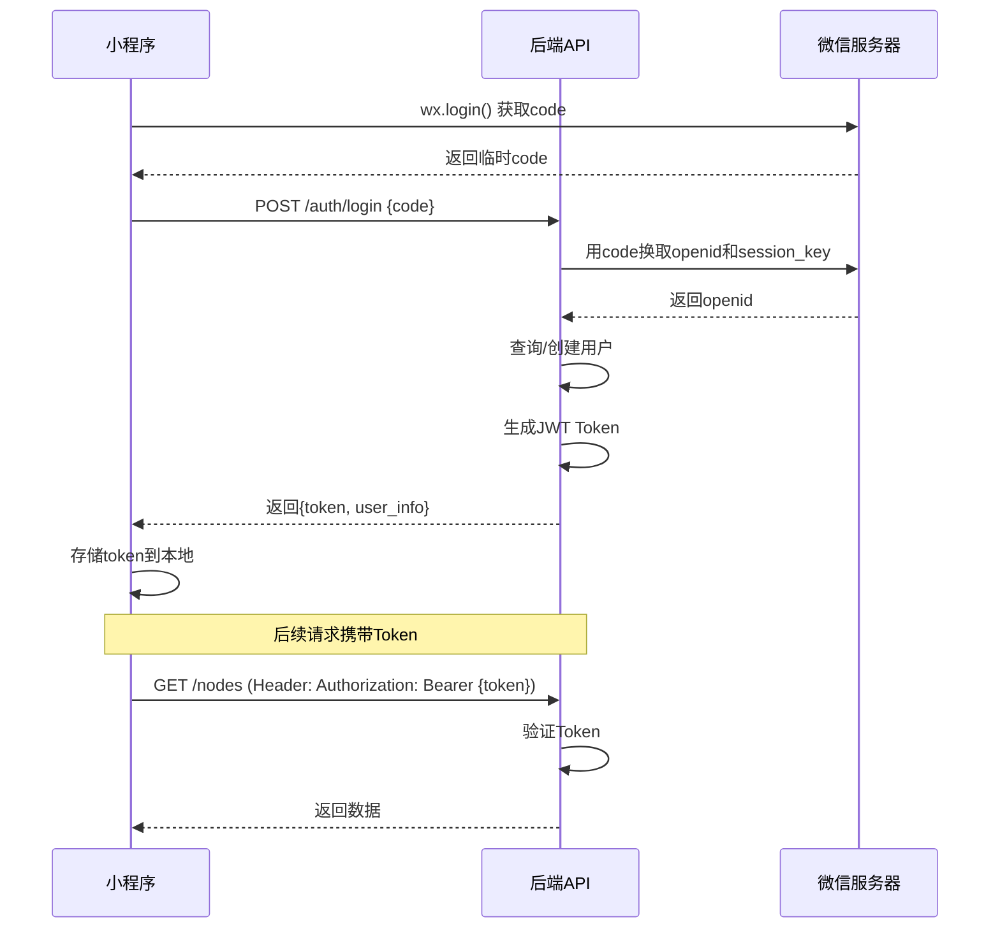

# 第四章：非功能性需求 (Non-Functional Requirements)**

---

## **4.1 性能需求 (Performance Requirements)**

### **4.1.1 响应时间 (Response Time)**

**核心API响应时间要求：**

| API类别      | 端点示例                         | P50    | P95    | P99    | 超时时间 |
| ------------ | -------------------------------- | ------ | ------ | ------ | -------- |
| **快速读取** | GET /nodes, GET /awakening/queue | ≤200ms | ≤500ms | ≤800ms | 2s       |
| **标准写入** | POST /nodes/voice (不含AI)       | ≤300ms | ≤800ms | ≤1.5s  | 3s       |
| **AI处理**   | POST /nodes/voice (含AI)         | ≤2s    | ≤5s    | ≤8s    | 15s      |
| **OCR处理**  | POST /nodes/image                | ≤3s    | ≤8s    | ≤12s   | 20s      |
| **关联计算** | GET /nodes/{id}/resonances       | ≤500ms | ≤2s    | ≤5s    | 10s      |

**前端性能指标：**

| 指标                    | 目标值 | 测量方式                       |
| ----------------------- | ------ | ------------------------------ |
| **小程序冷启动时间**    | ≤3s    | 从点击图标到首屏可交互         |
| **小程序热启动时间**    | ≤1s    | 从后台切换到前台               |
| **首屏加载时间（FCP）** | ≤2s    | First Contentful Paint         |
| **可交互时间（TTI）**   | ≤3s    | Time to Interactive            |
| **页面切换时间**        | ≤500ms | 路由跳转到新页面渲染完成       |
| **动画帧率**            | ≥50fps | 关键动画（闪卡翻转、节点创建） |

**AI服务处理时间分解：**

```
语音节点创建总耗时目标：≤5s (P95)
├─ 前端录音上传：500ms
├─ ASR识别：1.5s
├─ LLM精炼：2s
├─ 数据库写入：200ms
├─ 返回响应：100ms
└─ 缓冲时间：700ms

图片节点创建总耗时目标：≤8s (P95)
├─ 前端图片上传：1s
├─ OCR识别：3s
├─ LLM精炼：2s
├─ 数据库写入：200ms
└─ 缓冲时间：1.8s
```

---

### **4.1.2 并发与吞吐量 (Concurrency & Throughput)**

**MVP阶段目标（V1.0）：**

| 指标                  | 目标值     | 压测验证标准             |
| --------------------- | ---------- | ------------------------ |
| **支持DAU**           | 1,000      | 稳定运行24小时无严重错误 |
| **峰值QPS**           | 100        | 所有API P95响应时间达标  |
| **峰值并发用户**      | 200        | 同时在线，无明显卡顿     |
| **单用户API调用限制** | 100次/分钟 | 超过则限流返回429        |

**扩展性规划（V1.1+）：**

| 阶段         | DAU目标  | QPS目标 | 架构调整              |
| ------------ | -------- | ------- | --------------------- |
| **V1.0 MVP** | 1,000    | 100     | 单体应用 + 云函数     |
| **V1.1**     | 5,000    | 500     | 微服务拆分 + 负载均衡 |
| **V1.2**     | 20,000   | 2,000   | 容器化 + 自动扩缩容   |
| **V2.0**     | 100,000+ | 10,000+ | 分布式架构 + CDN      |

**弹性伸缩策略（V1.0基础版）：**

```yaml
自动扩缩容规则（基于云服务商能力）:
  
  触发扩容条件:
    - CPU使用率 > 70% 持续5分钟
    - 内存使用率 > 80% 持续5分钟
    - API P95响应时间 > 目标值2倍 持续3分钟
  
  触发缩容条件:
    - CPU使用率 < 30% 持续15分钟
    - 内存使用率 < 40% 持续15分钟
  
  扩缩容限制:
    - 最小实例数: 2（保证高可用）
    - 最大实例数: 10（成本控制）
    - 单次扩容幅度: +50%
    - 单次缩容幅度: -25%
    - 冷却时间: 5分钟
```

---

### **4.1.3 数据库性能 (Database Performance)**

**查询性能要求：**

| 查询类型         | 场景             | P95响应时间 | 优化策略                            |
| ---------------- | ---------------- | ----------- | ----------------------------------- |
| **主键查询**     | 获取单个节点     | ≤10ms       | 主键索引                            |
| **用户节点列表** | 获取用户所有节点 | ≤50ms       | user_id索引 + 分页                  |
| **待复习队列**   | 获取今日待复习   | ≤100ms      | 复合索引(user_id, next_review_date) |
| **关键词搜索**   | 全文搜索（V1.1） | ≤200ms      | 全文索引或ElasticSearch             |
| **关联计算**     | 查找相似节点     | ≤500ms      | 关键词缓存 + 批量查询               |

**数据库连接池配置：**

```python
# SQLAlchemy连接池配置（示例）
engine = create_engine(
    DATABASE_URL,
    pool_size=10,          # 常规连接池大小
    max_overflow=20,       # 最大溢出连接数
    pool_timeout=30,       # 获取连接超时时间（秒）
    pool_recycle=3600,     # 连接回收时间（秒）
    pool_pre_ping=True,    # 连接健康检查
    echo=False             # 生产环境关闭SQL日志
)
```

**索引设计：**

```sql
-- Nodes表核心索引
CREATE INDEX idx_nodes_user_id ON nodes(user_id);
CREATE INDEX idx_nodes_created_at ON nodes(created_at DESC);
CREATE INDEX idx_nodes_next_review ON nodes(user_id, (memory_stats->>'next_review_date'));
CREATE INDEX idx_nodes_deleted ON nodes(user_id, is_deleted) WHERE is_deleted = false;

-- Resonances表核心索引
CREATE INDEX idx_resonances_source ON resonances(source_node_id);
CREATE INDEX idx_resonances_related ON resonances(related_node_id);

-- ReviewLogs表核心索引
CREATE INDEX idx_review_logs_user_date ON review_logs(user_id, reviewed_at DESC);
```

---

### **4.1.4 缓存策略 (Caching Strategy)**

**多级缓存架构：**

```
┌─────────────┐
│   小程序端   │  ← L1: 本地存储（wx.setStorage）
└──────┬──────┘     • 用户信息（7天）
       │            • 节点列表（1小时）
       ↓            • 草稿数据（永久）
┌─────────────┐
│  CDN/边缘   │  ← L2: CDN缓存
└──────┬──────┘     • 静态资源（图片、音频）
       │            • 公共数据
       ↓
┌─────────────┐
│ Redis缓存   │  ← L3: 应用层缓存
└──────┬──────┘     • 热点数据
       │            • 会话信息
       ↓            • 计数器
┌─────────────┐
│  数据库     │  ← L4: 持久化存储
└─────────────┘
```

**具体缓存规则：**

| 数据类型         | 缓存位置 | TTL    | 更新策略            |
| ---------------- | -------- | ------ | ------------------- |
| **用户Token**    | Redis    | 7天    | 滑动过期            |
| **节点列表**     | Redis    | 10分钟 | 写入时主动失效      |
| **单个节点详情** | Redis    | 1小时  | 编辑/删除时主动失效 |
| **待复习队列**   | Redis    | 1小时  | 每日0点失效         |
| **关键词向量**   | Redis    | 24小时 | LRU淘汰             |
| **用户配置**     | Redis    | 1天    | 修改时主动失效      |
| **热点图片**     | CDN      | 30天   | 不主动失效          |

**Redis配置示例：**

```python
import redis
from redis.connection import ConnectionPool

# 连接池配置
pool = ConnectionPool(
    host='redis.example.com',
    port=6379,
    db=0,
    max_connections=50,
    decode_responses=True
)

redis_client = redis.Redis(connection_pool=pool)

# 缓存工具类
class CacheService:
    @staticmethod
    async def get_node(node_id: str):
        """获取节点（带缓存）"""
        cache_key = f"node:{node_id}"
        
        # 1. 尝试从缓存获取
        cached = redis_client.get(cache_key)
        if cached:
            return json.loads(cached)
        
        # 2. 缓存未命中，查询数据库
        node = await db.get_node(node_id)
        
        # 3. 写入缓存
        redis_client.setex(
            cache_key,
            3600,  # 1小时
            json.dumps(node.to_dict())
        )
        
        return node
    
    @staticmethod
    def invalidate_node(node_id: str):
        """使节点缓存失效"""
        redis_client.delete(f"node:{node_id}")
```

---

### **4.1.5 性能监控与告警**

**关键性能指标监控：**

| 指标             | 监控工具             | 告警阈值          | 处理SLA      |
| ---------------- | -------------------- | ----------------- | ------------ |
| **API响应时间**  | Prometheus + Grafana | P95 > 目标值1.5倍 | 30分钟内响应 |
| **API错误率**    | APM工具              | >1%               | 15分钟内响应 |
| **数据库慢查询** | 数据库监控           | >500ms            | 1小时内优化  |
| **Redis命中率**  | Redis INFO           | <80%              | 1小时内分析  |
| **CPU使用率**    | 云监控               | >80%              | 触发自动扩容 |
| **内存使用率**   | 云监控               | >85%              | 触发自动扩容 |
| **磁盘使用率**   | 云监控               | >80%              | 24小时内扩容 |

**性能日志记录：**

```python
import time
from functools import wraps

def performance_monitor(api_name: str):
    """API性能监控装饰器"""
    def decorator(func):
        @wraps(func)
        async def wrapper(*args, **kwargs):
            start_time = time.time()
            
            try:
                result = await func(*args, **kwargs)
                status = 'success'
                return result
            except Exception as e:
                status = 'error'
                raise
            finally:
                duration = time.time() - start_time
                
                # 记录性能指标
                metrics.record(
                    metric_name=f'api.{api_name}.duration',
                    value=duration,
                    tags={'status': status}
                )
                
                # 慢请求告警
                if duration > SLOW_REQUEST_THRESHOLD:
                    logger.warning(
                        f"Slow API: {api_name}, "
                        f"duration={duration:.2f}s"
                    )
        
        return wrapper
    return decorator

# 使用示例
@router.post("/api/v1/nodes/voice")
@performance_monitor('create_voice_node')
async def create_voice_node(...):
    pass
```

---

## **4.2 可用性与可靠性 (Availability & Reliability)**

### **4.2.1 服务可用性目标 (SLA)**

**V1.0 MVP阶段承诺：**

| 服务组件             | 可用性目标 | 年度停机时间 | 保障措施                |
| -------------------- | ---------- | ------------ | ----------------------- |
| **核心API服务**      | 99.9%      | ≤8.76小时    | 双实例 + 健康检查       |
| **数据库**           | 99.95%     | ≤4.38小时    | 主从复制 + 自动故障转移 |
| **AI服务（第三方）** | 99.5%      | ≤43.8小时    | 降级策略 + 重试机制     |
| **微信小程序平台**   | 依赖微信   | N/A          | 无法控制                |

**可用性计算公式：**

```
可用性(%) = (总时间 - 停机时间) / 总时间 × 100%

示例：
月度总时间 = 30天 × 24小时 = 720小时
99.9%可用性 = 720小时 - 0.72小时 = 720小时允许停机43分钟
```

---

### **4.2.2 容错与降级策略**

**服务降级矩阵：**

| 故障场景           | 降级策略                    | 用户体验                         | 恢复时间                   |
| ------------------ | --------------------------- | -------------------------------- | -------------------------- |
| **ASR服务不可用**  | 保存原始音频，稍后处理      | 提示"语音已保存，识别中..."      | 自动重试，最长24小时       |
| **OCR服务不可用**  | 保存原始图片，稍后处理      | 提示"图片已保存，识别中..."      | 自动重试，最长24小时       |
| **LLM服务不可用**  | 使用ASR/OCR原始文本创建节点 | 提示"AI服务繁忙，已保存原始内容" | 无自动重试，用户可手动触发 |
| **关联计算失败**   | 不显示"思想共鸣"模块        | 模块不可见，不影响核心功能       | 后台异步重试3次            |
| **Redis缓存失败**  | 直接查询数据库              | 响应速度变慢，但功能正常         | 15分钟内恢复               |
| **数据库主库故障** | 自动切换到从库              | 1-2秒的短暂不可用                | <5分钟                     |
| **全局服务故障**   | 显示维护页面                | 所有功能不可用                   | <30分钟                    |

**降级开关（Feature Flag）：**

```python
class FeatureFlags:
    """功能开关配置"""
    
    # 可通过环境变量或配置中心动态控制
    ENABLE_VOICE_INPUT = os.getenv('ENABLE_VOICE_INPUT', 'true') == 'true'
    ENABLE_IMAGE_INPUT = os.getenv('ENABLE_IMAGE_INPUT', 'true') == 'true'
    ENABLE_RESONANCE = os.getenv('ENABLE_RESONANCE', 'true') == 'true'
    ENABLE_AI_REFINEMENT = os.getenv('ENABLE_AI_REFINEMENT', 'true') == 'true'
    
    @classmethod
    def is_feature_enabled(cls, feature_name: str) -> bool:
        return getattr(cls, feature_name, False)

# 使用示例
@router.post("/api/v1/nodes/voice")
async def create_voice_node(...):
    if not FeatureFlags.is_feature_enabled('ENABLE_VOICE_INPUT'):
        raise HTTPException(
            status_code=503,
            detail="语音输入功能暂时维护中"
        )
    
    # AI精炼降级
    if FeatureFlags.is_feature_enabled('ENABLE_AI_REFINEMENT'):
        try:
            refined = await llm_service.refine(raw_text)
        except LLMError:
            # 降级：使用原始文本
            refined = {
                'title': raw_text[:30],
                'content': raw_text,
                'tags': []
            }
    else:
        # 功能关闭：直接使用原始文本
        refined = {...}
```

---

### **4.2.3 重试与熔断机制**

**指数退避重试策略：**

```python
import asyncio
from tenacity import (
    retry,
    stop_after_attempt,
    wait_exponential,
    retry_if_exception_type
)

class AIServiceClient:
    """AI服务客户端（带重试）"""
    
    @retry(
        stop=stop_after_attempt(3),           # 最多重试3次
        wait=wait_exponential(multiplier=1, min=1, max=10),  # 1s, 2s, 4s
        retry=retry_if_exception_type(TimeoutError),
        reraise=True
    )
    async def call_asr(self, audio_url: str):
        """调用ASR服务（自动重试）"""
        async with httpx.AsyncClient() as client:
            response = await client.post(
                ASR_API_URL,
                json={'audio_url': audio_url},
                timeout=5.0
            )
            response.raise_for_status()
            return response.json()
```

**熔断器实现（Circuit Breaker）：**

```python
from pybreaker import CircuitBreaker

# 熔断器配置
asr_breaker = CircuitBreaker(
    fail_max=5,              # 连续失败5次后熔断
    timeout_duration=60,     # 熔断60秒
    name='ASR_Service'
)

@asr_breaker
async def call_asr_with_circuit_breaker(audio_url: str):
    """带熔断器的ASR调用"""
    try:
        return await asr_service.transcribe(audio_url)
    except Exception as e:
        logger.error(f"ASR service error: {e}")
        raise

# 使用时捕获熔断异常
try:
    result = await call_asr_with_circuit_breaker(audio_url)
except CircuitBreakerError:
    # 熔断开启，直接降级
    logger.warning("ASR circuit breaker is open, using fallback")
    return fallback_handler(audio_url)
```

---

### **4.2.4 数据可靠性与备份**

**数据备份策略：**

| 备份类型         | 频率       | 保留期限 | 存储位置     | 恢复测试   |
| ---------------- | ---------- | -------- | ------------ | ---------- |
| **全量备份**     | 每日03:00  | 30天     | 异地对象存储 | 每月1次    |
| **增量备份**     | 每6小时    | 7天      | 本地+异地    | 每周1次    |
| **事务日志**     | 实时       | 7天      | 本地快速存储 | 每周1次    |
| **关键数据快照** | 每次发版前 | 永久     | 异地冷存储   | 发版前必测 |

**备份脚本示例：**

```bash
#!/bin/bash
# 每日数据库备份脚本

DATE=$(date +%Y%m%d_%H%M%S)
BACKUP_DIR="/data/backups"
DB_NAME="weave_production"
S3_BUCKET="s3://weave-backups"

# 1. 执行全量备份
pg_dump -h $DB_HOST -U $DB_USER -d $DB_NAME \
  | gzip > $BACKUP_DIR/weave_${DATE}.sql.gz

# 2. 上传到异地存储
aws s3 cp $BACKUP_DIR/weave_${DATE}.sql.gz \
  $S3_BUCKET/daily/ \
  --storage-class STANDARD_IA

# 3. 删除本地7天前的备份
find $BACKUP_DIR -name "weave_*.sql.gz" -mtime +7 -delete

# 4. 验证备份完整性
gunzip -t $BACKUP_DIR/weave_${DATE}.sql.gz
if [ $? -eq 0 ]; then
    echo "Backup successful and verified: weave_${DATE}.sql.gz"
else
    echo "ERROR: Backup verification failed!" | mail -s "Backup Alert" admin@weave.com
fi
```

**RPO/RTO定义：**

```
RPO (Recovery Point Objective) - 数据恢复点目标
└─ V1.0目标：≤24小时（最多丢失1天数据）
   理由：每日全量备份 + 实时事务日志

RTO (Recovery Time Objective) - 恢复时间目标
└─ V1.0目标：≤4小时（从故障到完全恢复）
   流程：
   1. 故障检测：15分钟（自动监控）
   2. 决策与准备：30分钟（人工介入）
   3. 数据恢复：2小时（从备份还原）
   4. 服务验证：1小时（功能测试）
   5. 流量切换：15分钟（DNS/负载均衡）
```

---

### **4.2.5 健康检查与自动恢复**

**健康检查端点：**

```python
@router.get("/health")
async def health_check():
    """
    健康检查端点（用于负载均衡器）
    """
    checks = {
        'status': 'healthy',
        'timestamp': datetime.now().isoformat(),
        'components': {}
    }
    
    # 1. 数据库连接检查
    try:
        await db.execute("SELECT 1")
        checks['components']['database'] = 'healthy'
    except Exception as e:
        checks['components']['database'] = f'unhealthy: {str(e)}'
        checks['status'] = 'degraded'
    
    # 2. Redis连接检查
    try:
        redis_client.ping()
        checks['components']['redis'] = 'healthy'
    except Exception as e:
        checks['components']['redis'] = f'unhealthy: {str(e)}'
        checks['status'] = 'degraded'
    
    # 3. 外部依赖检查（可选）
    if checks['status'] == 'degraded':
        return JSONResponse(
            status_code=503,
            content=checks
        )
    
    return checks


@router.get("/readiness")
async def readiness_check():
    """
    就绪检查（Kubernetes）
    """
    # 检查所有依赖是否就绪
    if not all([
        await db.is_ready(),
        redis_client.ping(),
        FeatureFlags.is_initialized()
    ]):
        return JSONResponse(
            status_code=503,
            content={'ready': False}
        )
    
    return {'ready': True}
```

**自动恢复机制：**

```yaml
# Kubernetes自动恢复配置示例
apiVersion: apps/v1
kind: Deployment
metadata:
  name: weave-api
spec:
  replicas: 2  # 最少2个实例
  strategy:
    type: RollingUpdate
    rollingUpdate:
      maxUnavailable: 1  # 滚动更新时最多1个不可用
      maxSurge: 1        # 最多额外启动1个
  
  template:
    spec:
      containers:
      - name: api
        image: weave/api:v1.0
        
        # 存活探针（容器崩溃自动重启）
        livenessProbe:
          httpGet:
            path: /health
            port: 8000
          initialDelaySeconds: 30
          periodSeconds: 10
          failureThreshold: 3
        
        # 就绪探针（未就绪不接收流量）
        readinessProbe:
          httpGet:
            path: /readiness
            port: 8000
          initialDelaySeconds: 10
          periodSeconds: 5
          failureThreshold: 2
        
        # 资源限制（防止OOM）
        resources:
          requests:
            memory: "512Mi"
            cpu: "500m"
          limits:
            memory: "1Gi"
            cpu: "1000m"
```

---

## **4.3 安全性 (Security Requirements)**

### **4.3.1 数据传输安全**

**加密传输要求：**

| 通信链路             | 加密协议   | 最低版本 | 证书要求         |
| -------------------- | ---------- | -------- | ---------------- |
| **小程序 ↔ 后端API** | HTTPS/TLS  | TLS 1.2  | 有效SSL证书      |
| **后端 ↔ 数据库**    | SSL/TLS    | TLS 1.2  | 自签名证书       |
| **后端 ↔ Redis**     | TLS (可选) | TLS 1.2  | 开发环境可不加密 |
| **后端 ↔ AI服务**    | HTTPS      | TLS 1.2  | 第三方证书       |

**TLS配置示例（Nginx）：**

```nginx
server {
    listen 443 ssl http2;
    server_name api.weave.com;
    
    # SSL证书配置
    ssl_certificate /etc/nginx/ssl/weave.crt;
    ssl_certificate_key /etc/nginx/ssl/weave.key;
    
    # TLS协议版本
    ssl_protocols TLSv1.2 TLSv1.3;
    
    # 加密套件（强安全）
    ssl_ciphers 'ECDHE-ECDSA-AES128-GCM-SHA256:ECDHE-RSA-AES128-GCM-SHA256';
    ssl_prefer_server_ciphers on;
    
    # HSTS（强制HTTPS）
    add_header Strict-Transport-Security "max-age=31536000; includeSubDomains" always;
    
    # 防止点击劫持
    add_header X-Frame-Options "DENY" always;
    add_header X-Content-Type-Options "nosniff" always;
    
    location / {
        proxy_pass http://backend_servers;
        proxy_set_header X-Real-IP $remote_addr;
        proxy_set_header X-Forwarded-For $proxy_add_x_forwarded_for;
        proxy_set_header X-Forwarded-Proto $scheme;
    }
}
```

---

### **4.3.2 数据存储安全**

**静态数据加密：**

| 数据类型          | 加密方式            | 密钥管理              | 访问控制    |
| ----------------- | ------------------- | --------------------- | ----------- |
| **数据库**        | AES-256全盘加密     | 云服务商KMS           | IAM角色     |
| **用户密码**      | N/A（使用微信授权） | N/A                   | N/A         |
| **API Token**     | JWT签名 + Redis存储 | 环境变量（HS256密钥） | 过期时间7天 |
| **音频/图片文件** | 对象存储服务端加密  | 云服务商托管密钥      | 私有读写    |
| **备份文件**      | AES-256加密         | 独立密钥（离线存储）  | 仅管理员    |

**敏感信息脱敏：**

```python
import hashlib
import hmac

class DataMasking:
    """敏感数据脱敏工具"""
    
    @staticmethod
    def mask_openid(openid: str) -> str:
        """脱敏微信OpenID（用于日志）"""
        if len(openid) <= 8:
            return '***'
        return openid[:4] + '****' + openid[-4:]
    
    @staticmethod
    def hash_user_id(user_id: str, salt: str) -> str:
        """单向哈希用户ID（用于数据分析）"""
        return hashlib.sha256(
            (user_id + salt).encode()
        ).hexdigest()[:16]
    
    @staticmethod
    def anonymize_content(content: str) -> str:
        """匿名化用户内容（用于训练数据）"""
        # 移除可能的姓名、手机号、邮箱等
        import re
        content = re.sub(r'\d{11}', '[PHONE]', content)
        content = re.sub(r'[\w\.-]+@[\w\.-]+', '[EMAIL]', content)
        return content

# 在日志中使用
logger.info(f"User {DataMasking.mask_openid(openid)} created node")
```

---

### **4.3.3 认证与授权**

**认证流程：**



**JWT Token生成与验证：**

```python
import jwt
from datetime import datetime, timedelta

SECRET_KEY = os.getenv('JWT_SECRET_KEY')
ALGORITHM = 'HS256'
TOKEN_EXPIRE_DAYS = 7

class AuthService:
    
    @staticmethod
    def create_token(user_id: str, openid: str) -> str:
        """生成JWT Token"""
        payload = {
            'user_id': user_id,
            'openid': openid,
            'exp': datetime.utcnow() + timedelta(days=TOKEN_EXPIRE_DAYS),
            'iat': datetime.utcnow()
        }
        
        token = jwt.encode(payload, SECRET_KEY, algorithm=ALGORITHM)
        
        # 同时存储到Redis（支持主动失效）
        redis_client.setex(
            f"token:{user_id}",
            TOKEN_EXPIRE_DAYS * 86400,
            token
        )
        
        return token
    
    @staticmethod
    def verify_token(token: str) -> dict:
        """验证Token"""
        try:
            payload = jwt.decode(token, SECRET_KEY, algorithms=[ALGORITHM])
            
            # 检查Redis黑名单（用于登出）
            if redis_client.exists(f"blacklist:{token}"):
                raise HTTPException(status_code=401, detail="Token已失效")
            
            return payload
            
        except jwt.ExpiredSignatureError:
            raise HTTPException(status_code=401, detail="Token已过期")
        except jwt.InvalidTokenError:
            raise HTTPException(status_code=401, detail="Token无效")

# FastAPI依赖注入
async def get_current_user(
    authorization: str = Header(None)
) -> User:
    """获取当前用户（依赖注入）"""
    if not authorization or not authorization.startswith('Bearer '):
        raise HTTPException(status_code=401, detail="未授权")
    
    token = authorization.split(' ')[1]
    payload = AuthService.verify_token(token)
    
    user = await db.get_user(payload['user_id'])
    if not user:
        raise HTTPException(status_code=401, detail="用户不存在")
    
    return user
```

**权限控制：**

```python
from enum import Enum

class Permission(Enum):
    """权限枚举"""
    READ_OWN_NODES = "read:own_nodes"
    WRITE_OWN_NODES = "write:own_nodes"
    DELETE_OWN_NODES = "delete:own_nodes"
    EXPORT_DATA = "export:data"
    
    # 管理员权限（V1.1）
    ADMIN_READ_ALL = "admin:read_all"
    ADMIN_DELETE_ALL = "admin:delete_all"

def require_permission(permission: Permission):
    """权限检查装饰器"""
    def decorator(func):
        @wraps(func)
        async def wrapper(*args, current_user: User, **kwargs):
            if permission not in current_user.permissions:
                raise HTTPException(
                    status_code=403,
                    detail=f"缺少权限: {permission.value}"
                )
            return await func(*args, current_user=current_user, **kwargs)
        return wrapper
    return decorator

# 使用示例
@router.delete("/api/v1/nodes/{node_id}")
@require_permission(Permission.DELETE_OWN_NODES)
async def delete_node(
    node_id: str,
    current_user: User = Depends(get_current_user)
):
    # 额外检查：只能删除自己的节点
    node = await db.get_node(node_id)
    if node.user_id != current_user.id:
        raise HTTPException(status_code=403, detail="无权删除他人节点")
    
    await db.delete_node(node_id)
    return {'status': 'success'}
```

---

### **4.3.4 防攻击措施**

**限流（Rate Limiting）：**

```python
from slowapi import Limiter
from slowapi.util import get_remote_address

limiter = Limiter(key_func=get_remote_address)

# 全局限流配置
@app.state.limiter = limiter
@app.add_exception_handler(RateLimitExceeded, _rate_limit_exceeded_handler)

# API级别限流
@router.post("/api/v1/nodes/voice")
@limiter.limit("10/minute")  # 每分钟最多10次
async def create_voice_node(request: Request, ...):
    pass

@router.post("/api/v1/auth/login")
@limiter.limit("5/minute")  # 登录接口更严格
async def login(request: Request, ...):
    pass
```

**防SQL注入：**

```python
# ✅ 正确：使用参数化查询
cursor.execute(
    "SELECT * FROM nodes WHERE user_id = %s AND title LIKE %s",
    (user_id, f"%{keyword}%")
)

# ❌ 错误：字符串拼接（易受注入）
cursor.execute(
    f"SELECT * FROM nodes WHERE user_id = '{user_id}' AND title LIKE '%{keyword}%'"
)
```

**防XSS攻击：**

```python
import bleach

def sanitize_user_input(text: str) -> str:
    """清理用户输入，防止XSS"""
    # 允许的HTML标签（Markdown子集）
    allowed_tags = ['p', 'br', 'strong', 'em', 'code', 'pre', 'ul', 'ol', 'li']
    
    return bleach.clean(
        text,
        tags=allowed_tags,
        strip=True
    )

# 在保存节点前清理
node.content = sanitize_user_input(raw_content)
```

**防CSRF（微信小程序场景）：**

```
微信小程序的请求不受浏览器同源策略限制，
且使用Token认证（非Cookie），天然防CSRF。
无需额外CSRF Token。
```

---

### **4.3.5 安全审计日志**

**关键操作审计：**

```python
class AuditLog:
    """安全审计日志"""
    
    @staticmethod
    async def log_security_event(
        user_id: str,
        event_type: str,
        details: dict,
        ip_address: str,
        user_agent: str
    ):
        """记录安全事件"""
        log_entry = {
            'timestamp': datetime.utcnow().isoformat(),
            'user_id': user_id,
            'event_type': event_type,
            'details': details,
            'ip_address': ip_address,
            'user_agent': user_agent
        }
        
        # 写入专门的审计日志表（不可删除）
        await db.insert('audit_logs', log_entry)
        
        # 敏感操作额外告警
        if event_type in ['DATA_EXPORT', 'ACCOUNT_DELETE']:
            await send_alert_to_admin(log_entry)

# 使用示例
@router.post("/api/v1/export/request")
async def request_export(request: Request, current_user: User):
    await AuditLog.log_security_event(
        user_id=current_user.id,
        event_type='DATA_EXPORT',
        details={'format': 'json'},
        ip_address=request.client.host,
        user_agent=request.headers.get('user-agent')
    )
    # ...
```

**需要审计的事件：**

| 事件类型              | 描述     | 保留期限 |
| --------------------- | -------- | -------- |
| `AUTH_LOGIN`          | 用户登录 | 90天     |
| `AUTH_LOGOUT`         | 用户登出 | 90天     |
| `AUTH_FAILED`         | 登录失败 | 180天    |
| `DATA_EXPORT`         | 数据导出 | 永久     |
| `NODE_DELETE`         | 删除节点 | 365天    |
| `ACCOUNT_DELETE`      | 删除账户 | 永久     |
| `PERMISSION_DENIED`   | 权限拒绝 | 180天    |
| `RATE_LIMIT_EXCEEDED` | 超过限流 | 30天     |

---

## **4.4 兼容性 (Compatibility)**

### **4.4.1 微信小程序环境兼容性**

**基础库版本要求：**

| 组件            | 最低版本    | 推荐版本    | 兼容范围            |
| --------------- | ----------- | ----------- | ------------------- |
| **微信基础库**  | 2.10.0      | 最新稳定版  | 覆盖99%+用户        |
| **iOS系统**     | iOS 10      | iOS 14+     | 支持iPhone 5s及以上 |
| **Android系统** | Android 5.0 | Android 10+ | 支持95%+设备        |

**API兼容性检查：**

```javascript
// 检查API是否支持
if (wx.canIUse('getRecorderManager')) {
  // 使用录音管理器
  const recorderManager = wx.getRecorderManager();
} else {
  // 降级方案：使用旧API
  wx.showModal({
    title: '提示',
    content: '当前微信版本过低，请更新后使用语音功能'
  });
}

// 检查基础库版本
const systemInfo = wx.getSystemInfoSync();
if (compareVersion(systemInfo.SDKVersion, '2.10.0') < 0) {
  wx.showModal({
    title: '提示',
    content: '当前微信版本过低，建议更新以获得最佳体验'
  });
}

function compareVersion(v1, v2) {
  const v1Arr = v1.split('.');
  const v2Arr = v2.split('.');
  const len = Math.max(v1Arr.length, v2Arr.length);
  
  for (let i = 0; i < len; i++) {
    const num1 = parseInt(v1Arr[i]) || 0;
    const num2 = parseInt(v2Arr[i]) || 0;
    if (num1 > num2) return 1;
    if (num1 < num2) return -1;
  }
  return 0;
}
```

---

### **4.4.2 设备兼容性**

**测试机型矩阵（Top 10覆盖）：**

| 排名 | 机型         | 系统版本   | 屏幕尺寸 | 测试优先级 |
| ---- | ------------ | ---------- | -------- | ---------- |
| 1    | iPhone 13    | iOS 15     | 6.1"     | P0         |
| 2    | iPhone 12    | iOS 14     | 6.1"     | P0         |
| 3    | 华为Mate 40  | Android 10 | 6.5"     | P0         |
| 4    | 小米11       | Android 11 | 6.81"    | P0         |
| 5    | OPPO Find X3 | Android 11 | 6.7"     | P1         |
| 6    | vivo X60     | Android 11 | 6.56"    | P1         |
| 7    | iPhone SE 2  | iOS 15     | 4.7"     | P1（小屏） |
| 8    | 华为P40      | Android 10 | 6.1"     | P1         |
| 9    | 荣耀50       | Android 11 | 6.57"    | P2         |
| 10   | Redmi K40    | Android 11 | 6.67"    | P2         |

**屏幕适配方案：**

```css
/* 使用rpx单位（750rpx = 屏幕宽度） */
.node-card {
  width: 710rpx;  /* 左右各留20rpx边距 */
  padding: 32rpx;
  border-radius: 24rpx;
}

/* 安全区域适配（刘海屏） */
.page-container {
  padding-top: constant(safe-area-inset-top);
  padding-top: env(safe-area-inset-top);
  padding-bottom: constant(safe-area-inset-bottom);
  padding-bottom: env(safe-area-inset-bottom);
}

/* 响应式布局 */
@media (max-width: 375px) {
  /* 小屏设备（iPhone SE） */
  .node-title {
    font-size: 28rpx;
  }
}
```

---

### **4.4.3 浏览器兼容性（V2.0规划）**

当未来推出Web版时，需考虑：

| 浏览器  | 最低版本 | 市场份额 | 测试优先级 |
| ------- | -------- | -------- | ---------- |
| Chrome  | 90+      | 65%      | P0         |
| Safari  | 14+      | 18%      | P0         |
| Edge    | 90+      | 8%       | P1         |
| Firefox | 88+      | 4%       | P1         |
| IE      | 不支持   | <1%      | N/A        |

---

## **4.5 可维护性与扩展性 (Maintainability & Scalability)**

### **4.5.1 代码规范与质量**

**代码规范要求：**

| 语言           | 规范   | 工具                | 覆盖率要求 |
| -------------- | ------ | ------------------- | ---------- |
| **Python**     | PEP 8  | black, flake8, mypy | -          |
| **JavaScript** | Airbnb | ESLint, Prettier    | -          |
| **SQL**        | 自定义 | SQLFluff            | -          |

**代码审查（Code Review）：**

```yaml
代码审查清单:
  
  功能性:
    - [ ] 功能实现符合PRD要求
    - [ ] 边界条件已处理
    - [ ] 错误处理完善
  
  性能:
    - [ ] 无N+1查询问题
    - [ ] 大数据量场景已优化
    - [ ] 缓存策略合理
  
  安全性:
    - [ ] 用户输入已验证和清理
    - [ ] 敏感信息已脱敏
    - [ ] SQL注入/XSS已防范
  
  可测试性:
    - [ ] 单元测试覆盖率>80%
    - [ ] 关键路径有集成测试
    - [ ] Mock外部依赖
  
  可维护性:
    - [ ] 代码易读，有必要注释
    - [ ] 函数单一职责
    - [ ] 避免硬编码
```

**单元测试要求：**

```python
# pytest示例
import pytest
from app.services.memory import SM2MemoryScheduler

class TestSM2Algorithm:
    """SM-2算法测试"""
    
    def test_init_memory_stats(self):
        """测试初始化"""
        stats = SM2MemoryScheduler.init_memory_stats()
        assert stats['repetition_count'] == 0
        assert stats['easiness_factor'] == 2.5
    
    def test_first_review_success(self):
        """测试首次复习成功"""
        current_stats = SM2MemoryScheduler.init_memory_stats()
        new_stats = SM2MemoryScheduler.calculate_next_review(
            quality_score=5,
            current_stats=current_stats
        )
        assert new_stats['repetition_count'] == 1
        assert new_stats['interval_days'] == 1
    
    def test_review_failure_resets(self):
        """测试复习失败重置"""
        current_stats = {
            'repetition_count': 5,
            'easiness_factor': 2.8,
            'interval_days': 30
        }
        new_stats = SM2MemoryScheduler.calculate_next_review(
            quality_score=2,  # 忘记了
            current_stats=current_stats
        )
        assert new_stats['repetition_count'] == 0
        assert new_stats['interval_days'] == 1

# 运行测试并生成覆盖率报告
# pytest --cov=app --cov-report=html
```

---

### **4.5.2 架构扩展性**

**微服务拆分规划（V1.1+）：**

```
V1.0 单体架构:
┌──────────────────────────────────┐
│      Weave API (单体应用)         │
│  ┌────────────────────────────┐  │
│  │  路由层                     │  │
│  │  业务逻辑层                 │  │
│  │  数据访问层                 │  │
│  └────────────────────────────┘  │
└──────────────────────────────────┘
         ↓
     数据库 + Redis


V1.1+ 微服务架构:
┌────────────┐  ┌────────────┐  ┌────────────┐
│  Auth服务   │  │  Node服务   │  │ Review服务 │
│  (认证授权)  │  │  (节点管理)  │  │ (记忆复习)  │
└─────┬──────┘  └─────┬──────┘  └─────┬──────┘
      │               │               │
      └───────────────┴───────────────┘
                      │
              ┌───────┴────────┐
              │   API Gateway   │  ← 统一入口
              └────────────────┘
                      │
              ┌───────┴────────┐
              │  消息队列(RabbitMQ) │  ← 异步通信
              └────────────────┘
```

**数据库分片策略（V1.2+）：**

```python
# 按用户ID分片（Sharding）
def get_shard_id(user_id: str) -> int:
    """根据用户ID计算分片"""
    return int(hashlib.md5(user_id.encode()).hexdigest(), 16) % SHARD_COUNT

# 使用示例
shard_id = get_shard_id(user_id)
db_connection = get_db_connection(shard_id)
nodes = db_connection.query(Node).filter_by(user_id=user_id).all()
```

---

### **4.5.3 AI模型可替换性**

**抽象层设计：**

```python
from abc import ABC, abstractmethod

class BaseASRService(ABC):
    """ASR服务抽象基类"""
    
    @abstractmethod
    async def transcribe(self, audio_url: str) -> dict:
        """语音转文本"""
        pass

class AliyunASRService(BaseASRService):
    """阿里云ASR实现"""
    async def transcribe(self, audio_url: str) -> dict:
        # 阿里云具体实现
        pass

class TencentASRService(BaseASRService):
    """腾讯云ASR实现"""
    async def transcribe(self, audio_url: str) -> dict:
        # 腾讯云具体实现
        pass

# 工厂模式
class ASRServiceFactory:
    @staticmethod
    def create(provider: str) -> BaseASRService:
        if provider == 'aliyun':
            return AliyunASRService()
        elif provider == 'tencent':
            return TencentASRService()
        else:
            raise ValueError(f"Unknown provider: {provider}")

# 配置化切换
ASR_PROVIDER = os.getenv('ASR_PROVIDER', 'aliyun')
asr_service = ASRServiceFactory.create(ASR_PROVIDER)
```

---

### **4.5.4 配置管理**

**环境配置分离：**

```python
# config/base.py
class BaseConfig:
    """基础配置"""
    APP_NAME = "Weave"
    API_VERSION = "v1"
    
    # 数据库
    DB_POOL_SIZE = 10
    DB_MAX_OVERFLOW = 20
    
    # JWT
    JWT_ALGORITHM = "HS256"
    JWT_EXPIRE_DAYS = 7

# config/development.py
class DevelopmentConfig(BaseConfig):
    """开发环境"""
    DEBUG = True
    DATABASE_URL = "postgresql://localhost/weave_dev"
    REDIS_URL = "redis://localhost:6379/0"
    
    # AI服务（使用免费额度）
    ASR_PROVIDER = "aliyun"
    LLM_PROVIDER = "glm"

# config/production.py
class ProductionConfig(BaseConfig):
    """生产环境"""
    DEBUG = False
    DATABASE_URL = os.getenv("DATABASE_URL")
    REDIS_URL = os.getenv("REDIS_URL")
    
    # 生产级配置
    DB_POOL_SIZE = 20
    
    # 安全
    SECRET_KEY = os.getenv("SECRET_KEY")  # 必须从环境变量读取

# 根据环境加载
ENV = os.getenv("ENVIRONMENT", "development")
if ENV == "production":
    config = ProductionConfig()
else:
    config = DevelopmentConfig()
```

---

## **4.6 可监控性 (Observability)**

### **4.6.1 日志规范**

**日志级别使用规范：**

| 级别         | 使用场景               | 示例                                     |
| ------------ | ---------------------- | ---------------------------------------- |
| **DEBUG**    | 开发调试，详细执行流程 | "Entering function calculate_similarity" |
| **INFO**     | 正常业务流程           | "User {user_id} created node {node_id}"  |
| **WARNING**  | 潜在问题，但不影响功能 | "ASR confidence low: 0.65"               |
| **ERROR**    | 功能错误，需要关注     | "LLM service timeout after 15s"          |
| **CRITICAL** | 严重错误，需要立即处理 | "Database connection pool exhausted"     |

**结构化日志格式：**

```python
import logging
import json
from pythonjsonlogger import jsonlogger

# 配置JSON格式日志
logger = logging.getLogger()
handler = logging.StreamHandler()
formatter = jsonlogger.JsonFormatter(
    fmt='%(asctime)s %(name)s %(levelname)s %(message)s'
)
handler.setFormatter(formatter)
logger.addHandler(handler)
logger.setLevel(logging.INFO)

# 使用示例
logger.info(
    "Node created",
    extra={
        'user_id': user_id,
        'node_id': node_id,
        'source_type': 'voice',
        'processing_time': 3.2,
        'ai_provider': 'aliyun'
    }
)

# 输出示例（JSON格式，便于日志分析工具处理）
# {
#   "asctime": "2025-10-21 10:30:00",
#   "name": "app.services.node",
#   "levelname": "INFO",
#   "message": "Node created",
#   "user_id": "uuid-123",
#   "node_id": "uuid-456",
#   "source_type": "voice",
#   "processing_time": 3.2,
#   "ai_provider": "aliyun"
# }
```

---

### **4.6.2 指标监控（Metrics）**

**核心业务指标：**

```python
from prometheus_client import Counter, Histogram, Gauge

# 计数器
node_created_total = Counter(
    'node_created_total',
    'Total number of nodes created',
    ['source_type', 'ai_provider']
)

# 直方图（用于统计分布）
api_request_duration = Histogram(
    'api_request_duration_seconds',
    'API request duration in seconds',
    ['method', 'endpoint', 'status'],
    buckets=[0.1, 0.5, 1.0, 2.0, 5.0, 10.0]
)

# 仪表盘（当前值）
active_users_gauge = Gauge(
    'active_users',
    'Number of currently active users'
)

# 使用示例
@api_request_duration.time()
@router.post("/api/v1/nodes/voice")
async def create_voice_node(...):
    node = await service.create_node(...)
    
    node_created_total.labels(
        source_type='voice',
        ai_provider='aliyun'
    ).inc()
    
    return node
```

**Prometheus监控配置：**

```yaml
# prometheus.yml
global:
  scrape_interval: 15s

scrape_configs:
  - job_name: 'weave-api'
    static_configs:
      - targets: ['api-server-1:8000', 'api-server-2:8000']
    metrics_path: '/metrics'
```

---

### **4.6.3 链路追踪（Tracing）**

**分布式追踪（OpenTelemetry）：**

```python
from opentelemetry import trace
from opentelemetry.exporter.jaeger.thrift import JaegerExporter
from opentelemetry.sdk.trace import TracerProvider
from opentelemetry.sdk.trace.export import BatchSpanProcessor

# 配置追踪器
trace.set_tracer_provider(TracerProvider())
tracer = trace.get_tracer(__name__)

# 配置导出器（Jaeger）
jaeger_exporter = JaegerExporter(
    agent_host_name="localhost",
    agent_port=6831,
)
trace.get_tracer_provider().add_span_processor(
    BatchSpanProcessor(jaeger_exporter)
)

# 使用追踪
@router.post("/api/v1/nodes/voice")
async def create_voice_node(...):
    with tracer.start_as_current_span("create_voice_node") as span:
        span.set_attribute("user_id", user_id)
        
        with tracer.start_as_current_span("asr_processing"):
            text = await asr_service.transcribe(audio_url)
        
        with tracer.start_as_current_span("llm_refinement"):
            refined = await llm_service.refine(text)
        
        with tracer.start_as_current_span("db_save"):
            node = await db.save_node(refined)
        
        return node
```

这样可以在Jaeger UI中看到完整的调用链路和耗时分布。

---

### **4.6.4 告警规则**

**Prometheus告警规则示例：**

```yaml
# alerts.yml
groups:
  - name: weave_api_alerts
    interval: 30s
    rules:
      # API错误率过高
      - alert: HighAPIErrorRate
        expr: |
          rate(api_request_total{status=~"5.."}[5m]) 
          / 
          rate(api_request_total[5m]) > 0.01
        for: 5m
        labels:
          severity: critical
        annotations:
          summary: "API错误率超过1%"
          description: "{{ $labels.endpoint }} 错误率 {{ $value | humanizePercentage }}"
      
      # API响应时间过长
      - alert: SlowAPIResponse
        expr: |
          histogram_quantile(0.95, api_request_duration_seconds_bucket) > 5
        for: 10m
        labels:
          severity: warning
        annotations:
          summary: "API P95响应时间超过5秒"
      
      # 数据库连接池耗尽
      - alert: DatabasePoolExhausted
        expr: db_connection_pool_active >= db_connection_pool_size * 0.9
        for: 5m
        labels:
          severity: critical
        annotations:
          summary: "数据库连接池即将耗尽"
      
      # AI服务调用失败率高
      - alert: HighAIServiceFailureRate
        expr: |
          rate(ai_service_call_total{status="failed"}[5m])
          /
          rate(ai_service_call_total[5m]) > 0.05
        for: 10m
        labels:
          severity: warning
        annotations:
          summary: "AI服务失败率超过5%"
```

