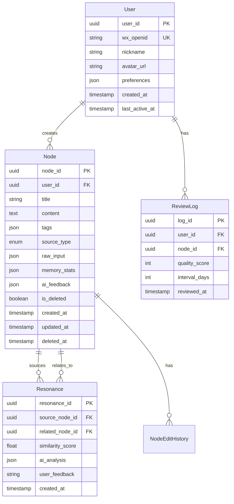

# 第八章：附录 (Appendix)**

---

## **8.1 数据字典 (Data Dictionary)**

### **8.1.1 核心实体关系图 (ERD)**



---

### **8.1.2 表结构详细定义**

#### **表1: users（用户表）**

| 字段名                | 数据类型  | 长度/精度 | 是否NULL | 默认值             | 索引  | 说明                |
| --------------------- | --------- | --------- | -------- | ------------------ | ----- | ------------------- |
| `user_id`             | UUID      | 36        | No       | uuid_generate_v4() | PK    | 用户唯一标识        |
| `wx_openid`           | VARCHAR   | 128       | No       | -                  | UK    | 微信OpenID（唯一）  |
| `wx_unionid`          | VARCHAR   | 128       | Yes      | NULL               | INDEX | 微信UnionID（可选） |
| `nickname`            | VARCHAR   | 255       | Yes      | NULL               | -     | 微信昵称            |
| `avatar_url`          | VARCHAR   | 1024      | Yes      | NULL               | -     | 微信头像链接        |
| `phone`               | VARCHAR   | 20        | Yes      | NULL               | UK    | 手机号（可选绑定）  |
| `email`               | VARCHAR   | 255       | Yes      | NULL               | -     | 邮箱（可选绑定）    |
| `preferences`         | JSONB     | -         | Yes      | '{}'               | GIN   | 用户偏好设置        |
| `subscription_status` | ENUM      | -         | No       | 'active'           | INDEX | 订阅消息状态        |
| `is_active`           | BOOLEAN   | -         | No       | true               | INDEX | 是否激活            |
| `created_at`          | TIMESTAMP | -         | No       | CURRENT_TIMESTAMP  | INDEX | 创建时间            |
| `last_active_at`      | TIMESTAMP | -         | Yes      | NULL               | INDEX | 最后活跃时间        |
| `updated_at`          | TIMESTAMP | -         | No       | CURRENT_TIMESTAMP  | -     | 更新时间            |

**preferences字段结构（JSONB）：**

```json
{
  "review_time": "08:00",           // 复习推送时间
  "review_enabled": true,            // 是否开启复习提醒
  "theme": "auto",                   // 主题：auto/light/dark
  "language": "zh-CN",               // 语言
  "onboarding_completed": true,      // 是否完成引导
  "sample_pack_imported": false,     // 是否导入示例包
  "tutorial_steps": {                // 教程进度
    "voice_input": true,
    "review": false
  }
}
```

**索引：**

```sql
CREATE UNIQUE INDEX idx_users_wx_openid ON users(wx_openid);
CREATE INDEX idx_users_created_at ON users(created_at);
CREATE INDEX idx_users_last_active ON users(last_active_at);
CREATE INDEX idx_users_subscription ON users(subscription_status) WHERE is_active = true;
```

---

#### **表2: nodes（智慧节点表）**

| 字段名           | 数据类型  | 长度/精度 | 是否NULL | 默认值             | 索引      | 说明                       |
| ---------------- | --------- | --------- | -------- | ------------------ | --------- | -------------------------- |
| `node_id`        | UUID      | 36        | No       | uuid_generate_v4() | PK        | 节点唯一标识               |
| `user_id`        | UUID      | 36        | No       | -                  | FK, INDEX | 所属用户ID                 |
| `title`          | VARCHAR   | 255       | No       | -                  | -         | AI生成的标题               |
| `content`        | TEXT      | -         | No       | -                  | FULLTEXT  | AI精炼后的内容（Markdown） |
| `tags`           | JSONB     | -         | Yes      | '[]'               | GIN       | AI提取的标签数组           |
| `source_type`    | ENUM      | -         | No       | -                  | INDEX     | 输入源类型                 |
| `raw_input`      | JSONB     | -         | No       | -                  | -         | 原始输入数据               |
| `memory_stats`   | JSONB     | -         | No       | -                  | -         | SM-2记忆参数               |
| `ai_feedback`    | JSONB     | -         | Yes      | NULL               | -         | 用户对AI处理的反馈         |
| `is_user_edited` | BOOLEAN   | -         | No       | false              | -         | 是否被用户编辑过           |
| `is_deleted`     | BOOLEAN   | -         | No       | false              | INDEX     | 是否已删除（软删除）       |
| `created_at`     | TIMESTAMP | -         | No       | CURRENT_TIMESTAMP  | INDEX     | 创建时间                   |
| `updated_at`     | TIMESTAMP | -         | No       | CURRENT_TIMESTAMP  | -         | 最后更新时间               |
| `deleted_at`     | TIMESTAMP | -         | Yes      | NULL               | -         | 删除时间                   |

**source_type枚举值：**

```sql
CREATE TYPE source_type_enum AS ENUM ('voice', 'image', 'text', 'sample');
```

**raw_input字段结构（JSONB）：**

```json
{
  "type": "voice",                   // voice/image/text
  "text": "原始ASR识别文本",
  "audio_url": "https://...",        // 语音文件URL（可选）
  "image_url": "https://...",        // 图片文件URL（可选）
  "duration": 15.5,                  // 语音时长（秒，可选）
  "ocr_confidence": 0.92,            // OCR置信度（可选）
  "processing_time": 3.2             // AI处理耗时（秒）
}
```

**memory_stats字段结构（JSONB）：**

```json
{
  "repetition_count": 3,             // 复习次数
  "easiness_factor": 2.6,            // 简单系数
  "interval_days": 15,               // 当前间隔天数
  "next_review_date": "2025-11-05",  // 下次复习日期
  "last_quality_score": 5,           // 上次评分
  "total_review_time": 120           // 累计复习时间（秒）
}
```

**ai_feedback字段结构（JSONB）：**

```json
{
  "rating": "good",                  // good/bad
  "timestamp": "2025-10-20T10:30:00Z",
  "context": "content_quality"       // 反馈的具体方面
}
```

**索引：**

```sql
CREATE INDEX idx_nodes_user_id ON nodes(user_id);
CREATE INDEX idx_nodes_user_created ON nodes(user_id, created_at DESC);
CREATE INDEX idx_nodes_next_review ON nodes(user_id, ((memory_stats->>'next_review_date')::DATE))
  WHERE is_deleted = false;
CREATE INDEX idx_nodes_tags ON nodes USING GIN(tags);
CREATE INDEX idx_nodes_source_type ON nodes(source_type);
CREATE INDEX idx_nodes_deleted ON nodes(user_id, is_deleted);

-- 全文搜索索引（V1.1）
CREATE INDEX idx_nodes_content_fts ON nodes USING GIN(to_tsvector('chinese', title || ' ' || content))
  WHERE is_deleted = false;
```

---

#### **表3: resonances（思想共鸣表）**

| 字段名             | 数据类型  | 长度/精度 | 是否NULL | 默认值             | 索引      | 说明              |
| ------------------ | --------- | --------- | -------- | ------------------ | --------- | ----------------- |
| `resonance_id`     | UUID      | 36        | No       | uuid_generate_v4() | PK        | 共鸣关系唯一标识  |
| `source_node_id`   | UUID      | 36        | No       | -                  | FK, INDEX | 源节点ID          |
| `related_node_id`  | UUID      | 36        | No       | -                  | FK, INDEX | 关联节点ID        |
| `similarity_score` | DECIMAL   | (5,4)     | No       | -                  | -         | 相似度分数（0-1） |
| `method`           | ENUM      | -         | No       | 'keyword'          | -         | 关联方法          |
| `ai_analysis`      | JSONB     | -         | No       | -                  | -         | AI分析结果        |
| `user_feedback`    | ENUM      | -         | Yes      | NULL               | INDEX     | 用户反馈          |
| `is_active`        | BOOLEAN   | -         | No       | true               | INDEX     | 是否激活展示      |
| `created_at`       | TIMESTAMP | -         | No       | CURRENT_TIMESTAMP  | INDEX     | 创建时间          |

**method枚举值：**

```sql
CREATE TYPE resonance_method_enum AS ENUM ('keyword', 'vector', 'manual');
```

**user_feedback枚举值：**

```sql
CREATE TYPE feedback_enum AS ENUM ('helpful', 'irrelevant');
```

**ai_analysis字段结构（JSONB）：**

```json
{
  "method": "keyword",                        // 关联方法
  "explanation": "这两个思想高度相关...",    // AI生成的解释
  "common_keywords": ["学习", "记忆", "方法"], // 共同关键词
  "evidence": {                               // 关键依据（可选）
    "source_sentence": "费曼学习法强调主动回忆...",
    "related_sentence": "间隔重复也依赖主动召回..."
  },
  "confidence": 0.85                          // 置信度（可选）
}
```

**索引：**

```sql
CREATE INDEX idx_resonances_source ON resonances(source_node_id);
CREATE INDEX idx_resonances_related ON resonances(related_node_id);
CREATE INDEX idx_resonances_feedback ON resonances(user_feedback) WHERE user_feedback IS NOT NULL;
CREATE UNIQUE INDEX idx_resonances_unique ON resonances(source_node_id, related_node_id);
```

---

#### **表4: review_logs（复习日志表）**

| 字段名            | 数据类型  | 长度/精度 | 是否NULL | 默认值             | 索引      | 说明           |
| ----------------- | --------- | --------- | -------- | ------------------ | --------- | -------------- |
| `log_id`          | UUID      | 36        | No       | uuid_generate_v4() | PK        | 日志唯一标识   |
| `user_id`         | UUID      | 36        | No       | -                  | FK, INDEX | 用户ID         |
| `node_id`         | UUID      | 36        | No       | -                  | FK, INDEX | 节点ID         |
| `quality_score`   | SMALLINT  | -         | No       | -                  | -         | 评分（2/3/5）  |
| `interval_days`   | INT       | -         | No       | -                  | -         | 本次间隔天数   |
| `previous_ef`     | DECIMAL   | (3,2)     | Yes      | NULL               | -         | 复习前的EF值   |
| `new_ef`          | DECIMAL   | (3,2)     | No       | -                  | -         | 复习后的EF值   |
| `review_duration` | INT       | -         | Yes      | NULL               | -         | 复习耗时（秒） |
| `reviewed_at`     | TIMESTAMP | -         | No       | CURRENT_TIMESTAMP  | INDEX     | 复习时间       |

**索引：**

```sql
CREATE INDEX idx_review_logs_user_date ON review_logs(user_id, reviewed_at DESC);
CREATE INDEX idx_review_logs_node ON review_logs(node_id, reviewed_at DESC);
CREATE INDEX idx_review_logs_quality ON review_logs(quality_score);

-- 分区表（按月分区，优化查询性能）
CREATE TABLE review_logs_2025_10 PARTITION OF review_logs
  FOR VALUES FROM ('2025-10-01') TO ('2025-11-01');
```

---

#### **表5: node_edit_history（节点编辑历史表）**

| 字段名             | 数据类型  | 长度/精度 | 是否NULL | 默认值             | 索引      | 说明             |
| ------------------ | --------- | --------- | -------- | ------------------ | --------- | ---------------- |
| `history_id`       | UUID      | 36        | No       | uuid_generate_v4() | PK        | 历史记录唯一标识 |
| `node_id`          | UUID      | 36        | No       | -                  | FK, INDEX | 节点ID           |
| `previous_title`   | VARCHAR   | 255       | No       | -                  | -         | 修改前的标题     |
| `previous_content` | TEXT      | -         | No       | -                  | -         | 修改前的内容     |
| `previous_tags`    | JSONB     | -         | Yes      | '[]'               | -         | 修改前的标签     |
| `edited_by`        | UUID      | 36        | No       | -                  | FK        | 编辑人（用户ID） |
| `edited_at`        | TIMESTAMP | -         | No       | CURRENT_TIMESTAMP  | INDEX     | 编辑时间         |

**索引：**

```sql
CREATE INDEX idx_edit_history_node ON node_edit_history(node_id, edited_at DESC);
```

---

#### **表6: export_tasks（数据导出任务表）**

| 字段名          | 数据类型  | 长度/精度 | 是否NULL | 默认值             | 索引      | 说明              |
| --------------- | --------- | --------- | -------- | ------------------ | --------- | ----------------- |
| `task_id`       | UUID      | 36        | No       | uuid_generate_v4() | PK        | 任务唯一标识      |
| `user_id`       | UUID      | 36        | No       | -                  | FK, INDEX | 用户ID            |
| `format`        | ENUM      | -         | No       | -                  | -         | 导出格式          |
| `include_media` | BOOLEAN   | -         | No       | false              | -         | 是否包含媒体文件  |
| `status`        | ENUM      | -         | No       | 'pending'          | INDEX     | 任务状态          |
| `download_url`  | VARCHAR   | 1024      | Yes      | NULL               | -         | 下载链接          |
| `file_size`     | BIGINT    | -         | Yes      | NULL               | -         | 文件大小（字节）  |
| `error_message` | TEXT      | -         | Yes      | NULL               | -         | 错误信息          |
| `created_at`    | TIMESTAMP | -         | No       | CURRENT_TIMESTAMP  | INDEX     | 创建时间          |
| `completed_at`  | TIMESTAMP | -         | Yes      | NULL               | -         | 完成时间          |
| `expires_at`    | TIMESTAMP | -         | Yes      | NULL               | -         | 过期时间（7天后） |

**format枚举值：**

```sql
CREATE TYPE export_format_enum AS ENUM ('json', 'markdown', 'csv');
```

**status枚举值：**

```sql
CREATE TYPE task_status_enum AS ENUM ('pending', 'processing', 'completed', 'failed');
```

**索引：**

```sql
CREATE INDEX idx_export_tasks_user_status ON export_tasks(user_id, status);
CREATE INDEX idx_export_tasks_expires ON export_tasks(expires_at) WHERE status = 'completed';
```

---

#### **表7: ai_feedback_queue（AI反馈队列表）**

用于收集用户反馈，优化AI模型。

| 字段名          | 数据类型  | 长度/精度 | 是否NULL | 默认值             | 索引      | 说明         |
| --------------- | --------- | --------- | -------- | ------------------ | --------- | ------------ |
| `feedback_id`   | UUID      | 36        | No       | uuid_generate_v4() | PK        | 反馈唯一标识 |
| `node_id`       | UUID      | 36        | No       | -                  | FK, INDEX | 节点ID       |
| `user_id`       | UUID      | 36        | No       | -                  | FK        | 用户ID       |
| `feedback_type` | ENUM      | -         | No       | -                  | INDEX     | 反馈类型     |
| `rating`        | ENUM      | -         | No       | -                  | -         | 评分         |
| `raw_input`     | TEXT      | -         | No       | -                  | -         | 原始输入     |
| `ai_output`     | JSONB     | -         | No       | -                  | -         | AI输出       |
| `status`        | ENUM      | -         | No       | 'pending'          | INDEX     | 处理状态     |
| `analyzed_at`   | TIMESTAMP | -         | Yes      | NULL               | -         | 分析时间     |
| `created_at`    | TIMESTAMP | -         | No       | CURRENT_TIMESTAMP  | INDEX     | 创建时间     |

**feedback_type枚举值：**

```sql
CREATE TYPE feedback_type_enum AS ENUM ('content_quality', 'resonance_quality', 'general');
```

**索引：**

```sql
CREATE INDEX idx_feedback_status ON ai_feedback_queue(status, created_at);
CREATE INDEX idx_feedback_rating ON ai_feedback_queue(rating) WHERE status = 'pending';
```

---

### **8.1.3 数据保留策略**

```yaml
热数据（在线数据库）：
  nodes: 永久保留（除非用户删除）
  resonances: 永久保留
  review_logs: 保留1年
  node_edit_history: 保留6个月
  export_tasks: 完成后保留7天
  ai_feedback_queue: 分析后保留30天

冷数据（归档存储）：
  review_logs: 1年后归档至对象存储
  node_edit_history: 6个月后归档
  ai_feedback_queue: 30天后归档

数据清理任务（定时执行）：
  - 每日03:00：清理过期的export_tasks
  - 每周日：归档1年前的review_logs
  - 每月1日：清理软删除超过30天的nodes
```

---

## **8.2 术语表 (Glossary)**

### **8.2.1 产品术语**

| 术语           | 英文              | 定义                                           | 使用场景               |
| -------------- | ----------------- | ---------------------------------------------- | ---------------------- |
| **织念**       | Weave             | 产品正式名称                                   | 品牌传播、对外宣传     |
| **智慧节点**   | Wisdom Node       | 用户创建的核心内容单元，由AI处理后的结构化知识 | 产品内所有节点相关功能 |
| **思想星空**   | Thought Cosmos    | 产品主界面的视觉隐喻，展示所有智慧节点         | 主界面、品牌宣传       |
| **思想共鸣**   | Thought Resonance | AI自动发现的节点间知识关联                     | 关联推荐功能           |
| **记忆唤醒**   | Memory Awakening  | 基于遗忘曲线的主动复习功能                     | 复习功能模块           |
| **智慧耳语**   | Wisdom Whisper    | 品牌化的复习推送消息                           | 订阅消息推送           |
| **啊哈时刻**   | Aha Moment        | 用户体验到产品核心价值的关键时刻               | 产品分析、增长优化     |
| **织念于无形** | Weaving Invisibly | 核心设计理念：让AI服务无感化                   | 设计原则、品牌传播     |

---

### **8.2.2 技术术语**

| 术语          | 英文/缩写                                 | 定义                                     | 使用场景                   |
| ------------- | ----------------------------------------- | ---------------------------------------- | -------------------------- |
| **ASR**       | Automatic Speech Recognition              | 自动语音识别，将语音转为文字             | 语音输入功能               |
| **OCR**       | Optical Character Recognition             | 光学字符识别，将图片文字转为文本         | 截图输入功能               |
| **LLM**       | Large Language Model                      | 大语言模型，用于内容精炼和理解           | AI内容处理                 |
| **Embedding** | -                                         | 文本向量化，将文本转为高维向量           | 向量检索版思想共鸣（V1.1） |
| **ANN**       | Approximate Nearest Neighbor              | 近似最近邻搜索，用于快速找到相似向量     | 向量检索                   |
| **SM-2**      | SuperMemo 2                               | 间隔重复算法，用于优化记忆复习间隔       | 记忆复习功能               |
| **Prompt**    | -                                         | 提示词，指导LLM生成特定格式内容的指令    | AI服务调用                 |
| **Token**     | -                                         | LLM处理的最小单元，中文约0.5-1字=1 Token | AI成本计算                 |
| **TF-IDF**    | Term Frequency-Inverse Document Frequency | 文本特征提取算法，衡量词的重要性         | 关键词匹配版思想共鸣       |
| **Cohort**    | -                                         | 群组，按特定时间注册的用户群体           | 留存分析                   |

---

### **8.2.3 指标术语**

| 术语           | 英文/缩写                  | 定义                             | 计算公式                                         |
| -------------- | -------------------------- | -------------------------------- | ------------------------------------------------ |
| **W.A.N.U.**   | Weekly Awakened Node Users | 周度节点唤醒用户数（北极星指标） | 过去7天至少掌握1个节点的用户数                   |
| **DAU**        | Daily Active Users         | 日活跃用户数                     | 每日至少打开1次小程序的用户数                    |
| **MAU**        | Monthly Active Users       | 月活跃用户数                     | 每月至少打开1次小程序的用户数                    |
| **留存率**     | Retention Rate             | 用户在特定时间后仍活跃的比例     | Day N留存 = 第N天活跃用户 / 第0天注册用户 × 100% |
| **激活率**     | Activation Rate            | 新用户完成核心操作的比例         | 完成首次节点创建的用户 / 注册用户 × 100%         |
| **复习完成率** | Review Completion Rate     | 用户完成推荐复习的比例           | 完成所有待复习节点的用户 / 收到推送的用户 × 100% |
| **AI好评率**   | AI Approval Rate           | 用户对AI内容点赞的比例           | 点赞次数 / (点赞+点踩)次数 × 100%                |
| **NPS**        | Net Promoter Score         | 净推荐值，衡量用户忠诚度         | 推荐者% - 贬损者%                                |
| **LTV**        | Lifetime Value             | 用户生命周期价值                 | 用户在整个生命周期内贡献的总价值                 |
| **CAC**        | Customer Acquisition Cost  | 用户获取成本                     | 营销总成本 / 新增用户数                          |
| **ARPU**       | Average Revenue Per User   | 单用户平均收入                   | 总收入 / 活跃用户数                              |

---

### **8.2.4 缩写词汇表**

| 缩写            | 全称                              | 中文                                  |
| --------------- | --------------------------------- | ------------------------------------- |
| **MVP**         | Minimum Viable Product            | 最小可行产品                          |
| **PRD**         | Product Requirements Document     | 产品需求文档                          |
| **PMF**         | Product-Market Fit                | 产品市场契合度                        |
| **UI**          | User Interface                    | 用户界面                              |
| **UX**          | User Experience                   | 用户体验                              |
| **API**         | Application Programming Interface | 应用程序接口                          |
| **SDK**         | Software Development Kit          | 软件开发工具包                        |
| **SLA**         | Service Level Agreement           | 服务等级协议                          |
| **RPO**         | Recovery Point Objective          | 数据恢复点目标                        |
| **RTO**         | Recovery Time Objective           | 恢复时间目标                          |
| **QPS**         | Queries Per Second                | 每秒查询数                            |
| **TPS**         | Transactions Per Second           | 每秒事务数                            |
| **P50/P95/P99** | Percentile                        | 百分位数（50%/95%/99%用户的响应时间） |

---

## **8.3 待定问题 (Open Questions)**

### **8.3.1 产品相关**

**Q1: 示例包的具体内容设计**

```yaml
问题：
  示例包应该包含哪3个节点？内容如何设计才能最好地展示产品价值？

当前方案（待验证）：
  节点1：费曼学习法
  节点2：间隔重复原理
  节点3：主动召回技巧

待决策：
  - 是否需要针对不同用户画像准备多套示例包？
    （如产品经理版、学生版、职场人版）
  - 示例包的关联解释应该多详细？
  - 是否需要视频/图片演示？

负责人：产品经理
决策时间：Alpha测试前（Week 6）
决策依据：内测用户反馈
```

**Q2: 用户二次编辑率的容忍阈值**

```yaml
问题：
  多少比例的用户编辑AI生成内容是合理的？超过多少需要优化Prompt？

当前假设：
  - 二次编辑率 < 20%：AI质量优秀
  - 二次编辑率 20-30%：AI质量可接受
  - 二次编辑率 > 30%：需优化AI

待验证：
  - Alpha/Beta期间收集数据
  - 分析编辑的具体原因（是标题不准？内容遗漏？标签错误？）

负责人：产品经理 + 算法工程师
决策时间：Beta测试期间（Week 12）
决策依据：用户行为数据 + 访谈反馈
```

**Q3: "思想共鸣"的最佳展示数量**

```yaml
问题：
  每个节点应该展示几个关联？展示太多会不会造成信息过载？

当前方案：
  - 默认展示Top 1最相关
  - 可展开查看Top 3

待测试：
  - A组：只展示1个（简洁）
  - B组：展示3个（丰富）
  - C组：智能展示（相似度>0.8的全部展示，否则只展示1个）

负责人：产品经理
决策时间：Beta A/B测试（Week 13）
决策依据：点击率、用户反馈
```

**Q4: 复习推送的最佳频率**

```yaml
问题：
  每天推送会不会太频繁？用户关闭率高怎么办？

当前方案：
  - 默认每天早上8:00推送（如果有待复习节点）

待测试：
  - A组：每天推送
  - B组：隔天推送（周一/三/五）
  - C组：智能推送（根据用户历史打开时间）

关键指标：
  - 订阅消息关闭率（目标 < 20%）
  - 复习完成率（目标 > 30%）

负责人：产品经理 + 数据分析师
决策时间：Beta测试期间（Week 12-13）
```

---

### **8.3.2 技术相关**

**Q5: 第三方AI服务的成本模型**

```yaml
问题：
  在高频使用下，单个活跃用户的月度API成本到底是多少？

当前估算：≤ ¥4/月（见第九章详细计算）

待验证：
  - Alpha实测成本（100用户样本）
  - Beta实测成本（500用户样本）
  - 不同用户行为模式的成本差异（高频 vs 低频）

关键变量：
  - 用户周均创建节点数
  - 节点平均长度（影响Token消耗）
  - "思想共鸣"计算频率

负责人：技术Lead + 财务
验证时间：Alpha结束时（Week 8）
决策影响：如果成本超标，需调整技术方案或商业模式
```

**Q6: 向量数据库的性能拐点**

```yaml
问题：
  向量数据库在多大数据量下会出现性能瓶颈？

当前预期：
  - 10万向量：P95 < 200ms
  - 50万向量：P95 < 500ms
  - 100万向量：需测试

待压测：
  - V1.1开发阶段进行完整压力测试
  - 找到性能拐点和最佳参数配置

负责人：技术Lead
测试时间：V1.1规划阶段（Week 20）
```

**Q7: 是否需要实时ASR**

```yaml
问题：
  批量ASR（3-5秒延迟）是否足够？是否需要投入实时流式ASR？

当前方案：批量ASR（成本低、开发快）

待验证：
  - Alpha/Beta期间收集用户反馈
  - 用户是否抱怨"等待时间太长"？
  - 实时ASR的成本增加多少？

决策矩阵：
  - 如果用户满意度 > 85%：不升级
  - 如果满意度 70-85%：V1.1考虑
  - 如果满意度 < 70%：优先升级

负责人：产品经理 + 技术Lead
决策时间：Beta总结（Week 14）
```

---

### **8.3.3 商业相关**

**Q8: 付费转化率预期**

```yaml
问题：
  如果推出付费版，预期转化率是多少？定价多少合理？

市场参考：
  - Notion：付费转化率约5%，价格 $10/月
  - Obsidian：买断制 $50，转化率约3%
  - 印象笔记：付费转化率约8%，价格 ¥8.9/月

Weave目标（待验证）：
  - 转化率：3-5%
  - 定价：¥19.9/月 或 ¥199/年

验证方式：
  - Beta期间进行付费意愿调研（问卷+访谈）
  - 测试不同价格的接受度

负责人：产品经理 + CEO
决策时间：V1.1规划时（Week 20）
```

**Q9: 是否需要融资**

```yaml
问题：
  MVP阶段预算¥50万，是否足够支撑到PMF验证？是否需要融资？

当前策略：
  - V1.0阶段自有资金（¥50万）
  - V1.0成功后（30日留存率≥10%），启动天使轮融资

融资目标（如需要）：
  - 金额：¥300-500万
  - 用途：团队扩张、市场推广、V2.0开发
  - 估值：根据数据表现谈判

负责人：CEO + 财务
决策时间：V1.0发布后1个月（Week 22）
```

---

## **8.4 核心Prompt模板库**

### **8.4.1 内容精炼Prompt（语音/文本）**

```
===== Prompt Template V1.0 =====

【角色】
你是一个专业的知识管理助手，擅长将口语化的内容精炼为结构化的知识点。

【任务】
将以下用户的语音转录内容，精炼为一个结构化的智慧节点。

【输入】
{raw_text}

【输出要求】
必须严格遵循以下JSON格式输出，不要有任何额外的解释：

{
  "title": "精炼的标题，不超过20字，概括核心观点",
  "content": "精炼后的核心内容，200字以内，Markdown格式，保留关键细节和逻辑",
  "tags": ["标签1", "标签2", "标签3"]
}

【精炼标准】
1. 标题要精准：直击核心观点，避免泛泛而谈
2. 内容要精炼：去除口语化表达（如"嗯"、"那个"），但保留专业术语和关键数据
3. 标签要具体：使用具体概念（如"费曼学习法"而非"学习"），最多3个

【示例】
输入：嗯，我今天听了一个播客，讲的是那个，费曼学习法，就是说呢，你要能用简单的话把一个复杂的概念讲清楚，如果讲不清楚，说明你自己也没理解，然后呢，这个方法特别适合学习新知识...

输出：
{
  "title": "费曼学习法：用简单语言检验理解深度",
  "content": "费曼学习法的核心是**用简单的语言解释复杂的概念**。如果你无法用自己的话将一个知识点讲清楚，说明你还没有真正理解它。\n\n这个方法特别适合学习新知识，通过主动输出来检验和深化理解。",
  "tags": ["费曼学习法", "学习方法", "主动输出"]
}

【开始精炼】
请严格按照上述要求，精炼以下内容：
{raw_text}
```

**迭代记录：**

```yaml
V1.0（Week 4）：
  - 初版Prompt，强调JSON格式输出
  - 加入示例，提升稳定性

V1.1（Week 8，Alpha反馈后）：
  - 优化：强调"不超过200字"（之前有用户反馈太长）
  - 优化：标签示例更具体

V1.2（Week 12，Beta反馈后）：
  - 待定：根据Bad Case继续优化
```

---

### **8.4.2 图片内容精炼Prompt（OCR后）**

```
===== OCR Content Refinement Prompt =====

【角色】
你是一个专业的知识管理助手。

【任务】
用户上传了一张图片，经过OCR识别后得到以下文字。请将这些文字精炼为结构化的智慧节点。

【输入】
OCR识别文本：
{ocr_text}

OCR识别置信度：{ocr_confidence}

【特殊说明】
- 如果识别置信度 < 0.7，OCR可能有错误，请尽量理解原意
- 如果文本是图表、公式，请尽量保留其结构
- 如果文本是多段内容，请提取最核心的信息

【输出要求】
严格JSON格式：
{
  "title": "标题，不超过20字",
  "content": "精炼内容，200字以内，保留关键信息和结构",
  "tags": ["标签1", "标签2", "标签3"]
}

【开始精炼】
{ocr_text}
```

---

### **8.4.3 思想共鸣解释Prompt（向量检索版，V1.1）**

```
===== Resonance Analysis Prompt V1.1 =====

【角色】
你是一个知识连接专家，擅长发现不同知识点之间的深层关联。

【任务】
分析两个智慧节点之间的关联关系，并给出清晰的解释。

【节点A（新节点）】
标题：{node_a_title}
内容：{node_a_content}

【节点B（历史节点）】
标题：{node_b_title}
内容：{node_b_content}

【输出要求】
必须严格遵循以下JSON格式：

{
  "summary": "一句话总结两者的关系，30字以内",
  "explanation": "详细解释两者的关联，80-120字，说明相同点、不同点或互补关系",
  "evidence": {
    "sentence_a": "从节点A中提取的关键句子，能证明两者相关",
    "sentence_b": "从节点B中提取的关键句子，能证明两者相关"
  },
  "confidence": 0.85
}

【分析标准】
1. 找到真正的关联：不要牵强附会，如果两者关系不大，诚实指出
2. 提供具体证据：evidence字段必须是原文中的句子，不要自己编造
3. 解释要易懂：用用户能理解的语言，避免过于学术化

【开始分析】
```

---

## **8.5 技术选型对比报告**

### **8.5.1 ASR服务商对比**

| 对比维度                 | 阿里云           | 腾讯云      | 百度云       | 推荐      |
| ------------------------ | ---------------- | ----------- | ------------ | --------- |
| **准确率（标准普通话）** | 95%              | 94%         | 95%          | ⭐⭐⭐       |
| **方言支持**             | 8种              | 12种        | 15种         | 腾讯/百度 |
| **实时识别延迟**         | 200ms            | 180ms       | 250ms        | 腾讯      |
| **批量识别速度**         | 1:2（录音:处理） | 1:1.8       | 1:2.2        | 腾讯      |
| **价格（录音文件）**     | ¥0.039/分钟      | ¥0.048/分钟 | ¥0.036/分钟  | 百度      |
| **价格（实时流式）**     | ¥0.045/分钟      | ¥0.050/分钟 | ¥0.040/分钟  | 百度      |
| **免费额度**             | 无               | 无          | 50小时/月    | 百度      |
| **并发限制（QPS）**      | 50               | 30          | 100          | 百度      |
| **SDK质量**              | ⭐⭐⭐⭐             | ⭐⭐⭐⭐        | ⭐⭐⭐          | 阿里/腾讯 |
| **技术支持**             | 工单响应快       | 工单响应快  | 工单响应较慢 | 阿里/腾讯 |
| **国内合规性**           | ✅ 完全合规       | ✅ 完全合规  | ✅ 完全合规   | 三者相同  |

**综合推荐：阿里云（主）+ 腾讯云（备）**

**理由：**

1. 阿里云准确率高、SDK稳定、技术支持好
2. 价格适中（比腾讯低，比百度略高，但换取更好的服务）
3. 腾讯云作为备用，切换成本低

---

### **8.5.2 OCR服务商对比**

| 对比维度             | 百度OCR   | 腾讯OCR    | 阿里OCR  | 推荐      |
| -------------------- | --------- | ---------- | -------- | --------- |
| **印刷体识别准确率** | 98%       | 97%        | 97%      | 百度      |
| **手写体识别准确率** | 92%       | 90%        | 91%      | 百度      |
| **图表/公式识别**    | ⭐⭐⭐⭐      | ⭐⭐⭐        | ⭐⭐⭐⭐     | 百度/阿里 |
| **倾斜/模糊矫正**    | ✅ 支持    | ✅ 支持     | ✅ 支持   | 相同      |
| **价格（通用文字）** | ¥0.008/次 | ¥0.0015/次 | ¥0.01/次 | 腾讯      |
| **价格（高精度）**   | ¥0.05/次  | ¥0.04/次   | ¥0.06/次 | 腾讯      |
| **免费额度**         | 1000次/天 | 1000次/月  | 500次/月 | 百度      |
| **并发限制（QPS）**  | 10        | 10         | 5        | 百度/腾讯 |
| **响应速度（P95）**  | <2s       | <1.5s      | <2s      | 腾讯      |

**综合推荐：百度OCR**

**理由：**

1. 准确率最高（尤其印刷体和图表）
2. 免费额度最大（1000次/天足够MVP使用）
3. 虽然单次价格比腾讯高，但免费额度抵消了成本差异

---

### **8.5.3 LLM服务商对比**

| 对比维度            | 智谱GLM-4      | 文心一言       | 通义千问       | OpenAI GPT-3.5         | 推荐          |
| ------------------- | -------------- | -------------- | -------------- | ---------------------- | ------------- |
| **中文理解能力**    | ⭐⭐⭐⭐⭐          | ⭐⭐⭐⭐           | ⭐⭐⭐⭐           | ⭐⭐⭐                    | 智谱          |
| **JSON输出稳定性**  | ⭐⭐⭐⭐           | ⭐⭐⭐            | ⭐⭐⭐⭐           | ⭐⭐⭐⭐⭐                  | GPT-3.5       |
| **响应速度（P95）** | <2s            | <3s            | <2s            | <1.5s                  | GPT-3.5       |
| **价格（输入）**    | ¥0.05/千tokens | ¥0.12/千tokens | ¥0.02/千tokens | ¥0.15/千tokens（海外） | 通义          |
| **价格（输出）**    | ¥0.05/千tokens | ¥0.12/千tokens | ¥0.06/千tokens | ¥0.20/千tokens         | 智谱          |
| **免费额度**        | 100万tokens/月 | 无             | 100万tokens/月 | 无                     | 智谱/通义     |
| **国内合规性**      | ✅ 完全合规     | ✅ 完全合规     | ✅ 完全合规     | ⚠️ 数据出境风险         | 国内三家      |
| **API稳定性**       | ⭐⭐⭐⭐           | ⭐⭐⭐            | ⭐⭐⭐⭐           | ⭐⭐⭐⭐⭐                  | GPT/智谱/通义 |

**综合推荐：智谱GLM-4**

**理由：**

1. 中文理解能力最强（对口语化表达处理好）
2. 性价比高（价格中等，免费额度大）
3. 完全合规（避免数据出境风险）
4. API稳定性好

**备选：OpenAI GPT-3.5-turbo**

- 如果合规风险可控，GPT-3.5的JSON输出最稳定

---

### **8.5.4 向量数据库对比（V1.1规划）**

| 对比维度              | 阿里云DashVector | Pinecone         | Milvus（开源）   | 推荐            |
| --------------------- | ---------------- | ---------------- | ---------------- | --------------- |
| **查询性能（P95）**   | <100ms           | <50ms            | <200ms（需优化） | Pinecone        |
| **数据规模支持**      | 千万级           | 亿级             | 亿级             | Pinecone/Milvus |
| **价格（100万向量）** | ¥500/月          | $70/月           | 自建服务器成本   | 阿里云          |
| **自动扩缩容**        | ✅ 支持           | ✅ 支持           | ❌ 需自己实现     | 阿里云/Pinecone |
| **国内访问速度**      | <50ms            | 200-500ms        | 取决于部署       | 阿里云          |
| **易用性**            | ⭐⭐⭐⭐             | ⭐⭐⭐⭐⭐            | ⭐⭐               | Pinecone        |
| **数据安全**          | 国内云，合规     | 海外，有出境风险 | 完全自控         | 阿里云/Milvus   |

**综合推荐：阿里云DashVector**

**理由：**

1. 性能满足需求（<100ms对用户感知足够快）
2. 国内服务，延迟低、合规好
3. 全托管，无需运维
4. 价格合理

**如果需要极致性能或成本优化：**

- 考虑自建Milvus（需要专职运维）

---

## **8.6 测试用例库**

### **8.6.1 功能测试用例（US2：语音输入）**

| 用例ID     | 测试场景                   | 前置条件         | 操作步骤                                | 预期结果                           | 优先级 |
| ---------- | -------------------------- | ---------------- | --------------------------------------- | ---------------------------------- | ------ |
| TC-US2-001 | 正常语音输入（标准普通话） | 已授权麦克风权限 | 1. 长按麦克风<br>2. 说话15秒<br>3. 松开 | 3-5秒内显示AI生成的节点            | P0     |
| TC-US2-002 | 语音过短（<2秒）           | 已授权麦克风权限 | 1. 长按麦克风<br>2. 说话1秒<br>3. 松开  | 提示"说话时间太短"，不创建节点     | P0     |
| TC-US2-003 | 语音过长（>60秒）          | 已授权麦克风权限 | 1. 长按麦克风<br>2. 说话65秒            | 60秒时自动截断，提示"已达最大时长" | P1     |
| TC-US2-004 | 环境噪音干扰               | 已授权麦克风权限 | 在嘈杂环境下录音                        | ASR尽力识别，如果识别不到内容提示  | P1     |
| TC-US2-005 | 网络断开时录音             | 未连接网络       | 长按麦克风录音                          | 本地缓存，网络恢复后自动上传       | P0     |
| TC-US2-006 | AI处理超时                 | 后端AI服务慢     | 正常录音                                | 15秒内未完成显示降级提示           | P0     |
| TC-US2-007 | 方言识别                   | -                | 用粤语/四川话录音                       | 识别率可能下降，但不应崩溃         | P2     |

---

### **8.6.2 性能测试用例**

| 用例ID | 测试场景                  | 性能指标     | 通过标准      | 测试方法                 |
| ------ | ------------------------- | ------------ | ------------- | ------------------------ |
| PT-001 | API响应时间（GET /nodes） | P95延迟      | <500ms        | JMeter压测               |
| PT-002 | 语音节点创建（含AI）      | P95总耗时    | <5s           | 100并发，持续10分钟      |
| PT-003 | 图片节点创建（含OCR）     | P95总耗时    | <8s           | 50并发，持续10分钟       |
| PT-004 | 数据库查询（复杂Cohort）  | P95查询时间  | <1s           | 模拟1000用户，30天数据   |
| PT-005 | 小程序冷启动              | 首屏加载时间 | <3s           | 真机测试（10台设备平均） |
| PT-006 | 并发创建节点              | 系统稳定性   | 100 QPS无错误 | 持续压测30分钟           |

---

### **8.6.3 兼容性测试用例**

| 用例ID | 测试维度       | 测试配置                               | 通过标准               |
| ------ | -------------- | -------------------------------------- | ---------------------- |
| CT-001 | iOS兼容性      | iPhone 12 (iOS 15), iPhone 13 (iOS 16) | 核心功能正常，无崩溃   |
| CT-002 | Android兼容性  | 华为Mate 40, 小米11, OPPO Find X3      | 核心功能正常，无崩溃   |
| CT-003 | 微信版本兼容性 | 微信 8.0.20, 8.0.28, 最新版            | 核心功能正常           |
| CT-004 | 小屏设备       | iPhone SE（4.7寸）                     | 界面无遮挡，可正常操作 |
| CT-005 | 大屏设备       | iPad（10.2寸）                         | 界面适配合理           |
| CT-006 | 低端设备       | 3GB RAM Android设备                    | 无明显卡顿，可正常使用 |

---

## **8.7 埋点需求汇总表**

### **8.7.1 页面浏览埋点**

| 事件名称    | 触发时机     | 参数                                 | 用途         |
| ----------- | ------------ | ------------------------------------ | ------------ |
| `page_view` | 进入任何页面 | `page_name`, `referrer`, `timestamp` | 用户路径分析 |
| `page_stay` | 离开页面时   | `page_name`, `stay_duration`         | 页面停留时长 |

---

### **8.7.2 用户行为埋点**

| 事件名称                  | 触发时机         | 参数                                             | 用途                   | 优先级 |
| ------------------------- | ---------------- | ------------------------------------------------ | ---------------------- | ------ |
| `node_create_start`       | 开始创建节点     | `source_type`                                    | 漏斗分析               | P0     |
| `node_create_success`     | 节点创建成功     | `node_id`, `source_type`, `processing_time`      | 成功率、性能监控       | P0     |
| `node_create_fail`        | 节点创建失败     | `error_type`, `error_message`                    | 错误分析               | P0     |
| `node_edit`               | 编辑节点         | `node_id`, `edit_type`                           | 二次编辑率             | P1     |
| `node_delete`             | 删除节点         | `node_id`, `node_age_days`                       | 流失原因分析           | P1     |
| `review_session_start`    | 开始复习         | `queue_size`                                     | 复习参与度             | P0     |
| `review_session_complete` | 完成复习         | `total_nodes`, `mastered_count`, `duration`      | 完成率、质量           | P0     |
| `node_reviewed`           | 复习单个节点     | `node_id`, `quality_score`, `next_interval_days` | SM-2算法效果           | P0     |
| `node_awakened`           | 节点评分为"掌握" | `node_id`                                        | **北极星指标W.A.N.U.** | P0     |
| `resonance_click`         | 点击"思想共鸣"   | `resonance_id`, `similarity_score`               | 功能使用率             | P1     |
| `resonance_feedback`      | 反馈共鸣质量     | `resonance_id`, `rating`                         | AI质量监控             | P1     |
| `ai_feedback`             | 反馈AI内容       | `node_id`, `rating`                              | AI质量监控             | P0     |

---

### **8.7.3 业务指标埋点**

| 指标名称        | 计算方式                                           | 数据来源    | 更新频率 |
| --------------- | -------------------------------------------------- | ----------- | -------- |
| **W.A.N.U.**    | 统计`node_awakened`事件（去重user_id）             | 埋点数据    | 每日     |
| **DAU/WAU/MAU** | 统计`page_view`事件（去重user_id）                 | 埋点数据    | 实时     |
| **激活率**      | `node_create_success` / 注册用户                   | 埋点+数据库 | 每日     |
| **留存率**      | Cohort分析（按注册时间分组）                       | 埋点数据    | 每日     |
| **AI好评率**    | `ai_feedback(rating=good)` / 总反馈                | 埋点数据    | 每周     |
| **复习完成率**  | `review_session_complete` / `review_session_start` | 埋点数据    | 每周     |

---

## **8.8 变更日志 (Change Log)**

| 版本            | 日期       | 变更内容                                                                                                                                                                                                                                                       | 负责人   |
| --------------- | ---------- | -------------------------------------------------------------------------------------------------------------------------------------------------------------------------------------------------------------------------------------------------------------- | -------- |
| **v1.0-draft**  | 2025-10-18 | 初稿完成，提交内部评审                                                                                                                                                                                                                                         | 产品经理 |
| **v2.0-review** | 2025-10-19 | 评审反馈修订，新增US7-US9                                                                                                                                                                                                                                      | 产品经理 |
| **v3.0-final**  | 2025-10-19 | 最终评审通过，进入系统设计                                                                                                                                                                                                                                     | 产品经理 |
| **v4.0-final**  | 2025-10-20 | 根据外部评审意见重大修订：<br>- 新增第九章《AI成本模型》<br>- 新增第十章《数据隐私与合规》<br>- 调整KPI目标至行业合理水平<br>- 采用渐进式技术方案<br>- 补充关键功能定义（编辑、删除、离线降级）<br>- 调整发布计划至18周<br>- 分阶段发布策略（Alpha→Beta→V1.0） | 产品经理 |

---

## **8.9 参考文献 (References)**

### **8.9.1 产品设计参考**

1. **《超级记忆力训练法》** - Dominic O'Brien
   - 记忆原理、间隔重复算法理论基础

2. **《Learning How to Learn》** - Barbara Oakley
   - 学习科学、记忆机制

3. **《Make It Stick: The Science of Successful Learning》**
   - 主动召回、间隔重复的科学依据

4. **《The Pragmatic Programmer》** - Andy Hunt & Dave Thomas
   - 知识管理方法论

---

### **8.9.2 技术参考**

1. **SuperMemo 2算法论文** (1990)
   - Piotr Wozniak, "Optimization of learning"
   - SM-2算法的官方文档

2. **Anki开源代码** 
   - https://github.com/ankitects/anki
   - SM-2实现参考

3. **微信小程序官方文档**
   - https://developers.weixin.qq.com/miniprogram/dev/framework/

4. **阿里云AI服务文档**
   - ASR、OCR、NLP服务API文档

---

### **8.9.3 竞品分析**

| 产品              | 核心特点                | 学习点               |
| ----------------- | ----------------------- | -------------------- |
| **Notion**        | 灵活的Block编辑器、协作 | 模块化设计、数据结构 |
| **Obsidian**      | 双向链接、本地优先      | 知识连接、图谱可视化 |
| **Roam Research** | 大纲式笔记、时间戳块    | 原子化知识单元       |
| **Anki**          | 间隔重复、闪卡复习      | 记忆算法、复习交互   |
| **RemNote**       | 笔记+间隔重复融合       | 记忆与笔记的结合     |
| **飞书文档**      | 协作、模板、AI助手      | 企业级功能           |

---

### **8.9.4 行业报告**

1. **《2024中国知识管理市场研究报告》** - 艾瑞咨询
   - 市场规模、用户画像、趋势预测

2. **《AI原生应用白皮书》** - 36氪研究院
   - AI应用分类、技术趋势

3. **《SaaS产品增长策略》** - a16z
   - PLG（产品驱动增长）方法论

---

## **8.10 附录索引**

| 章节 | 内容             | 页码 |
| ---- | ---------------- | ---- |
| 8.1  | 数据字典         | -    |
| 8.2  | 术语表           | -    |
| 8.3  | 待定问题         | -    |
| 8.4  | 核心Prompt模板库 | -    |
| 8.5  | 技术选型对比报告 | -    |
| 8.6  | 测试用例库       | -    |
| 8.7  | 埋点需求汇总表   | -    |
| 8.8  | 变更日志         | -    |
| 8.9  | 参考文献         | -    |

