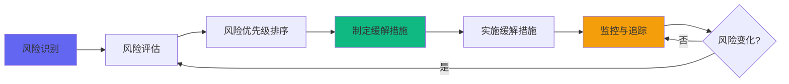

# 第七章：风险与缓解措施 (Risks & Mitigations)**

---

## **7.1 风险管理框架 (Risk Management Framework)**

### **7.1.1 风险评估方法论**

**风险评分公式：**

```
风险分数 = 可能性 (Probability) × 影响程度 (Impact)

可能性评级：
- 低 (Low):     10-30%   → 1分
- 中 (Medium):  31-60%   → 2分
- 高 (High):    61-100%  → 3分

影响程度评级：
- 低 (Low):     对项目影响轻微，可忽略   → 1分
- 中 (Medium):  影响部分功能或延期<2周   → 2分
- 高 (High):    严重影响核心功能或延期>2周 → 3分
- 极高 (Critical): 导致项目失败或重大损失 → 4分

风险等级矩阵：
┌─────────────────────────────────────┐
│ 影响程度                             │
│    4│     [中风险]  [高风险]  [极高风险] │
│    3│     [低风险]  [中风险]  [高风险]   │
│    2│     [低风险]  [低风险]  [中风险]   │
│    1│     [低风险]  [低风险]  [低风险]   │
│     └───────────────────────────────│
│         1         2         3        │
│              可能性                  │
└─────────────────────────────────────┘

风险等级处理策略：
- 极高风险（分数8-12）：立即制定详细应对计划，CEO级别关注
- 高风险（分数6-7）：  优先处理，周度review
- 中风险（分数3-5）：  纳入风险清单，月度review
- 低风险（分数1-2）：  监控即可，季度review
```

### **7.1.2 风险管理流程**



**风险管理角色：**

| 角色          | 职责                         | 频率       |
| ------------- | ---------------------------- | ---------- |
| **风险Owner** | 识别、评估、监控特定类别风险 | 持续       |
| **产品经理**  | 产品/用户风险的Owner         | 每周review |
| **技术Lead**  | 技术风险的Owner              | 每周review |
| **项目经理**  | 整体风险协调，主持风险会议   | 每周review |
| **CEO**       | 极高风险的最终决策人         | 重大风险时 |

---

## **7.2 技术风险 (Technical Risks)**

### **7.2.1 第三方AI服务依赖风险**

**风险描述：**

```
依赖第三方AI服务（ASR、OCR、LLM），如果服务不稳定、
性能下降或成本突然上涨，将严重影响产品核心功能。
```

| 维度         | 评估                 | 说明                   |
| ------------ | -------------------- | ---------------------- |
| **可能性**   | 🟡 中 (2分)           | 第三方服务偶尔会有波动 |
| **影响程度** | 🔴 极高 (4分)         | 核心功能完全依赖AI服务 |
| **风险等级** | 🔴 **极高风险 (8分)** | 需立即应对             |

**缓解措施：**

**措施1：多服务商备份策略**

```yaml
主服务商：
  ASR: 阿里云
  OCR: 百度
  LLM: 智谱GLM-4

备用服务商（配置好但不启用）：
  ASR: 腾讯云
  OCR: 腾讯云
  LLM: 文心一言

切换机制：
  - 自动检测：主服务商失败率>5%持续5分钟
  - 自动切换：30秒内切换到备用服务商
  - 通知机制：立即通知技术团队
  - 切换演练：每月进行一次切换演练

负责人：技术Lead
完成时间：Week 5（Alpha发布前）
```

**措施2：降级策略**

```python
# AI服务降级策略代码示例
class AIServiceFallback:
    
    async def create_node_with_fallback(self, raw_input):
        """带降级的节点创建"""
        
        # 尝试1：调用主AI服务
        try:
            result = await primary_ai_service.process(raw_input)
            return result
        except AIServiceError as e:
            logger.warning(f"Primary AI service failed: {e}")
        
        # 尝试2：调用备用AI服务
        try:
            result = await backup_ai_service.process(raw_input)
            return result
        except AIServiceError as e:
            logger.error(f"Backup AI service also failed: {e}")
        
        # 尝试3：降级到简单处理
        return self.fallback_simple_process(raw_input)
    
    def fallback_simple_process(self, raw_input):
        """最简单的降级处理（不依赖AI）"""
        return {
            'title': raw_input['text'][:30] + '...',  # 前30字作为标题
            'content': raw_input['text'],              # 原文作为内容
            'tags': self.extract_simple_keywords(raw_input['text']),
            'is_ai_processed': False  # 标记为降级处理
        }
```

**措施3：成本监控与预算告警**

```yaml
监控指标：
  - 单日AI成本
  - 单用户AI成本
  - 各服务商成本占比

告警阈值：
  - 单日成本 > ¥500 → 邮件通知
  - 单日成本 > ¥1000 → 电话通知 + 暂停非核心AI调用
  - 单用户成本 > ¥5/月 → 周度review

应对措施：
  1. 优化Prompt（减少Token消耗）
  2. 增加缓存（减少重复调用）
  3. 调整服务商（选择性价比更高的）
  4. 临时限流（保护预算）

负责人：技术Lead + 产品经理
监控频率：每日
```

**措施4：合同保障**

```
与主要服务商签订SLA协议，明确：
- 服务可用性承诺（≥99.5%）
- 价格保护条款（6个月内不涨价）
- 优先技术支持
- 故障赔偿机制

负责人：CEO + 采购
完成时间：Week 4
```

---

### **7.2.2 向量数据库性能瓶颈风险**

**风险描述：**

```
V1.1计划引入向量检索版"思想共鸣"，向量数据库在高并发
读写下可能出现性能瓶颈，导致关联计算缓慢或失败。
```

| 维度         | 评估               | 说明                                   |
| ------------ | ------------------ | -------------------------------------- |
| **可能性**   | 🟡 中 (2分)         | 用户量<1000时概率较低，但需提前准备    |
| **影响程度** | 🟡 中 (2分)         | 仅影响"思想共鸣"功能，核心流程不受影响 |
| **风险等级** | 🟡 **中风险 (4分)** | 需关注                                 |

**缓解措施：**

**措施1：采用成熟的云服务**

```
V1.0阶段：不使用向量数据库（降低复杂度）
V1.1阶段：使用云向量数据库服务

推荐方案（按优先级）：
1. 阿里云DashVector（国内，延迟低）
2. Pinecone（功能强，但海外服务）
3. Milvus（开源，但需自维护）

选择标准：
- 支持毫秒级查询（P95 < 100ms）
- 支持百万级向量
- 自动扩缩容
- 有成功案例

负责人：技术Lead
决策时间：V1.1规划时（Week 20）
```

**措施2：性能测试与压力测试**

```yaml
测试计划：
  阶段1：功能测试
    - 向量维度：768维（常见Embedding模型）
    - 数据量：10万条向量
    - 查询类型：Top-K近邻搜索 (K=5)
    - 通过标准：P95 < 200ms
  
  阶段2：性能测试
    - 数据量：50万条向量（预估1年后规模）
    - 并发：50 QPS
    - 通过标准：P95 < 500ms
  
  阶段3：压力测试
    - 数据量：100万条向量
    - 并发：100 QPS（峰值）
    - 观察：性能拐点、错误率

如果测试不通过：
- Plan A：优化索引参数
- Plan B：增加缓存层（热点向量缓存）
- Plan C：延后V1.1发布，继续使用关键词匹配

负责人：技术Lead + 后端开发
完成时间：V1.1开发阶段
```

**措施3：降级策略**

```python
# 向量检索降级策略
class ResonanceService:
    
    async def find_resonances(self, node_id):
        """查找思想共鸣（带降级）"""
        
        # 优先使用向量检索（V1.1）
        if self.vector_db_available:
            try:
                return await self.vector_search(node_id)
            except VectorDBError:
                logger.warning("Vector DB failed, fallback to keyword")
                self.vector_db_available = False  # 临时禁用
        
        # 降级到关键词匹配（V1.0）
        return await self.keyword_search(node_id)
```

---

### **7.2.3 数据库扩展性风险**

**风险描述：**

```
随着用户和节点数量增长，数据库查询性能可能下降，
特别是复杂的Cohort留存分析和全局搜索。
```

| 维度         | 评估               | 说明                   |
| ------------ | ------------------ | ---------------------- |
| **可能性**   | 🟡 中 (2分)         | MAU > 5000时可能出现   |
| **影响程度** | 🟡 中 (3分)         | 影响用户体验和数据分析 |
| **风险等级** | 🟡 **中风险 (6分)** | 需提前规划             |

**缓解措施：**

**措施1：数据库优化（短期）**

```sql
-- 1. 添加必要索引（Week 3完成）
CREATE INDEX idx_nodes_user_created ON nodes(user_id, created_at DESC);
CREATE INDEX idx_nodes_next_review ON nodes(user_id, (memory_stats->>'next_review_date'));
CREATE INDEX idx_review_logs_user_date ON review_logs(user_id, reviewed_at DESC);

-- 2. 分区表（当单表>100万记录时）
CREATE TABLE review_logs (
    id UUID PRIMARY KEY,
    user_id UUID,
    reviewed_at TIMESTAMP,
    ...
) PARTITION BY RANGE (reviewed_at);

CREATE TABLE review_logs_2025_q4 PARTITION OF review_logs
    FOR VALUES FROM ('2025-10-01') TO ('2026-01-01');

-- 3. 定期vacuum和analyze（每周执行）
VACUUM ANALYZE nodes;
VACUUM ANALYZE review_logs;
```

**措施2：读写分离（中期，MAU > 3000时）**

```yaml
架构升级：
  主库（Master）：
    - 处理所有写操作
    - 处理实时性要求高的读操作
  
  从库（Slave 1-2个）：
    - 处理复杂查询（如Cohort分析）
    - 处理非实时读操作（如数据报表）
    - 主从延迟 < 1秒

实施步骤：
  1. Week 20：配置主从复制
  2. Week 21：改造应用层（读写路由）
  3. Week 22：灰度切换（10% → 50% → 100%）

成本：¥3000/月（额外1个从库）
负责人：技术Lead
```

**措施3：数据归档（长期）**

```
归档策略：
  - 归档对象：1年前的历史数据
  - 归档频率：每季度一次
  - 归档存储：低成本对象存储
  - 查询接口：保留查询历史数据的API

实施时间：V2.0阶段
```

---

### **7.2.4 小程序包体积超限风险**

**风险描述：**

```
微信小程序主包大小限制2MB，分包总大小限制20MB。
如果资源文件过多（图片、字体、库），可能超限导致无法发布。
```

| 维度         | 评估               | 说明                 |
| ------------ | ------------------ | -------------------- |
| **可能性**   | 🟢 低 (1分)         | 可通过工程化手段控制 |
| **影响程度** | 🟡 中 (3分)         | 影响功能迭代速度     |
| **风险等级** | 🟢 **低风险 (3分)** | 预防性措施           |

**缓解措施：**

**措施1：资源优化**

```yaml
图片优化：
  - 格式：优先使用WebP（比PNG小30-50%）
  - 压缩：TinyPNG压缩所有图片
  - CDN：大图片放CDN，不打包到小程序
  - 按需加载：非首屏图片懒加载

代码优化：
  - Tree Shaking：移除未使用的代码
  - 代码分割：按页面分包
  - 压缩混淆：UglifyJS + Terser

第三方库：
  - 评估必要性：每引入一个库都评估是否必须
  - 按需引入：如lodash只引入使用的函数
  - 自定义编译：移除库的无用功能

目标：
  - 主包 < 1.5MB（预留500KB缓冲）
  - 分包 < 10MB（预留50%缓冲）

负责人：前端Lead
检查频率：每次发布前
```

**措施2：监控与告警**

```javascript
// 构建脚本中的包体积检查
const checkPackageSize = () => {
  const mainPackageSize = getMainPackageSize();
  const subPackageSize = getSubPackageSize();
  
  if (mainPackageSize > 1.5 * 1024 * 1024) {  // 1.5MB
    console.error(`❌ 主包体积超限：${(mainPackageSize / 1024 / 1024).toFixed(2)}MB`);
    process.exit(1);
  }
  
  if (subPackageSize > 10 * 1024 * 1024) {  // 10MB
    console.error(`❌ 分包体积超限：${(subPackageSize / 1024 / 1024).toFixed(2)}MB`);
    process.exit(1);
  }
  
  console.log(`✅ 包体积检查通过：主包 ${(mainPackageSize / 1024 / 1024).toFixed(2)}MB，分包 ${(subPackageSize / 1024 / 1024).toFixed(2)}MB`);
};

// 集成到CI/CD流程
```

---

## **7.3 产品与用户风险 (Product & User Risks)**

### **7.3.1 核心留存率不达标风险**

**风险描述：**

```
MVP的成败关键指标是30日留存率。如果Beta测试阶段
30日留存率 < 8%，说明产品未找到PMF，需重大调整。
```

| 维度         | 评估                 | 说明                          |
| ------------ | -------------------- | ----------------------------- |
| **可能性**   | 🟡 中 (2分)           | 新产品找到PMF本身就有不确定性 |
| **影响程度** | 🔴 极高 (4分)         | 直接决定项目生死              |
| **风险等级** | 🔴 **极高风险 (8分)** | CEO级别关注                   |

**预警指标：**

```
Day 1留存率 < 30%   → 🟡 黄色预警（需关注）
Day 3留存率 < 20%   → 🟠 橙色预警（需行动）
Day 7留存率 < 15%   → 🔴 红色预警（需紧急干预）
Day 14留存率 < 10%  → 🔴 红色预警（预测30日留存率不达标）
```

**缓解措施：**

**措施1：深度用户研究（Alpha/Beta持续）**

```yaml
访谈计划：
  Alpha阶段：
    - 高活用户访谈：10人
    - 流失用户访谈：5人
    - 频率：每周2-3场
  
  Beta阶段：
    - 高活用户访谈：20人
    - 普通用户访谈：10人
    - 流失用户访谈：10人
    - 频率：每周5场

核心问题：
  1. 你为什么选择使用Weave？（动机）
  2. Weave解决了你的什么问题？（价值）
  3. 你为什么不再使用Weave？（流失原因）
  4. 与其他工具相比，Weave的优势/劣势是什么？（差异化）
  5. 你愿意为Weave付费吗？多少？（付费意愿）

输出：
  - 每周用户洞察报告
  - 优化建议清单（优先级排序）
  - 核心痛点识别

负责人：产品经理
```

**措施2：快速A/B测试迭代**

```yaml
Beta期间至少进行3个A/B测试：

测试1：Onboarding优化
  - 假设：示例包能提升Day 1留存率5%+
  - 周期：2周
  - 样本：200人/组

测试2：复习推送优化
  - 假设：个性化推送时间能提升复习完成率10%+
  - 周期：2周
  - 样本：150人/组

测试3："思想共鸣"展示优化
  - 假设：主动弹窗比被动展示，点击率提升20%+
  - 周期：2周
  - 样本：200人/组

快速决策：
  - 测试结果显著（p < 0.05）→ 全量推广
  - 测试结果不显著 → 继续优化或放弃
  - 测试结果负向 → 立即停止

负责人：产品经理 + 数据分析师
```

**措施3：分层分析，识别"啊哈时刻"**

```python
# 数据分析：找到高留存用户的共同特征
def analyze_aha_moment():
    """
    分析高留存用户的"啊哈时刻"
    """
    # 1. 定义高留存用户（30日留存）
    high_retention_users = get_users_with_30d_retention()
    
    # 2. 分析他们的行为特征
    features = [
        'first_node_create_time',       # 首次创建节点时间（注册后多久）
        'nodes_created_in_first_week',  # 首周创建节点数
        'first_review_time',            # 首次复习时间
        'resonance_clicked_count',      # 点击"思想共鸣"次数
        'voice_input_ratio',            # 语音输入占比
    ]
    
    # 3. 与低留存用户对比
    low_retention_users = get_users_with_churn()
    
    # 4. 识别显著差异特征
    significant_features = statistical_analysis(
        high_retention_users,
        low_retention_users,
        features
    )
    
    # 5. 输出"啊哈时刻"假设
    return significant_features

# 示例输出：
# "啊哈时刻"可能是：
# - 用户在首日创建3个以上节点
# - 用户在首周完成至少1次复习
# - 用户点击了"思想共鸣"并查看关联节点
```

**措施4：应急优化路线图**

```
如果Week 12时预测30日留存率 < 8%：

紧急行动（Week 12-14）：
  Day 1-2：
    - 召开紧急产品会议
    - 分析用户反馈和数据
    - 确定Top 3优化方向
  
  Day 3-7：
    - 快速原型设计
    - 小范围灰度测试（50人）
    - 收集反馈并快速迭代
  
  Day 8-14：
    - 全量发布优化版本
    - 密切监控留存率变化
    - 准备Go/No-Go决策

Go/No-Go决策点（Week 14末）：
  ✅ Go：优化后留存率≥8% → 继续V1.0发布
  🔄 Pivot：留存率6-8% → 调整产品方向，延期2周
  ❌ No-Go：留存率<6% → 暂停发布，深度复盘

负责人：产品负责人 + CEO
```

---

### **7.3.2 AI内容质量不达标风险**

**风险描述：**

```
用户对AI生成内容（精炼后的节点、思想共鸣的解释）
不满意，好评率 < 85%，导致信任度下降和流失。
```

| 维度         | 评估               | 说明                  |
| ------------ | ------------------ | --------------------- |
| **可能性**   | 🟡 中 (2分)         | LLM效果依赖Prompt工程 |
| **影响程度** | 🔴 高 (3分)         | 直接影响核心价值感知  |
| **风险等级** | 🟠 **高风险 (6分)** | 需优先处理            |

**缓解措施：**

**措施1：Prompt工程持续优化**

```yaml
阶段1：Alpha前（Week 4-6）
  - 准备100条真实语音样本
  - 测试至少5个版本的Prompt
  - 人工评估质量（好/中/差）
  - 选择最佳Prompt作为V1.0基线

阶段2：Alpha期间（Week 7-8）
  - 收集用户反馈（👍/👎）
  - 分析差评Case
  - 每周迭代1次Prompt
  - 监控好评率变化

阶段3：Beta期间（Week 10-14）
  - 建立Bad Case库（差评内容）
  - 每周分析Top 10 Bad Case
  - 针对性优化Prompt
  - A/B测试新旧Prompt

目标：
  - Alpha结束时好评率 ≥ 80%
  - Beta结束时好评率 ≥ 85%

负责人：算法工程师Lead + 产品经理
```

**措施2：建立反馈闭环**

```python
# AI内容反馈系统
class AIFeedbackSystem:
    
    async def process_feedback(self, node_id, rating, user_id):
        """处理用户反馈"""
        
        # 1. 记录反馈
        await db.save_feedback({
            'node_id': node_id,
            'rating': rating,  # 'good' or 'bad'
            'user_id': user_id,
            'timestamp': datetime.now()
        })
        
        # 2. 如果是差评，标记为待分析
        if rating == 'bad':
            await self.flag_for_review(node_id)
        
        # 3. 更新统计
        await self.update_metrics(node_id, rating)
    
    async def flag_for_review(self, node_id):
        """标记差评内容供人工review"""
        
        node = await db.get_node(node_id)
        
        # 保存到Bad Case库
        await db.save_bad_case({
            'node_id': node_id,
            'raw_input': node.raw_input,
            'ai_output': {
                'title': node.title,
                'content': node.content,
                'tags': node.tags
            },
            'status': 'pending_review'
        })
        
        # 如果差评数累计到10条，发送告警
        bad_cases_count = await db.count_pending_bad_cases()
        if bad_cases_count >= 10:
            await send_alert_to_team(
                "AI质量告警：待分析Bad Case已达10条"
            )
    
    async def weekly_analysis(self):
        """每周分析报告"""
        
        # 统计本周数据
        stats = await db.get_weekly_ai_stats()
        
        # 生成报告
        report = f"""
        AI质量周报：
        
        好评率：{stats['good_rate']:.1%}
        差评率：{stats['bad_rate']:.1%}
        
        Top 5 差评Case：
        {format_bad_cases(stats['top_bad_cases'])}
        
        建议优化方向：
        {suggest_improvements(stats)}
        """
        
        # 发送给团队
        await send_email(report, to=['pm@weave.com', 'algo@weave.com'])
```

**措施3：多模型对比测试**

```yaml
如果主模型（智谱GLM-4）表现不佳，测试备选方案：

备选模型：
  1. OpenAI GPT-3.5-turbo（海外，合规风险）
  2. 文心一言（国内，成本较高）
  3. 通义千问（国内，阿里生态）

对比维度：
  - 精炼质量（人工评分）
  - 响应速度（P95延迟）
  - 成本（每1000次调用）
  - 稳定性（错误率）

决策矩阵：
  质量 > 稳定性 > 成本 > 速度

测试周期：Alpha期间（Week 7-8）
决策时间：Alpha结束前
```

**措施4：用户可编辑机制**

```
降低AI质量不佳的影响：

1. 明确提示AI生成内容可编辑
   "AI为你精炼了内容，你可以随时修改"

2. 一键恢复原始内容
   "不满意？点击查看并恢复原始内容"

3. 降低对AI的依赖感知
   - 不过度强调"AI"
   - 强调"辅助"而非"自动"

4. 建立合理预期
   - Onboarding时说明"AI理解有时会有偏差"
   - 鼓励用户反馈，帮助AI进步
```

---

### **7.3.3 用户习惯养成失败风险**

**风险描述：**

```
记忆复习需要用户养成习惯。如果用户无法坚持复习，
"记忆唤醒"功能失去价值，核心价值主张崩塌。
```

| 维度         | 评估               | 说明                   |
| ------------ | ------------------ | ---------------------- |
| **可能性**   | 🔴 高 (3分)         | 养成习惯本身就很难     |
| **影响程度** | 🔴 高 (3分)         | 影响北极星指标W.A.N.U. |
| **风险等级** | 🔴 **高风险 (9分)** | 极高优先级             |

**缓解措施：**

**措施1：降低复习门槛**

```yaml
策略1：简化复习流程
  - 闪卡模式：一目了然
  - 快速评分：3个按钮（忘记/模糊/掌握）
  - 无需输入：不要求用户输入答案
  - 时间可控：单次复习5-10分钟（5-10个节点）

策略2：推送时间优化
  - 默认时间：早上8:00（通勤时间）
  - 可自定义：用户可选择最佳时间
  - 智能推荐：基于用户历史打开时间推荐

策略3：降低推送频率
  - Alpha/Beta：每日推送（观察反馈）
  - 如果关闭率>30%：改为每2日推送
  - 最终：基于用户偏好个性化

负责人：产品经理
```

**措施2：激励机制设计**

```yaml
即时反馈：
  - 完成复习后：显示成就页面
    "太棒了！今日的记忆已被点亮 ✨"
  - 展示统计：今日复习X个，掌握Y个
  - 正向强化：使用积极文案和动画

长期激励：
  - Streak（连续天数）：
    "你已连续复习7天 🔥 继续保持！"
  - 里程碑：
    "恭喜！你已累计唤醒100个思想节点 🎉"
  - 可视化进步：
    "本周掌握率比上周提升15%，持续进步中！"

社交激励（V1.1考虑）：
  - 邀请好友一起复习
  - 复习排行榜
  - 徽章系统

负责人：产品经理 + UI/UX设计师
```

**措施3：推送策略优化**

```yaml
推送内容优化：
  ❌ 差："你有3个节点待复习"（生硬）
  ✅ 好："你的3个思想即将遗忘，花5分钟唤醒它们吧"（情感化）
  
  ❌ 差："点击复习"（功能性）
  ✅ 好："今日的智慧耳语已送达"（品牌化）

推送频率控制：
  - 监控关闭率：每周统计订阅消息关闭率
  - 告警阈值：关闭率 > 20%
  - 应对措施：
    1. 分析关闭用户特征
    2. A/B测试不同推送频率（每日 vs 隔日）
    3. 提供"暂停3天"选项（而非完全关闭）

推送时间个性化（V1.1）：
  - 收集数据：用户过去打开小程序的时间分布
  - 智能推荐："根据你的使用习惯，建议在晚上8点推送"
  - 用户确认：让用户选择是否接受推荐

负责人：产品经理 + 数据分析师
```

**措施4：应急降级方案**

```
如果Beta期间复习完成率 < 20%：

调查方向：
  1. 是推送时间不对？
  2. 是复习流程太复杂？
  3. 是节点内容质量差？
  4. 是用户根本不需要复习功能？

快速测试：
  - 测试1：不同推送时间（早/中/晚）
  - 测试2：简化复习流程（减少步骤）
  - 测试3：增加激励（完成复习送积分/徽章）

如果仍然 < 20%：
  - 重新评估"记忆复习"的必要性
  - 考虑将其作为可选功能（而非核心功能）
  - 调整产品定位（弱化"记忆管理"，强化"知识连接"）
```

---

## **7.4 成本与商业风险 (Cost & Business Risks)**

### **7.4.1 AI成本失控风险**

**风险描述：**

```
单用户AI成本超出预算（>¥4/月），导致MVP阶段
资金消耗过快，影响后续迭代或融资。
```

| 维度         | 评估               | 说明                     |
| ------------ | ------------------ | ------------------------ |
| **可能性**   | 🟡 中 (2分)         | 取决于用户行为和优化效果 |
| **影响程度** | 🔴 高 (3分)         | 直接影响项目财务健康     |
| **风险等级** | 🟠 **高风险 (6分)** | CEO级别关注              |

**详细分析见第九章《AI成本模型》**

**缓解措施：**

**措施1：成本实时监控与告警**

```yaml
监控维度：
  - 单日总成本
  - 单用户平均成本
  - 各AI服务成本占比
  - 异常用户识别（成本是平均值3倍以上）

告警机制：
  级别1（黄色）：单日成本 > ¥500
    - 通知：邮件通知产品经理和技术Lead
    - 行动：分析成本构成，识别异常

  级别2（橙色）：单日成本 > ¥1000
    - 通知：电话通知 + 微信群
    - 行动：立即review是否有Bug导致重复调用

  级别3（红色）：单日成本 > ¥2000 或 单用户成本 > ¥10
    - 通知：CEO + 全体核心团队
    - 行动：紧急启动降级策略，暂停非核心AI功能

仪表盘：
  - Grafana实时成本大盘
  - 每日成本趋势图
  - 成本预测曲线（基于当前趋势）

负责人：技术Lead + 财务
```

**措施2：成本优化技术手段**

```python
# 1. 缓存策略
class CacheStrategy:
    """AI调用缓存，减少重复调用"""
    
    async def get_ai_result_with_cache(self, input_text):
        """带缓存的AI调用"""
        
        # 计算输入的hash
        cache_key = hashlib.md5(input_text.encode()).hexdigest()
        
        # 尝试从缓存获取
        cached = await redis.get(f"ai_result:{cache_key}")
        if cached:
            logger.info("Cache hit, saved AI cost")
            return json.loads(cached)
        
        # 缓存未命中，调用AI
        result = await ai_service.process(input_text)
        
        # 写入缓存（24小时过期）
        await redis.setex(
            f"ai_result:{cache_key}",
            86400,
            json.dumps(result)
        )
        
        return result

# 2. Prompt优化（减少Token消耗）
OPTIMIZED_PROMPT = """
精炼以下内容：
{raw_text}

要求：
1. 标题≤20字
2. 内容≤200字
3. 标签≤3个

输出JSON格式。
"""
# vs. 原Prompt（冗长的说明，消耗更多Token）

# 3. 批量处理
async def batch_process_embeddings(nodes):
    """批量生成Embedding（降低API调用次数）"""
    texts = [node.content for node in nodes]
    embeddings = await embedding_service.batch_embed(texts)  # 一次调用
    return embeddings
```

**措施3：用户行为引导**

```yaml
限制策略（保护成本）：
  - 单用户每日最多创建20个节点（超过提示"休息一下"）
  - 单条语音最长60秒（超过自动截断）
  - 单张图片最大5MB（超过压缩或拒绝）

但注意：
  - 不要影响核心用户体验
  - 限制要温和提示，不要强硬
  - 可以对高价值用户放宽限制

负责人：产品经理
```

**措施4：预算管理**

```yaml
MVP阶段预算分配（共¥50万）：

AI成本预算：¥15万（30%）
  - Alpha（2周，100用户）：¥2,000
  - Beta（5周，500用户）：¥30,000
  - V1.0（3个月，1000用户）：¥120,000
  
  预算监控：
    - 每周对比实际成本 vs 预算
    - 超预算10%：黄色预警
    - 超预算20%：启动成本优化
    - 超预算30%：暂停新功能，削减成本

应急储备：¥5万（10%）
  - 用于应对突发情况（如价格上涨）

负责人：CEO + 财务
```

---

### **7.4.2 商业模式不清晰风险**

**风险描述：**

```
MVP阶段不收费，如果后续无法找到可行的商业模式，
项目长期可持续性存疑，影响融资和团队信心。
```

| 维度         | 评估               | 说明                         |
| ------------ | ------------------ | ---------------------------- |
| **可能性**   | 🟡 中 (2分)         | 工具类产品付费转化本身有挑战 |
| **影响程度** | 🟡 中 (3分)         | 不影响MVP，但影响长期发展    |
| **风险等级** | 🟡 **中风险 (6分)** | 需提前规划                   |

**缓解措施：**

**措施1：付费意愿测试（Beta期间）**

```yaml
调研方法：
  1. 用户访谈时询问：
     "如果Weave未来收费，你愿意付费吗？多少钱？"
     
  2. 问卷调查（发送给高活用户）：
     - 愿意付费吗？（是/否）
     - 可接受的价格？（¥9.9/月, ¥19.9/月, ¥29.9/月, ¥99/年）
     - 最看重的功能？（排序）
  
  3. 价格测试（A/B Test）：
     - 在App内展示"即将推出会员版"
     - 测试不同价格的点击率
     - 不实际收费，仅测试意愿

目标样本：至少100名高活用户

分析维度：
  - 付费意愿率
  - 价格敏感度
  - 必备功能 vs Nice-to-have功能

输出：V1.2付费方案草案

负责人：产品经理 + 运营
```

**措施2：商业模式备选方案**

```yaml
方案A：Freemium模式（推荐）
  免费版：
    - 每月最多100个节点
    - 基础AI功能
    - 有广告（非干扰性）
  
  付费版（¥19.9/月或¥199/年）：
    - 无限节点
    - 高级AI功能（实时ASR、向量检索共鸣）
    - 无广告
    - 优先客服
    - 数据导出
  
  转化率预期：3-5%
  ARPU预期：¥0.6-1.0/月（包含免费用户）

方案B：按量计费模式
  - 基础功能免费
  - AI增值服务按次收费（如"深度分析"¥1/次）
  - 适合低频用户
  
  转化率预期：10-15%
  ARPU预期：¥0.5-0.8/月

方案C：B端企业版（长期）
  - 团队版：¥99/人/月
  - 企业级功能：知识库共享、权限管理、数据安全
  - 目标客户：咨询公司、培训机构

决策时间：V1.1规划时（Week 20）
决策依据：Beta期间的付费意愿调研
```

**措施3：降低对付费的依赖**

```yaml
多元化收入（V2.0考虑）：

1. 广告收入：
   - 在免费版中植入非干扰性广告
   - 如知识付费课程推荐、工具类产品推广
   - 预估：¥0.2-0.5/用户/月

2. 数据服务（匿名化）：
   - 向教育机构、研究机构提供匿名化的学习行为数据
   - 严格合规，用户授权
   - 预估：¥10万/年

3. API服务：
   - 将AI能力开放为API（如"智能精炼API"）
   - 目标客户：其他笔记工具、内容平台
   - 预估：¥5万/年

原则：
  - 用户价值优先，不为变现损害体验
  - 合规第一，绝不出售用户隐私
```

---

## **7.5 合规与法律风险 (Compliance & Legal Risks)**

**详细内容见第十章《数据隐私与合规规范》**

### **7.5.1 用户隐私数据泄露风险**

| 维度         | 评估               | 说明                 |
| ------------ | ------------------ | -------------------- |
| **可能性**   | 🟢 低 (1分)         | 采取了充分的安全措施 |
| **影响程度** | 🔴 极高 (4分)       | 法律责任、品牌损毁   |
| **风险等级** | 🟡 **中风险 (4分)** | 零容忍，需持续监控   |

**缓解措施：**

- 数据传输加密（HTTPS/TLS 1.2+）
- 数据存储加密（AES-256）
- 严格的权限控制（用户数据隔离）
- 定期安全审计（每季度一次）
- 应急响应预案（见第六章6.5.4）

**负责人：** 技术Lead + 信息安全专家

---

### **7.5.2 AI生成内容合规风险**

**风险描述：**

```
LLM生成的内容可能包含：
1. 违法违规内容（政治敏感、色情暴力）
2. 侵权内容（抄袭他人作品）
3. 误导性信息（虚假医疗建议等）
```

| 维度         | 评估               | 说明                      |
| ------------ | ------------------ | ------------------------- |
| **可能性**   | 🟡 中 (2分)         | LLM有一定概率生成不当内容 |
| **影响程度** | 🔴 高 (3分)         | 可能被监管部门约谈或下架  |
| **风险等级** | 🟠 **高风险 (6分)** | 需主动防范                |

**缓解措施：**

**措施1：内容审核机制**

```python
class ContentModeration:
    """AI内容审核"""
    
    async def moderate_ai_content(self, content):
        """
        审核AI生成的内容
        """
        # 1. 敏感词过滤（本地）
        if self.contains_sensitive_words(content):
            logger.warning("Content contains sensitive words")
            return {
                'pass': False,
                'reason': 'sensitive_words'
            }
        
        # 2. 调用第三方内容审核API（如阿里云、腾讯云）
        moderation_result = await content_security_api.check(content)
        
        if not moderation_result['pass']:
            logger.error(f"Content moderation failed: {moderation_result}")
            return {
                'pass': False,
                'reason': moderation_result['label']  # 如'politics', 'porn'
            }
        
        # 3. 通过审核
        return {'pass': True}
    
    def contains_sensitive_words(self, content):
        """本地敏感词检测（快速初筛）"""
        sensitive_words = load_sensitive_words_dict()
        for word in sensitive_words:
            if word in content:
                return True
        return False

# 在节点创建流程中集成
async def create_node_with_moderation(raw_input):
    # AI处理
    ai_result = await llm_service.refine(raw_input)
    
    # 内容审核
    moderation = await ContentModeration().moderate_ai_content(
        ai_result['content']
    )
    
    if not moderation['pass']:
        # 审核不通过，降级处理
        logger.warning(f"AI content moderation failed, using fallback")
        return create_fallback_node(raw_input)
    
    # 审核通过，正常创建
    return create_node(ai_result)
```

**措施2：用户协议与免责声明**

```yaml
在用户协议中明确：

1. AI生成内容的性质：
   "Weave使用AI技术为你精炼内容，AI生成的内容仅供参考，
   我们不对其准确性、完整性、适用性做任何保证。"

2. 用户责任：
   "你应自行判断AI生成内容的准确性，并对使用AI生成内容
   产生的后果承担责任。"

3. 禁止用途：
   "禁止将Weave用于生成违法违规内容，包括但不限于：
   政治敏感、色情暴力、侵犯他人权益等。"

4. 平台权利：
   "我们有权对疑似违规内容进行审核、删除，
   并有权暂停或终止违规用户的账号。"

负责人：法务 + 产品经理
完成时间：Alpha发布前
```

**措施3：人工抽查机制**

```yaml
抽查频率：
  - Alpha阶段：每日抽查20条AI生成内容
  - Beta阶段：每周抽查100条
  - V1.0：每周抽查200条

抽查方式：
  - 随机抽样
  - 重点抽查：用户举报的内容、系统标记为高风险的内容

抽查指标：
  - 违规内容比例
  - 内容质量（准确性、相关性）
  - 误报率（正常内容被误判）

发现违规后：
  1. 立即删除违规内容
  2. 分析原因（是LLM问题还是用户输入问题）
  3. 优化Prompt或审核规则
  4. 严重情况报告监管部门

负责人：运营 + 算法工程师
```

---

## **7.6 运营风险 (Operational Risks)**

### **7.6.1 用户增长停滞风险**

**风险描述：**

```
Beta/V1.0发布后，用户增长缓慢或停滞，
无法达到DAU目标，影响后续融资和团队士气。
```

| 维度         | 评估               | 说明                      |
| ------------ | ------------------ | ------------------------- |
| **可能性**   | 🟡 中 (2分)         | 取决于产品质量和渠道策略  |
| **影响程度** | 🟡 中 (2分)         | 不影响MVP验证，但影响士气 |
| **风险等级** | 🟡 **中风险 (4分)** | 需关注                    |

**缓解措施：**

**措施1：多渠道获客策略**

```yaml
有机增长渠道（低成本）：
  1. 产品内推荐机制：
     - "邀请好友，双方各得7天会员"
     - 邀请链接分享（微信、朋友圈）
     - 目标：K因子 > 0.3
  
  2. SEO优化：
     - 官网优化（关键词：AI笔记、知识管理、记忆复习）
     - 知乎/百度知道回答（长尾流量）
     - 目标：自然搜索流量占比 > 20%
  
  3. 内容营销：
     - 撰写产品方法论文章（如"如何用AI管理知识"）
     - 发布在少数派、产品沉思录等平台
     - 目标：每月发布2篇高质量文章

付费增长渠道（控制成本）：
  1. 小红书/即刻投放：
     - 预算：¥10,000/月
     - CPA目标：< ¥20/激活用户
  
  2. KOL合作：
     - 寻找3-5个知识管理领域博主
     - 方式：免费试用 + 佣金分成
     - 目标：带来500+注册

决策机制：
  - 每周review各渠道ROI
  - ROI < 1的渠道立即暂停
  - ROI > 3的渠道加大投入

负责人：运营经理
```

**措施2：增长实验快速迭代**

```yaml
实验1：邀请奖励机制（Week 11-12）
  - 假设：物质奖励能提升邀请率
  - 对照组：无奖励
  - 实验组：邀请成功得7天会员
  - 指标：邀请转化率、K因子

实验2：落地页优化（Week 13-14）
  - 假设：视频演示比文字说明转化率高
  - 对照组：纯文字介绍
  - 实验组：30秒产品演示视频
  - 指标：注册转化率

实验3：社交分享优化（Week 15-16）
  - 假设：精美分享卡片能提升分享率
  - 对照组：纯文字分享
  - 实验组：自动生成知识卡片图
  - 指标：分享率、二次传播率

负责人：增长负责人（如有）或产品经理
```

**措施3：应急预案**

```
如果Week 16时DAU < 300（远低于预期500）：

分析原因：
  1. 是渠道投放不足？
  2. 是产品留存率差，导致增长乏力？
  3. 是市场竞争太激烈？

应对措施：
  - 短期：加大渠道投放（追加预算¥20,000）
  - 中期：优化产品核心功能（提升留存）
  - 长期：重新评估目标市场（是否Pivot）

决策点：
  - 如果投入¥50,000后DAU仍 < 500
  - 召开战略会议，评估是否调整方向
```

---

### **7.6.2 客服压力过大风险**

**风险描述：**

```
Beta/V1.0发布后用户量激增，如果客服响应不及时，
影响用户体验和口碑，大量差评导致负面传播。
```

| 维度         | 评估               | 说明                        |
| ------------ | ------------------ | --------------------------- |
| **可能性**   | 🟡 中 (2分)         | 取决于产品稳定性和FAQ完善度 |
| **影响程度** | 🟡 中 (2分)         | 影响用户体验，但可控        |
| **风险等级** | 🟡 **中风险 (4分)** | 需提前准备                  |

**缓解措施：**

**措施1：完善FAQ和帮助文档**

```yaml
FAQ涵盖（在Alpha期间整理）：

常见问题：
  1. 如何开始使用Weave？
  2. 语音输入没有反应怎么办？
  3. AI生成的内容不准确怎么办？
  4. 如何修改/删除节点？
  5. 如何导出我的数据？
  6. 为什么没有收到复习提醒？
  7. 如何邀请好友？

技术问题：
  1. 支持哪些设备和微信版本？
  2. 数据安全吗？会泄露吗？
  3. 占用手机存储空间大吗？

展示位置：
  - 小程序内"帮助中心"
  - 官网FAQ页面
  - 微信公众号菜单

目标：80%常见问题能通过FAQ解决

负责人：运营 + 产品经理
```

**措施2：智能客服系统**

```yaml
阶段1：FAQ机器人（Beta期间）
  - 用户输入问题，自动匹配FAQ
  - 如"语音输入没反应" → 推荐相关FAQ
  - 工具：微信客服API + 简单关键词匹配

阶段2：AI客服（V1.1考虑）
  - 基于LLM的智能客服
  - 能理解复杂问题并给出答案
  - 无法解决时转人工客服

人工客服：
  - Beta阶段：1名兼职客服（每天3小时）
  - V1.0：1名全职客服
  - 响应时间目标：<2小时（工作时间）

负责人：运营经理
```

**措施3：用户自助工具**

```yaml
工具1：问题诊断助手
  - 用户点击"遇到问题"
  - 系统自动检测：
    * 微信版本是否过低
    * 权限是否开启（麦克风、相机）
    * 网络是否正常
  - 给出具体解决方案

工具2：反馈收集
  - 设置页 - "反馈与建议"
  - 表单提交后自动创建工单
  - 客服优先处理高优工单

工具3：社区互助（V1.1）
  - 建立用户社群（微信群/论坛）
  - 鼓励用户互相帮助
  - 官方定期参与回答

负责人：运营经理
```

---

## **7.7 团队风险 (Team Risks)**

### **7.7.1 关键人员流失风险**

**风险描述：**

```
MVP阶段团队规模小，如果核心成员（技术Lead、产品经理）
离职，将严重影响项目进度甚至导致项目失败。
```

| 维度         | 评估               | 说明             |
| ------------ | ------------------ | ---------------- |
| **可能性**   | 🟢 低 (1分)         | 团队稳定性较好   |
| **影响程度** | 🔴 极高 (4分)       | 核心人员不可替代 |
| **风险等级** | 🟡 **中风险 (4分)** | 需关注团队氛围   |

**缓解措施：**

**措施1：激励机制**

```yaml
物质激励：
  - 合理薪酬：市场中位数以上
  - 项目奖金：
    * Alpha成功：¥5,000/人
    * Beta成功：¥10,000/人
    * V1.0成功：¥20,000/人
  - 股权激励：核心成员期权池

非物质激励：
  - 成长机会：学习预算（¥5,000/人/年）
  - 工作氛围：弹性工作、团建活动
  - 成就感：参与从0到1的产品创造

负责人：CEO + HR
```

**措施2：知识沉淀**

```yaml
文档化：
  - 技术文档：架构设计、关键代码注释
  - 产品文档：PRD、设计稿、决策记录
  - 运营文档：SOP、FAQ、客服话术

知识分享：
  - 每周技术分享会（30分钟）
  - 关键决策的会议纪要
  - 代码Review机制（互相了解）

目标：
  - 任何核心成员离开，1周内能有人接手

负责人：项目经理
```

**措施3：应急预案**

```yaml
如果核心成员突然离职：

Day 1-3：
  - 紧急评估影响范围
  - 工作交接（如果可能）
  - 启动招聘流程

Day 4-7：
  - 临时调配：其他成员临时接手
  - 降低工作强度：暂缓非核心功能

Day 8-30：
  - 完成招聘（内推+猎头）
  - 新人快速Onboarding
  - 逐步恢复正常节奏

极端情况：
  - 如果技术Lead离职且无法快速招到
  - 考虑延期发布或寻求外部技术支持
```

---

### **7.7.2 团队执行力不足风险**

**风险描述：**

```
18周时间线紧凑，如果团队执行力不足、沟通不畅，
可能导致延期发布或质量不达标。
```

| 维度         | 评估               | 说明                   |
| ------------ | ------------------ | ---------------------- |
| **可能性**   | 🟡 中 (2分)         | 新团队磨合需要时间     |
| **影响程度** | 🟡 中 (3分)         | 影响发布时间，但不致命 |
| **风险等级** | 🟡 **中风险 (6分)** | 需管理措施             |

**缓解措施：**

**措施1：敏捷开发流程**

```yaml
Sprint规划（2周一个Sprint）：
  Sprint 1-2：核心功能开发（US1-US3）
  Sprint 3：AI集成（US4-US6）
  Sprint 4：Alpha准备
  Sprint 5：Beta开发
  ...

每日站会（15分钟）：
  - 昨天做了什么
  - 今天计划做什么
  - 有什么阻碍

每周Review（1小时）：
  - Demo本周成果
  - 回顾本周问题
  - 规划下周工作

工具：
  - 项目管理：Jira/Trello
  - 沟通：飞书/钉钉
  - 代码管理：Git + Code Review

负责人：项目经理
```

**措施2：风险预警机制**

```yaml
延期预警：
  黄色预警：任务延期1天
    - 当天站会讨论
    - 评估是否需要支援

  橙色预警：任务延期3天
    - 立即重新评估优先级
    - 考虑砍功能或延期Sprint

  红色预警：里程碑延期1周
    - 紧急会议
    - 调整发布计划或增加资源

质量预警：
  - 单元测试覆盖率 < 80%
  - 严重Bug累计 > 5个
  - 性能测试不通过

负责人：项目经理 + 技术Lead
```

---

## **7.8 竞争风险 (Competitive Risks)**

### **7.8.1 竞品快速跟进风险**

**风险描述：**

```
知识管理赛道玩家众多（Notion、FlowUs、Obsidian等），
如果我们的创新点被快速模仿，差异化优势消失。
```

| 维度         | 评估               | 说明                   |
| ------------ | ------------------ | ---------------------- |
| **可能性**   | 🟡 中 (2分)         | AI功能易被模仿         |
| **影响程度** | 🟡 中 (2分)         | 影响竞争优势，但不致命 |
| **风险等级** | 🟡 **中风险 (4分)** | 需建立壁垒             |

**缓解措施：**

**措施1：建立产品壁垒**

```yaml
技术壁垒：
  - 深度优化的Prompt（难以复制）
  - 个性化记忆算法（需数据积累）
  - 用户行为数据（越用越聪明）

体验壁垒：
  - 极致的无感交互（需打磨细节）
  - 情感化设计（品牌认知）
  - 用户习惯（迁移成本）

数据壁垒（长期）：
  - 用户知识图谱（网络效应）
  - 用户复习数据（个性化优化）

时间窗口：
  - 快速迭代，保持领先6个月
  - 在竞品反应前建立用户规模
```

**措施2：差异化定位**

```yaml
避免正面竞争：
  - Notion：强调"结构化"和"协作"
    → 我们强调"无感记录"和"记忆管理"
  
  - Obsidian：强调"双向链接"和"本地优先"
    → 我们强调"AI原生"和"主动服务"
  
  - 传统笔记：强调"信息存储"
    → 我们强调"知识内化"

清晰的价值主张：
  "让记录像呼吸一样自然，让知识永不遗忘"
  → 聚焦"输入无感 + 记忆管理"两大核心
```

**措施3：快速迭代优势**

```yaml
迭代速度目标：
  - V1.0 → V1.1：1个月
  - V1.1 → V1.2：1个月
  - V1.2 → V2.0：3个月

对比大厂：
  - 大公司决策慢、流程长
  - 我们小团队，决策快、执行快
  - 争取时间窗口：领先6-12个月

负责人：产品负责人
```

---

## **7.9 风险监控与报告机制**

### **7.9.1 风险清单维护**

```yaml
风险登记表（Risk Register）：

字段：
  - 风险ID
  - 风险名称
  - 风险类别
  - 风险描述
  - 可能性
  - 影响程度
  - 风险等级
  - 缓解措施
  - 责任人
  - 当前状态（Open/Monitoring/Mitigated/Closed）
  - 最后更新时间

维护频率：
  - 周会：更新所有Open和Monitoring状态的风险
  - 月会：全面review所有风险

工具：
  - 使用Notion/飞书多维表格管理
  - 自动提醒责任人更新

负责人：项目经理
```

### **7.9.2 风险报告机制**

```yaml
每周风险报告：

发送对象：全体核心团队
发送时间：每周一上午

内容：
  1. 新识别风险（本周新增）
  2. 风险等级变化（上升/下降）
  3. 需要关注的Top 3风险
  4. 已缓解/关闭的风险
  5. 下周行动计划

模板示例：
  === Weave MVP 风险周报 Week 10 ===
  
  🔴 高风险（需立即行动）：
  - [RISK-003] AI成本超预算（单日成本¥1200，超预算20%）
    行动：已启动成本优化，预计下周降至¥1000以下
  
  🟡 中风险（需持续监控）：
  - [RISK-007] Day 7留存率17%（低于目标18%）
    行动：本周启动Onboarding优化A/B测试
  
  ✅ 本周关闭风险：
  - [RISK-012] 数据库慢查询（已优化索引，P95 < 100ms）
```

### **7.9.3 风险升级机制**

```yaml
升级规则：

级别1：Team Level（团队层面）
  - 风险等级：低、中
  - 处理人：责任人 + 项目经理
  - 汇报：周会

级别2：Management Level（管理层面）
  - 风险等级：高
  - 处理人：产品负责人 + 技术负责人
  - 汇报：周会 + 专题会议

级别3：Executive Level（高管层面）
  - 风险等级：极高
  - 处理人：CEO
  - 汇报：立即汇报 + 紧急会议

升级触发条件：
  - 风险等级上升
  - 缓解措施无效
  - 风险即将发生
  - 责任人判断需要升级

负责人：项目经理
```

