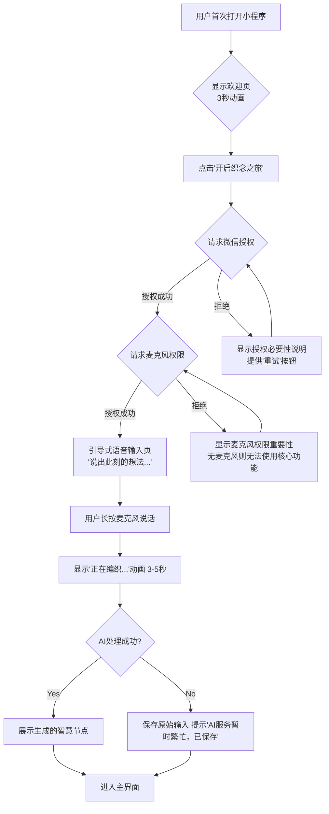
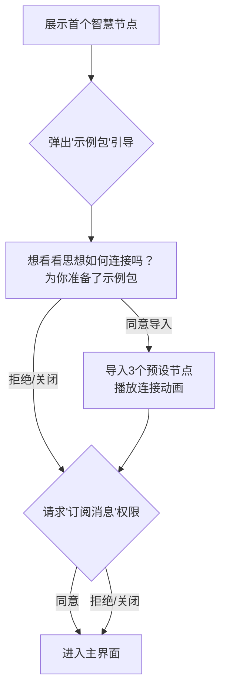
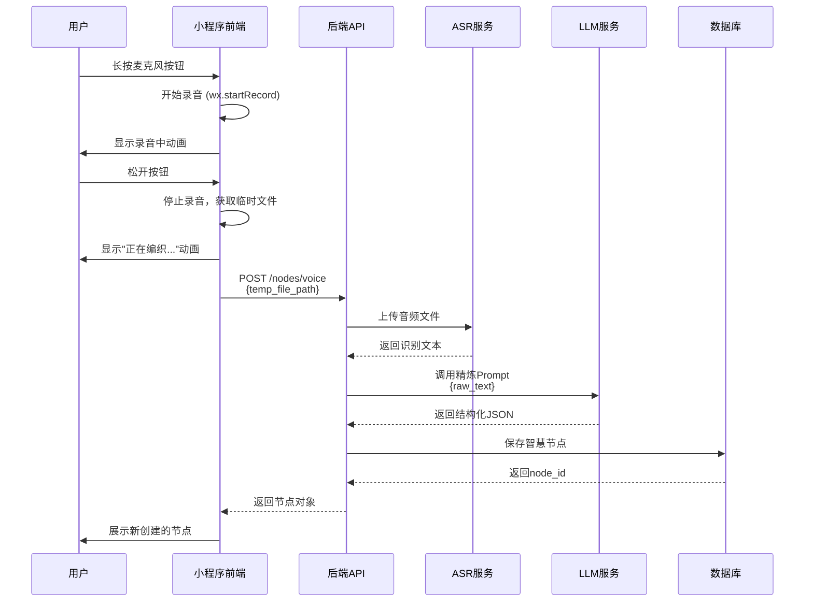
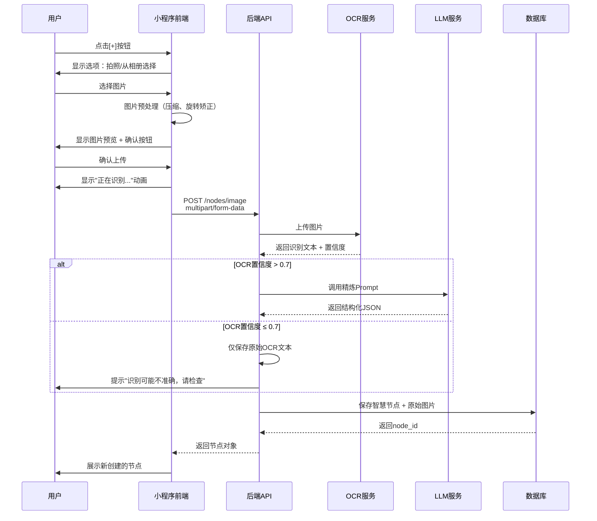
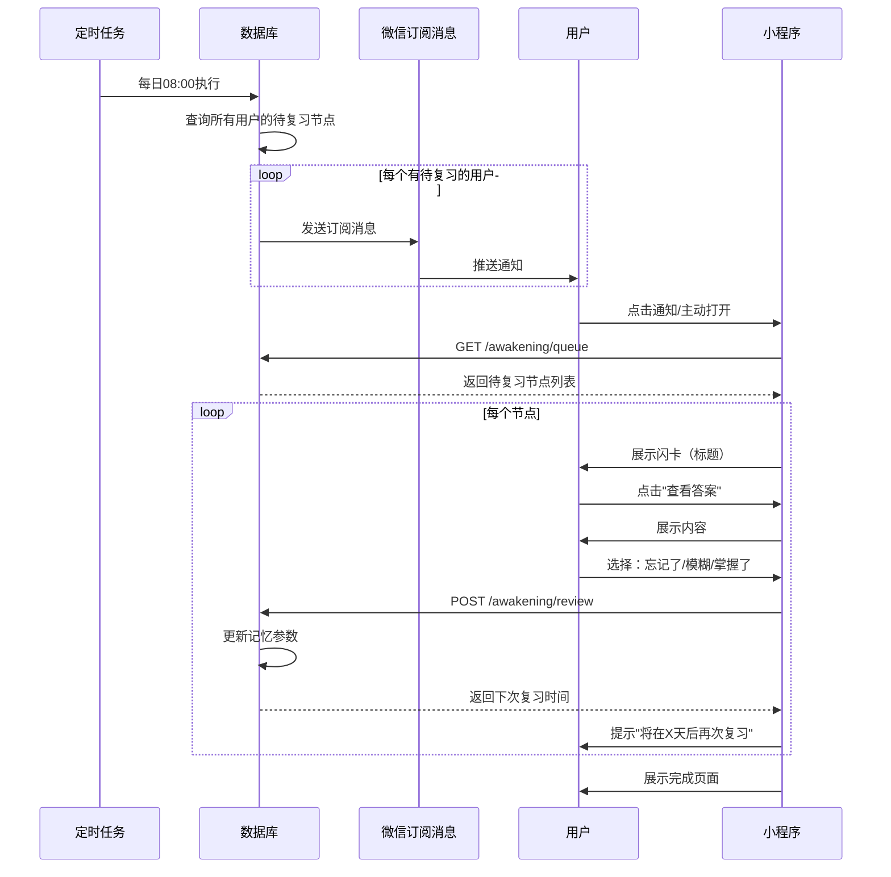

## 第三章：功能需求规格 (Functional Specifications)**

### **3.1 分阶段发布策略**

根据评审建议，V1.0将分为三个阶段发布，逐步验证核心假设：

| 阶段           | 时间      | 核心功能                | 验证目标                      | 用户规模   |
| -------------- | --------- | ----------------------- | ----------------------------- | ---------- |
| **Alpha内测**  | Week 7-8  | US1, US2, US6（简化版） | 验证"语音输入+复习"的核心闭环 | 50-100人   |
| **Beta公测**   | Week 9-14 | + US3, US4, US5, US7    | 验证完整体验与AI质量          | 500-1000人 |
| **V1.0正式版** | Week 15+  | 性能优化、Bug修复       | 达成KPI目标                   | 全量开放   |

---

### **3.2 US1: 新用户引导 - 播下第一颗思想的种子**

#### **3.2.1 功能目标**

**Alpha阶段目标：**

- 让用户在**60秒内**完成从打开小程序到创建首个节点的全流程
- 首次节点创建率 ≥ 50%
- 获取必要的系统权限（微信授权、麦克风）

**Beta阶段新增：**

- 通过"示例包"提前展示产品连接价值
- 获取"订阅消息"权限

---

#### **3.2.2 流程图 (Flowchart)**

**Alpha版本流程：**



**Beta版本新增流程：**



---

#### **3.2.3 界面与交互 (UI & UX)**

**欢迎页 (Welcome Screen):**

```
┌─────────────────────────────────┐
│                                 │
│         [动态星空背景]           │
│                                 │
│        ✨ Weave (织念)          │
│                                 │
│      编织思想，收获智慧          │
│                                 │
│    [开启我的织念之旅]  ← CTA按钮│
│         (发光效果)              │
│                                 │
└─────────────────────────────────┘

设计规范：
- 背景：深邃星空蓝 (#0A0F2C) + 缓慢移动的星云粒子
- 标题：白色 (#F0F0F0)，字号36px，PingFang SC Medium
- 副标题：月光白70%透明度，字号16px
- CTA按钮：灵感紫 (#A78BFA)，圆角16px，高度48px
- 动画：星云汇聚效果，3秒循环
```

**引导式语音输入页:**

```
┌─────────────────────────────────┐
│    [< 返回]              [跳过] │  ← 仅Alpha版显示
│                                 │
│                                 │
│   说出此刻的想法               │
│   播下第一颗思想的种子...       │
│                                 │
│                                 │
│         🎤                      │  ← 大麦克风图标
│      (长按说话)                 │     动态波纹效果
│                                 │
│                                 │
│  [实时转写文本显示区域]          │  ← Beta版新增
│                                 │
└─────────────────────────────────┘

交互规范：
- 长按麦克风：开始录音，图标变为红色脉冲
- 松开麦克风：结束录音，显示"正在编织..."
- 录音时长限制：最短2秒，最长60秒
- 超过50秒时：底部出现倒计时提示
```

**AI处理动画:**

```
视觉效果：
1. 文字碎片从四周飞入
2. 在中心汇聚成一个光点
3. 光点扩散形成节点卡片
4. 卡片逐渐清晰（内容渐显）

动画时长：3-5秒
文案：
- "正在编织思想..." (0-2秒)
- "正在发现连接..." (2-4秒，Beta版)
- "智慧节点已生成" (4-5秒)
```

**首个智慧节点展示:**

```
┌─────────────────────────────────┐
│  ✨ 你的第一个智慧节点            │
│                                 │
│  ┌───────────────────────────┐ │
│  │ 📌 [AI生成的标题]          │ │
│  │                           │ │
│  │ [AI精炼后的核心内容]       │ │
│  │ [最多显示3行，可展开]      │ │
│  │                           │ │
│  │ #标签1 #标签2             │ │
│  │                           │ │
│  │ [查看完整内容] →          │ │
│  └───────────────────────────┘ │
│                                 │
│  [继续创建]   [进入主界面]      │  ← Alpha版
│  [导入示例包]   [进入主界面]    │  ← Beta版
└─────────────────────────────────┘
```

**"示例包"弹窗 (Beta版):**

```
┌─────────────────────────────────┐
│  想看看思想是如何连接的吗？      │
│                                 │
│  我们为你准备了一个              │
│  《高效学习方法》示例包          │
│                                 │
│  包含3个精选知识节点：           │
│  • 费曼学习法                   │
│  • 间隔重复原理                 │
│  • 主动召回技巧                 │
│                                 │
│  它们之间已经建立了智慧连接      │
│                                 │
│  [好的，立即导入]               │  ← 主按钮
│  [不了，谢谢]                   │  ← 次级按钮
└─────────────────────────────────┘

设计规范：
- 模态弹窗，带20%透明度黑色遮罩
- 弹窗圆角24px，白色背景
- 主按钮：灵感紫填充
- 次级按钮：透明背景，灰色文字
```

---

#### **3.2.4 技术要求**

**Alpha阶段：**

- 前端需处理微信`wx.getUserProfile`和`wx.authorize`的完整逻辑
- 实现流畅的CSS/Lottie动画（欢迎页、AI处理动画）
- 录音管理器的正确使用与释放
- 异常处理：网络中断、AI服务超时、授权失败

**Beta阶段新增：**

- 后端准备固定的"示例包"数据（3个节点 + 2-3个预设关联）
- 示例包导入需为原子操作，确保数据一致性
- 订阅消息模板ID的配置与管理

**性能要求：**

- 欢迎页动画：60fps流畅度
- AI处理总耗时：P95 < 5秒
- 小程序包体积：< 2MB（分包加载）

---

#### **3.2.5 异常处理**

| 异常场景               | 处理策略                     | 用户提示                                              |
| ---------------------- | ---------------------------- | ----------------------------------------------------- |
| **用户拒绝微信授权**   | 阻断流程，显示授权必要性说明 | "Weave需要获取你的基本信息来保存你的思想，请允许授权" |
| **用户拒绝麦克风权限** | 阻断流程，引导去设置页开启   | "语音输入是Weave的核心功能，请在设置中开启麦克风权限" |
| **录音时长<2秒**       | 不发送请求，提示重新录入     | "说话时间太短啦，长按麦克风重新说一遍吧"              |
| **ASR服务失败**        | 保存空白节点，提示稍后重试   | "语音识别暂时出错，请稍后在节点中重新编辑"            |
| **LLM处理超时**        | 使用原始ASR文本创建节点      | "AI正在努力理解中...已为你保存原始内容"               |
| **网络完全断开**       | 本地缓存，待网络恢复自动上传 | "网络似乎断开了，内容已保存本地，联网后自动同步"      |

---

#### **3.2.6 数据埋点**

| 事件名称                    | 触发时机           | 关键参数                          |
| --------------------------- | ------------------ | --------------------------------- |
| `onboarding_start`          | 用户打开欢迎页     | `timestamp`, `channel_source`     |
| `auth_wechat_click`         | 点击"开启织念之旅" | -                                 |
| `auth_wechat_success`       | 微信授权成功       | `user_id`, `duration`             |
| `auth_wechat_fail`          | 微信授权失败       | `error_code`, `error_msg`         |
| `auth_mic_request`          | 请求麦克风权限     | -                                 |
| `auth_mic_success`          | 麦克风授权成功     | -                                 |
| `auth_mic_fail`             | 麦克风授权失败     | -                                 |
| `first_voice_record_start`  | 开始首次录音       | -                                 |
| `first_voice_record_end`    | 结束首次录音       | `duration_seconds`                |
| `first_node_create_success` | 首个节点创建成功   | `node_id`, `processing_time`      |
| `first_node_create_fail`    | 首个节点创建失败   | `error_type`                      |
| `sample_pack_show`          | 示例包弹窗展示     | `version` (Beta)                  |
| `sample_pack_import`        | 用户导入示例包     | `version` (Beta)                  |
| `sample_pack_dismiss`       | 用户关闭示例包弹窗 | `version` (Beta)                  |
| `subscribe_msg_request`     | 请求订阅消息权限   | `version` (Beta)                  |
| `subscribe_msg_success`     | 订阅消息授权成功   | `version` (Beta)                  |
| `onboarding_complete`       | 进入主界面         | `total_duration`, `nodes_created` |

---

#### **3.2.7 API契约**

**接口1：创建首个智慧节点（语音）**

```yaml
名称: POST /api/v1/onboarding/first-node
方法: POST
认证: Bearer Token (微信登录后获取)

请求体 (Request Body):
{
  "raw_text": "用户语音转录的原始文本",
  "audio_duration": 15.5,  // 秒
  "audio_url": "可选，云存储链接"
}

成功响应 (201 Created):
{
  "status": "success",
  "node": {
    "node_id": "uuid-xxxx",
    "title": "AI生成的标题",
    "content": "AI精炼后的内容（Markdown格式）",
    "tags": ["标签1", "标签2"],
    "created_at": "2025-10-20T10:30:00Z"
  },
  "ai_processing_time": 3.2  // 秒
}

错误响应:
400 Bad Request:
{
  "error": "invalid_input",
  "message": "raw_text不能为空"
}

503 Service Unavailable:
{
  "error": "ai_service_unavailable",
  "message": "AI服务暂时不可用，已保存原始输入",
  "node_id": "uuid-xxxx"  // 仍然创建节点，但内容为原始文本
}
```

**接口2：导入示例包（Beta版）**

```yaml
名称: POST /api/v1/onboarding/import-sample-pack
方法: POST
认证: Bearer Token

请求体:
{
  "pack_version": "v1.0"  // 示例包版本号
}

成功响应 (200 OK):
{
  "status": "success",
  "imported_nodes": [
    {
      "node_id": "uuid-1",
      "title": "费曼学习法"
    },
    {
      "node_id": "uuid-2",
      "title": "间隔重复原理"
    },
    {
      "node_id": "uuid-3",
      "title": "主动召回技巧"
    }
  ],
  "resonances_created": 2  // 创建的关联数
}

错误响应:
409 Conflict:
{
  "error": "already_imported",
  "message": "你已经导入过示例包了"
}
```

---

### **3.2.8 验收标准 (Acceptance Criteria)**

**Alpha版本：**

- [ ] 用户能在60秒内完成从打开到创建首个节点
- [ ] 首次节点创建率 ≥ 50%
- [ ] 麦克风权限获取率 ≥ 90%
- [ ] AI处理成功率 ≥ 95%
- [ ] 所有动画流畅，无明显卡顿

**Beta版本：**

- [ ] 示例包导入成功率 = 100%（技术层面）
- [ ] 示例包接受率 ≥ 30%（用户自愿导入的比例）
- [ ] 订阅消息授权率 ≥ 40%
- [ ] 导入示例包的用户，次日留存率比未导入用户高15%+

---

现在继续第三章的其他用户故事...

---

### **3.3 US2: 语音输入 - 让思想自由流淌**

#### **3.3.1 功能目标**

- 提供最低摩擦的信息捕捉方式
- 验证用户是否愿意高频使用语音记录（周均3次+）
- 通过AI将口语化输入转化为结构化知识

---

#### **3.3.2 技术方案对比**

根据评审建议，采用**渐进式技术方案**：

| 方案                   | 实现方式               | 用户体验               | 技术复杂度 | 成本 | MVP选择 |
| ---------------------- | ---------------------- | ---------------------- | ---------- | ---- | ------- |
| **方案A：实时流式ASR** | WebSocket + 流式识别   | ⭐⭐⭐⭐⭐<br/>实时看到文字 | ⭐⭐⭐⭐⭐      | 高   | ❌ V1.1  |
| **方案B：批量处理ASR** | 录音完成后上传处理     | ⭐⭐⭐⭐<br/>3-5秒延迟     | ⭐⭐⭐        | 中   | ✅ V1.0  |
| **方案C：混合方案**    | 短音频实时，长音频批量 | ⭐⭐⭐⭐                   | ⭐⭐⭐⭐       | 中高 | V1.2    |

**V1.0决策：选择方案B（批量处理）**

**理由：**

1. 3-5秒的延迟在可接受范围（用户预期AI需要"思考"）
2. 技术实现简单，开发周期短2-3周
3. 成本节省约40%（按调用量计费 vs 按连接时长计费）
4. 足以验证核心假设（用户是否愿意用语音输入）

---

#### **3.3.3 逻辑流程**



---

#### **3.3.4 界面与交互**

**主界面 - 语音入口:**

```
┌─────────────────────────────────┐
│  [< 织念]         [🔔]          │  ← Header
│                                 │
│  ┌───────────────────────────┐ │
│  │ 📌 智慧节点标题            │ │
│  │ 节点内容预览...            │ │  ← 节点列表
│  │ #标签  · 2小时前           │ │
│  └───────────────────────────┘ │
│                                 │
│  ┌───────────────────────────┐ │
│  │ 📌 另一个节点              │ │
│  └───────────────────────────┘ │
│                                 │
│         [空状态引导]            │  ← 无节点时
│                                 │
│                                 │
│                  🎤 ← 悬浮按钮  │
│                                 │
└─────────────────────────────────┘

设计规范：
- 悬浮按钮：右下角，距底部80px，距右侧20px
- 尺寸：64x64px，圆形
- 颜色：灵感紫 (#A78BFA)
- 阴影：0 4px 12px rgba(167, 139, 250, 0.4)
- 点击效果：缩放动画 (scale 0.95)
```

**录音中界面:**

```
┌─────────────────────────────────┐
│         全屏模态覆盖层           │
│      (半透明深色背景)           │
│                                 │
│                                 │
│      说出此刻的想法...           │
│                                 │
│         🎤                      │
│      (红色脉冲动画)             │
│                                 │
│      [00:15 / 01:00]            │  ← 录音时长
│                                 │
│    长按说话，松开完成           │
│                                 │
│      [× 取消]                   │  ← 上滑取消
└─────────────────────────────────┘

交互规范：
- 长按麦克风：开始录音，全屏模态展开
- 持续按住：录音进行中，显示时长
- 上滑手指：取消本次录音
- 松开手指：结束录音，开始处理
- 超过55秒：震动提示，倒计时显示
- 达到60秒：自动结束录音
```

**AI处理中界面:**

```
┌─────────────────────────────────┐
│         全屏模态覆盖层           │
│                                 │
│                                 │
│     [编织动画 - Lottie]         │
│                                 │
│      正在编织思想...            │
│                                 │
│      [进度指示器]               │
│      ▓▓▓▓▓░░░░░ 60%            │
│                                 │
└─────────────────────────────────┘

进度阶段：
1. "正在识别语音..." (0-40%)
2. "正在精炼内容..." (40-80%)
3. "正在生成节点..." (80-100%)

超时处理：
- 如果5秒未完成，显示"AI正在努力思考..."
- 如果10秒未完成，显示"网络似乎有点慢..."
- 如果15秒未完成，降级处理（见异常处理）
```

---

#### **3.3.5 技术实现细节**

**前端录音实现（微信小程序）:**

```javascript
// 录音管理器单例
const recorderManager = wx.getRecorderManager();

// 录音配置
const recorderOptions = {
  duration: 60000,        // 最大时长60秒
  sampleRate: 16000,      // 采样率16kHz（满足ASR要求）
  numberOfChannels: 1,    // 单声道
  encodeBitRate: 48000,   // 比特率
  format: 'mp3'           // 格式
};

// 开始录音
function startRecording() {
  recorderManager.start(recorderOptions);
  
  // 监听录音开始
  recorderManager.onStart(() => {
    console.log('录音开始');
    // 显示录音UI
  });
  
  // 监听录音结束
  recorderManager.onStop((res) => {
    const { tempFilePath, duration } = res;
    // 上传并处理
    uploadVoiceNode(tempFilePath, duration);
  });
  
  // 监听录音错误
  recorderManager.onError((err) => {
    console.error('录音失败', err);
    wx.showToast({
      title: '录音失败，请重试',
      icon: 'none'
    });
  });
}

// 停止录音
function stopRecording() {
  recorderManager.stop();
}

// 上传语音节点
async function uploadVoiceNode(filePath, duration) {
  try {
    // 显示加载动画
    showProcessingAnimation();
    
    // 上传文件到云存储
    const audioUrl = await uploadToCloud(filePath);
    
    // 调用后端API
    const res = await wx.request({
      url: API_BASE + '/nodes/voice',
      method: 'POST',
      header: {
        'Authorization': 'Bearer ' + getToken()
      },
      data: {
        audio_url: audioUrl,
        duration: duration / 1000  // 转换为秒
      },
      timeout: 15000  // 15秒超时
    });
    
    if (res.statusCode === 201) {
      // 成功，展示节点
      showNewNode(res.data.node);
    } else {
      throw new Error('创建失败');
    }
    
  } catch (error) {
    // 错误处理
    handleCreateNodeError(error);
  } finally {
    hideProcessingAnimation();
  }
}
```

**后端API实现（Python FastAPI示例）:**

```python
@router.post("/api/v1/nodes/voice")
async def create_voice_node(
    audio_url: str,
    duration: float,
    current_user: User = Depends(get_current_user),
    asr_service: ASRService = Depends(),
    llm_service: LLMService = Depends(),
    db: Session = Depends(get_db)
):
    """
    创建语音智慧节点
    """
    try:
        # 1. 下载音频文件
        audio_file = await download_file(audio_url)
        
        # 2. 调用ASR服务
        raw_text = await asr_service.transcribe(
            audio_file,
            language='zh-CN'
        )
        
        if not raw_text or len(raw_text) < 5:
            raise ValueError("语音识别结果过短")
        
        # 3. 调用LLM精炼
        refined_data = await llm_service.refine_content(
            raw_text=raw_text,
            user_id=current_user.id  # 用于个性化
        )
        
        # 4. 创建节点
        node = Node(
            user_id=current_user.id,
            title=refined_data['title'],
            content=refined_data['content'],
            tags=refined_data['tags'],
            source_type='voice',
            raw_input={
                'text': raw_text,
                'audio_url': audio_url,
                'duration': duration
            },
            memory_stats=init_memory_stats()  # 初始化SM-2参数
        )
        
        db.add(node)
        db.commit()
        db.refresh(node)
        
        # 5. 异步触发"思想共鸣"分析
        asyncio.create_task(
            find_resonances(node.id, current_user.id)
        )
        
        # 6. 记录埋点
        analytics.track(
            user_id=current_user.id,
            event='node_created',
            properties={
                'source_type': 'voice',
                'duration': duration,
                'processing_time': time.time() - start_time
            }
        )
        
        return {
            "status": "success",
            "node": node.to_dict()
        }
        
    except ASRError as e:
        # ASR服务失败，降级处理
        logger.error(f"ASR failed: {e}")
        return await create_fallback_node(
            user_id=current_user.id,
            audio_url=audio_url,
            error_msg="语音识别失败"
        )
    
    except LLMError as e:
        # LLM服务失败，使用原始文本
        logger.error(f"LLM failed: {e}")
        return await create_simple_node(
            user_id=current_user.id,
            raw_text=raw_text,
            audio_url=audio_url
        )
```

---

#### **3.3.6 AI服务技术选型**

根据第九章的成本分析，V1.0选择：

**ASR服务：阿里云实时语音识别**

| 参数         | 配置         | 说明               |
| ------------ | ------------ | ------------------ |
| **服务商**   | 阿里云       | 国内合规，稳定性高 |
| **模型**     | 通用中文识别 | 支持16kHz采样率    |
| **计费方式** | 按时长计费   | ¥0.039/分钟        |
| **准确率**   | >90%         | 标准口音           |
| **延迟**     | <2秒         | 批量处理模式       |

**配置示例（Python SDK）:**

```python
from aliyunsdkcore.client import AcsClient
from aliyunsdkcore.request import CommonRequest

class AliyunASRService:
    def __init__(self, access_key, access_secret):
        self.client = AcsClient(access_key, access_secret, 'cn-shanghai')
    
    async def transcribe(self, audio_file_path, language='zh-CN'):
        """
        语音转文本
        """
        # 上传到OSS
        audio_url = upload_to_oss(audio_file_path)
        
        # 提交识别任务
        request = CommonRequest()
        request.set_domain('nls-meta.cn-shanghai.aliyuncs.com')
        request.set_version('2019-02-28')
        request.set_action_name('CreateAsrTask')
        request.add_query_param('FileUrl', audio_url)
        request.add_query_param('Language', language)
        
        response = self.client.do_action_with_exception(request)
        task_id = json.loads(response)['TaskId']
        
        # 轮询结果（最多等待5秒）
        for i in range(10):
            await asyncio.sleep(0.5)
            result = self.get_task_result(task_id)
            if result['Status'] == 'SUCCESS':
                return result['Result']
        
        raise ASRError("ASR timeout")
```

---

### **3.4 US3: 截图输入 - 捕捉视觉中的智慧**

#### **3.4.1 功能目标**

- 提供第二种核心的低摩擦输入方式（覆盖阅读场景）
- 通过OCR+LLM将图片中的信息转化为结构化知识
- 验证多模态输入对用户留存的提升效果

**Beta阶段发布**（US2验证通过后再上线）

---

#### **3.4.2 支持的图片类型**

| 图片类型             | OCR准确率预期 | 处理策略         | 优先级       |
| -------------------- | ------------- | ---------------- | ------------ |
| **截图文字**         | >90%          | 标准OCR          | P0           |
| **书籍拍照**         | >85%          | OCR + 透视矫正   | P0           |
| **PPT/演示文稿**     | >90%          | OCR + 版式分析   | P1           |
| **手写笔记**         | >60%          | 手写识别OCR      | P2 (V1.1)    |
| **图表/信息图**      | >70%          | OCR + 结构化理解 | P2 (V1.1)    |
| **纯图片（无文字）** | N/A           | 暂不支持         | Out of scope |

---

#### **3.4.3 逻辑流程**



---

#### **3.4.4 界面与交互**

**主界面 - 图片入口:**

```
┌─────────────────────────────────┐
│  [< 织念]         [🔔]          │
│                                 │
│  [智慧节点列表]                 │
│                                 │
│                                 │
│                🎤  ← 主悬浮按钮│
│                [+] ← 次悬浮按钮│  
│                                 │
└─────────────────────────────────┘

交互规范：
- 点击[+]按钮：展开操作菜单
- 菜单包含：📷 拍照、🖼️ 从相册选择
- 菜单展开动画：从下向上滑入
```

**图片选择操作菜单:**

```
┌─────────────────────────────────┐
│                                 │
│  ┌───────────────────────────┐ │
│  │  📷  拍照                  │ │  ← 调用相机
│  ├───────────────────────────┤ │
│  │  🖼️  从相册选择            │ │  ← 调用相册
│  ├───────────────────────────┤ │
│  │  🎙️  语音输入              │ │  ← 快捷入口
│  ├───────────────────────────┤ │
│  │  ✕  取消                  │ │
│  └───────────────────────────┘ │
└─────────────────────────────────┘

设计规范：
- 弹出式底部操作栏
- 圆角顶部：24px
- 背景：白色，带20%透明度黑色遮罩
- 每个选项高度：56px
- 图标大小：24x24px
```

**图片预览与确认:**

```
┌─────────────────────────────────┐
│  [< 返回]        [✓ 确认]       │
│                                 │
│  ┌───────────────────────────┐ │
│  │                           │ │
│  │   [图片预览区域]           │ │
│  │   (可缩放、旋转)           │ │
│  │                           │ │
│  │                           │ │
│  └───────────────────────────┘ │
│                                 │
│  💡 提示：确保文字清晰可见       │
│                                 │
│  [🔄 重新选择]  [✓ 确认上传]   │
└─────────────────────────────────┘

交互规范：
- 支持手势：双指缩放、旋转
- 图片过大自动压缩（<2MB）
- 图片过暗/过亮提示用户重拍
- 支持实时裁剪（框选文字区域）
```

**OCR识别中界面:**

```
┌─────────────────────────────────┐
│                                 │
│     [扫描动画 - 扫描线效果]      │
│                                 │
│     正在识别图片中的文字...      │
│                                 │
│     [进度指示器]                │
│     ▓▓▓▓░░░░░░ 50%             │
│                                 │
│  [缩略图预览]                   │
└─────────────────────────────────┘

进度阶段：
1. "正在上传图片..." (0-30%)
2. "正在识别文字..." (30-70%)
3. "正在精炼内容..." (70-100%)

超时处理：
- 如果8秒未完成，显示"图片较大，请稍候..."
- 如果15秒未完成，提示降级处理
```

**OCR结果展示（低置信度场景）:**

```
┌─────────────────────────────────┐
│  📌 [AI生成的标题]               │
│                                 │
│  [AI精炼后的内容]                │
│                                 │
│  ⚠️ AI提示                      │
│  识别可能不够准确，建议检查原文  │
│                                 │
│  [查看原始图片] [查看识别文本]   │
│                                 │
│  #标签1 #标签2                  │
│                                 │
│  [👍] [👎]                      │
└─────────────────────────────────┘
```

---

#### **3.4.5 技术实现细节**

**前端图片处理（微信小程序）:**

```javascript
// 选择图片
function chooseImage(sourceType) {
  wx.chooseImage({
    count: 1,
    sizeType: ['compressed'],  // 压缩图
    sourceType: [sourceType],  // 'camera' 或 'album'
    success: (res) => {
      const tempFilePath = res.tempFilePaths[0];
      
      // 预处理图片
      preprocessImage(tempFilePath);
    }
  });
}

// 图片预处理
async function preprocessImage(filePath) {
  try {
    // 1. 获取图片信息
    const info = await wx.getImageInfo({ src: filePath });
    
    // 2. 检查尺寸（过大需要压缩）
    if (info.width > 2000 || info.height > 2000) {
      filePath = await compressImage(filePath);
    }
    
    // 3. 检查旋转（EXIF信息矫正）
    const orientation = await getImageOrientation(filePath);
    if (orientation !== 1) {
      filePath = await rotateImage(filePath, orientation);
    }
    
    // 4. 检查清晰度（模糊度检测）
    const sharpness = await detectSharpness(filePath);
    if (sharpness < 0.5) {
      wx.showModal({
        title: '图片可能不够清晰',
        content: '建议重新拍摄以获得更好的识别效果',
        confirmText: '重新拍摄',
        cancelText: '继续使用'
      });
    }
    
    // 5. 展示预览
    showImagePreview(filePath);
    
  } catch (error) {
    console.error('图片预处理失败', error);
  }
}

// 压缩图片
function compressImage(filePath) {
  return new Promise((resolve, reject) => {
    wx.compressImage({
      src: filePath,
      quality: 80,  // 压缩质量
      success: (res) => resolve(res.tempFilePath),
      fail: reject
    });
  });
}

// 上传图片节点
async function uploadImageNode(filePath) {
  try {
    showProcessingAnimation('正在识别图片...');
    
    // 上传到云存储
    const imageUrl = await uploadToCloud(filePath);
    
    // 调用后端API
    const res = await wx.request({
      url: API_BASE + '/nodes/image',
      method: 'POST',
      header: {
        'Authorization': 'Bearer ' + getToken(),
        'Content-Type': 'application/json'
      },
      data: {
        image_url: imageUrl
      },
      timeout: 20000  // 20秒超时（OCR较慢）
    });
    
    if (res.statusCode === 201) {
      showNewNode(res.data.node);
      
      // 如果置信度低，显示提示
      if (res.data.ocr_confidence < 0.7) {
        showLowConfidenceWarning();
      }
    } else {
      throw new Error('创建失败');
    }
    
  } catch (error) {
    handleCreateNodeError(error);
  } finally {
    hideProcessingAnimation();
  }
}
```

---

**后端API实现:**

```python
@router.post("/api/v1/nodes/image")
async def create_image_node(
    image_url: str,
    current_user: User = Depends(get_current_user),
    ocr_service: OCRService = Depends(),
    llm_service: LLMService = Depends(),
    db: Session = Depends(get_db)
):
    """
    创建图片智慧节点
    """
    start_time = time.time()
    
    try:
        # 1. 下载图片
        image_file = await download_file(image_url)
        
        # 2. 调用OCR服务
        ocr_result = await ocr_service.recognize_text(
            image_file,
            language='zh-CN',
            detect_orientation=True  # 自动检测方向
        )
        
        raw_text = ocr_result['text']
        confidence = ocr_result['confidence']
        
        if not raw_text or len(raw_text) < 10:
            raise ValueError("图片中未识别到足够的文字")
        
        # 3. 根据置信度决定处理策略
        if confidence > 0.7:
            # 高置信度：调用LLM精炼
            refined_data = await llm_service.refine_content(
                raw_text=raw_text,
                user_id=current_user.id,
                context_hint="这是从图片中识别的文字"
            )
        else:
            # 低置信度：简单处理
            refined_data = {
                'title': raw_text[:30] + '...',
                'content': raw_text,
                'tags': []
            }
        
        # 4. 创建节点
        node = Node(
            user_id=current_user.id,
            title=refined_data['title'],
            content=refined_data['content'],
            tags=refined_data['tags'],
            source_type='image',
            raw_input={
                'text': raw_text,
                'image_url': image_url,
                'ocr_confidence': confidence
            },
            memory_stats=init_memory_stats()
        )
        
        db.add(node)
        db.commit()
        db.refresh(node)
        
        # 5. 异步触发"思想共鸣"
        asyncio.create_task(
            find_resonances(node.id, current_user.id)
        )
        
        # 6. 埋点
        analytics.track(
            user_id=current_user.id,
            event='node_created',
            properties={
                'source_type': 'image',
                'ocr_confidence': confidence,
                'text_length': len(raw_text),
                'processing_time': time.time() - start_time
            }
        )
        
        return {
            "status": "success",
            "node": node.to_dict(),
            "ocr_confidence": confidence,
            "warning": "low_confidence" if confidence < 0.7 else None
        }
        
    except OCRError as e:
        logger.error(f"OCR failed: {e}")
        raise HTTPException(
            status_code=422,
            detail="图片文字识别失败，请确保图片清晰且包含文字"
        )
    
    except Exception as e:
        logger.error(f"Image node creation failed: {e}")
        raise HTTPException(
            status_code=500,
            detail="创建节点失败，请稍后重试"
        )
```

---

#### **3.4.6 OCR服务技术选型**

根据第九章成本分析，V1.0选择：

**OCR服务：百度OCR通用文字识别（高精度版）**

| 参数         | 配置                   | 说明                      |
| ------------ | ---------------------- | ------------------------- |
| **服务商**   | 百度智能云             | 国内领先，中文效果好      |
| **模型**     | 通用文字识别（高精度） | 支持倾斜、模糊文字        |
| **计费方式** | 按次计费               | ¥0.008/次（前1000次免费） |
| **准确率**   | >95%                   | 印刷体标准场景            |
| **延迟**     | <3秒                   | P95                       |
| **并发限制** | 10 QPS                 | 满足MVP需求               |

**配置示例（Python SDK）:**

```python
from aip import AipOcr

class BaiduOCRService:
    def __init__(self, app_id, api_key, secret_key):
        self.client = AipOcr(app_id, api_key, secret_key)
    
    async def recognize_text(
        self, 
        image_path: str,
        language: str = 'CHN_ENG',
        detect_orientation: bool = True
    ):
        """
        识别图片文字
        """
        # 读取图片
        with open(image_path, 'rb') as f:
            image_data = f.read()
        
        # 调用高精度OCR
        options = {
            'detect_direction': detect_orientation,
            'probability': True  # 返回置信度
        }
        
        result = self.client.accurate(image_data, options)
        
        if 'error_code' in result:
            raise OCRError(f"OCR failed: {result['error_msg']}")
        
        # 解析结果
        words_result = result.get('words_result', [])
        
        if not words_result:
            raise OCRError("图片中未识别到文字")
        
        # 提取文本和置信度
        texts = []
        confidences = []
        
        for item in words_result:
            texts.append(item['words'])
            if 'probability' in item:
                confidences.append(item['probability']['average'])
        
        full_text = '\n'.join(texts)
        avg_confidence = sum(confidences) / len(confidences) if confidences else 0
        
        return {
            'text': full_text,
            'confidence': avg_confidence,
            'words_count': len(words_result)
        }
```

---

#### **3.4.7 异常处理**

| 异常场景                       | 处理策略               | 用户提示                                   |
| ------------------------------ | ---------------------- | ------------------------------------------ |
| **图片无文字**                 | 拒绝创建节点           | "图片中未识别到文字，请重新选择"           |
| **图片过大（>10MB）**          | 自动压缩后上传         | "图片较大，正在处理..."                    |
| **图片过小（<100KB且尺寸小）** | 警告但允许             | "图片可能过小，识别效果可能不佳"           |
| **图片模糊**                   | 警告但允许             | "图片可能不够清晰，建议重拍"               |
| **OCR服务超时**                | 3次重试后降级          | "识别服务繁忙，已保存原图，稍后可重新识别" |
| **OCR识别乱码**                | 保存原图+乱码文本      | "识别结果可能不准确，请查看原图"           |
| **网络断开**                   | 本地缓存，待恢复后上传 | "网络已断开，图片已保存本地"               |

---

#### **3.4.8 数据埋点**

| 事件名称                       | 触发时机         | 关键参数                                  |
| ------------------------------ | ---------------- | ----------------------------------------- |
| `image_upload_click`           | 点击[+]按钮      | `source: 'camera' / 'album'`              |
| `image_selected`               | 选择图片成功     | `file_size`, `dimensions`                 |
| `image_preview_confirm`        | 确认上传         | `is_compressed`, `is_rotated`             |
| `image_ocr_start`              | 开始OCR识别      | `image_url`                               |
| `image_ocr_success`            | OCR成功          | `confidence`, `text_length`, `duration`   |
| `image_ocr_fail`               | OCR失败          | `error_type`                              |
| `image_node_created`           | 节点创建成功     | `node_id`, `ocr_confidence`, `total_time` |
| `low_confidence_warning_shown` | 显示低置信度警告 | `confidence`                              |
| `user_view_original_image`     | 用户查看原图     | `node_id`                                 |

---

#### **3.4.9 验收标准**

**功能验收：**

- [ ] 用户能通过拍照和相册两种方式上传图片
- [ ] 图片自动压缩至<2MB
- [ ] 支持图片旋转矫正
- [ ] OCR识别成功率 ≥ 85%（标准印刷体）
- [ ] 处理总耗时 P95 < 8秒

**体验验收：**

- [ ] 图片预览界面流畅，支持缩放
- [ ] 低置信度场景有明确提示
- [ ] 识别失败时有友好的错误提示
- [ ] 可查看原始图片

**数据验收：**

- [ ] 图片输入用户占比 ≥ 30%
- [ ] 图片节点的复习参与度 ≥ 语音节点的80%

---

### **3.5 US4: 思想共鸣 - AI发现知识的隐秘连接**

#### **3.5.1 功能目标**

- 自动发现新节点与历史知识的关联，提升产品的"魔法感"
- 帮助用户构建知识网络，而非孤立的信息孤岛
- 验证"AI连接价值"对用户留存的提升效果

**重要调整（根据评审建议）：**

- **V1.0 MVP**: 采用**关键词匹配 + TF-IDF**的轻量级方案
- **V1.1**: 升级为**向量检索 + LLM深度分析**

---

#### **3.5.2 技术方案对比**

| 方案                  | 实现方式              | 准确率 | 成本 | 开发周期 | MVP选择 |
| --------------------- | --------------------- | ------ | ---- | -------- | ------- |
| **方案A：关键词匹配** | TF-IDF + 余弦相似度   | 60-70% | 极低 | 1周      | ✅ V1.0  |
| **方案B：向量检索**   | Embedding + ANN       | 85-90% | 高   | 3周      | V1.1    |
| **方案C：混合方案**   | 关键词初筛 + 向量精排 | 80-85% | 中   | 2周      | V1.2    |

**V1.0决策：选择方案A（关键词匹配）**

**理由：**

1. **验证核心假设优先**：用户是否在意"思想共鸣"功能本身（无论准确率如何）
2. **成本考量**：节省70%的AI成本（无需调用Embedding API）
3. **开发速度**：1周即可上线，快速迭代
4. **足够好的体验**：在节点数<50时，关键词匹配已能提供合理的关联（用户容忍度高）

**数据驱动的升级决策：**

- 如果"思想共鸣"功能使用率 > 60% 且好评率 > 75%，则立即启动V1.1向量检索方案
- 如果使用率 < 30%，则暂缓升级，优先优化其他功能

---

#### **3.5.3 V1.0 算法逻辑（关键词匹配版）**

**步骤1：提取关键词**

```python
from sklearn.feature_extraction.text import TfidfVectorizer
import jieba.analyse

def extract_keywords(text: str, top_k: int = 10):
    """
    提取文本关键词
    """
    # 使用jieba的TF-IDF算法
    keywords = jieba.analyse.extract_tags(
        text,
        topK=top_k,
        withWeight=True
    )
    
    return keywords  # [(keyword, weight), ...]
```

**步骤2：计算节点相似度**

```python
def calculate_similarity(node_a: Node, node_b: Node):
    """
    计算两个节点的相似度
    """
    # 合并标题和内容
    text_a = node_a.title + ' ' + node_a.content
    text_b = node_b.title + ' ' + node_b.content
    
    # 提取关键词
    keywords_a = extract_keywords(text_a, top_k=15)
    keywords_b = extract_keywords(text_b, top_k=15)
    
    # 构建关键词集合
    set_a = set([kw[0] for kw in keywords_a])
    set_b = set([kw[0] for kw in keywords_b])
    
    # 计算Jaccard相似度
    intersection = set_a & set_b
    union = set_a | set_b
    
    if not union:
        return 0.0
    
    jaccard_sim = len(intersection) / len(union)
    
    # 加权：考虑关键词权重
    weighted_sim = 0.0
    weight_sum = 0.0
    
    for kw, weight in keywords_a:
        if kw in set_b:
            weighted_sim += weight
            weight_sum += weight
    
    if weight_sum > 0:
        weighted_sim = weighted_sim / weight_sum
    
    # 综合分数
    final_score = 0.4 * jaccard_sim + 0.6 * weighted_sim
    
    return final_score
```

**步骤3：查找关联节点**

```python
async def find_resonances(
    new_node_id: str,
    user_id: str,
    threshold: float = 0.3  # 相似度阈值
):
    """
    为新节点查找关联
    """
    # 1. 获取新节点
    new_node = await db.get_node(new_node_id)
    
    # 2. 获取用户所有历史节点（排除新节点）
    historical_nodes = await db.get_user_nodes(
        user_id,
        exclude_id=new_node_id,
        limit=100  # 最多检索最近100个节点
    )
    
    if len(historical_nodes) == 0:
        return  # 首个节点，无需查找关联
    
    # 3. 计算相似度
    similarities = []
    for old_node in historical_nodes:
        score = calculate_similarity(new_node, old_node)
        if score >= threshold:
            similarities.append((old_node, score))
    
    # 4. 排序并取Top 3
    similarities.sort(key=lambda x: x[1], reverse=True)
    top_resonances = similarities[:3]
    
    # 5. 生成解释文本
    for old_node, score in top_resonances:
        explanation = generate_simple_explanation(
            new_node, old_node, score
        )
        
        # 6. 保存关联关系
        resonance = Resonance(
            source_node_id=new_node_id,
            related_node_id=old_node.id,
            similarity_score=score,
            ai_analysis={
                'method': 'keyword_matching',
                'explanation': explanation,
                'common_keywords': get_common_keywords(new_node, old_node)
            }
        )
        
        await db.save_resonance(resonance)
    
    # 7. 通知前端
    await notify_resonances_ready(user_id, new_node_id)
```

**步骤4：生成简单解释**

```python
def generate_simple_explanation(node_a: Node, node_b: Node, score: float):
    """
    生成关联解释（V1.0简化版，无需调用LLM）
    """
    common_keywords = get_common_keywords(node_a, node_b)
    
    if score > 0.6:
        strength = "高度相关"
    elif score > 0.4:
        strength = "较为相关"
    else:
        strength = "可能相关"
    
    explanation = f"这两个思想{strength}，都涉及到：{', '.join(common_keywords[:3])}"
    
    return explanation

def get_common_keywords(node_a: Node, node_b: Node, top_k: int = 5):
    """
    提取共同关键词
    """
    text_a = node_a.title + ' ' + node_a.content
    text_b = node_b.title + ' ' + node_b.content
    
    kw_a = set([kw[0] for kw in extract_keywords(text_a, 15)])
    kw_b = set([kw[0] for kw in extract_keywords(text_b, 15)])
    
    common = list(kw_a & kw_b)
    return common[:top_k]
```

---

#### **3.5.4 界面与交互**

**节点详情页 - "思想共鸣"模块:**

```
┌─────────────────────────────────┐
│  [< 返回]       [📌 智慧节点]    │
│                                 │
│  费曼学习法                     │
│  ─────────────────────────      │
│                                 │
│  [核心内容区域]                 │
│  费曼学习法的核心是...           │
│                                 │
│  #学习方法 #认知科学             │
│  ─────────────────────────      │
│                                 │
│  ✨ 思想共鸣 (1)                │  ← 异步加载
│                                 │
│  ┌───────────────────────────┐ │
│  │ 💡 与「间隔重复原理」相关    │ │
│  │                           │ │
│  │ 这两个思想高度相关，        │ │
│  │ 都涉及到：记忆、学习、重复  │ │
│  │                           │ │
│  │ 🔗 共同关键词：            │ │
│  │ #记忆 #学习 #效率          │ │
│  │                           │ │
│  │ [查看关联节点 →]           │ │
│  │                           │ │
│  │ 这个关联有帮助吗？          │ │
│  │ [👍 有帮助]  [👎 无关]     │ │
│  └───────────────────────────┘ │
│                                 │
└─────────────────────────────────┘

设计规范：
- "思想共鸣"模块：圆角卡片，浅紫色背景
- 异步加载：骨架屏 → 内容渐显
- 关联节点可点击跳转
- 反馈按钮点击后有动画效果
```

**加载状态:**

```
┌─────────────────────────────────┐
│  ✨ 思想共鸣                    │
│                                 │
│  ┌───────────────────────────┐ │
│  │ [骨架屏动画]               │ │
│  │ ▓▓▓▓░░░░░░░░░░            │ │
│  │ ▓▓▓░░░░░░░░░░░            │ │
│  │                           │ │
│  │ 正在寻找共鸣...            │ │
│  └───────────────────────────┘ │
└─────────────────────────────────┘
```

**空状态（无关联）:**

```
┌─────────────────────────────────┐
│  ✨ 思想共鸣                    │
│                                 │
│  暂未发现与其他思想的连接        │
│  继续创建节点，编织你的智慧星图  │
└─────────────────────────────────┘
```

---

#### **3.5.5 技术实现细节**

**后端API实现:**

```python
@router.get("/api/v1/nodes/{node_id}/resonances")
async def get_node_resonances(
    node_id: str,
    current_user: User = Depends(get_current_user),
    db: Session = Depends(get_db)
):
    """
    获取节点的思想共鸣
    """
    # 1. 验证节点归属
    node = await db.get_node(node_id)
    if node.user_id != current_user.id:
        raise HTTPException(status_code=403, detail="无权访问")
    
    # 2. 查询已生成的关联
    resonances = await db.get_resonances(
        source_node_id=node_id,
        order_by='similarity_score DESC',
        limit=3
    )
    
    # 3. 格式化返回
    result = []
    for res in resonances:
        related_node = await db.get_node(res.related_node_id)
        result.append({
            'resonance_id': res.id,
            'related_node': {
                'node_id': related_node.id,
                'title': related_node.title
            },
            'similarity_score': res.similarity_score,
            'analysis': {
                'explanation': res.ai_analysis['explanation'],
                'common_keywords': res.ai_analysis['common_keywords']
            },
            'created_at': res.created_at
        })
    
    return {
        'status': 'success',
        'resonances': result
    }


@router.post("/api/v1/resonances/{resonance_id}/feedback")
async def feedback_resonance(
    resonance_id: str,
    rating: str,  # 'helpful' or 'irrelevant'
    current_user: User = Depends(get_current_user),
    db: Session = Depends(get_db)
):
    """
    用户反馈关联质量
    """
    resonance = await db.get_resonance(resonance_id)
    
    # 更新反馈
    resonance.user_feedback = rating
    await db.update(resonance)
    
    # 埋点
    analytics.track(
        user_id=current_user.id,
        event='resonance_feedback',
        properties={
            'resonance_id': resonance_id,
            'rating': rating,
            'similarity_score': resonance.similarity_score,
            'method': 'keyword_matching'
        }
    )
    
    return {'status': 'success'}
```

---

#### **3.5.6 性能优化**

| 优化点       | 实现方式                     | 效果         |
| ------------ | ---------------------------- | ------------ |
| **异步处理** | 节点创建后，异步任务计算关联 | 不阻塞主流程 |
| **批量计算** | 使用numpy/scipy向量化计算    | 性能提升10x  |
| **缓存策略** | 缓存每个节点的关键词向量     | 减少重复计算 |
| **限制范围** | 只检索最近100个历史节点      | 控制计算量   |
| **降级策略** | 超过3秒未完成则暂不展示      | 保证体验     |

---

#### **3.5.7 数据埋点**

| 事件名称                         | 触发时机             | 关键参数                                             |
| -------------------------------- | -------------------- | ---------------------------------------------------- |
| `resonance_calculation_start`    | 开始计算关联         | `node_id`, `history_nodes_count`                     |
| `resonance_calculation_complete` | 计算完成             | `duration`, `resonances_found`                       |
| `resonance_shown`                | 前端展示关联         | `node_id`, `resonance_id`, `similarity_score`        |
| `resonance_clicked`              | 用户点击查看关联节点 | `source_node_id`, `related_node_id`                  |
| `resonance_feedback`             | 用户反馈             | `rating: 'helpful'/'irrelevant'`, `similarity_score` |

---

#### **3.5.8 验收标准**

**功能验收：**

- [ ] 新节点创建后10秒内完成关联计算
- [ ] 关联发现率 ≥ 40%（有节点数≥3的用户）
- [ ] 关联准确率 ≥ 60%（用户反馈"有帮助"的比例）
- [ ] 异步加载流畅，无阻塞

**体验验收：**

- [ ] "思想共鸣"模块有明确的空状态和加载状态
- [ ] 关联解释文案易懂
- [ ] 可点击跳转至关联节点

**数据验收：**

- [ ] "思想共鸣"功能使用率 ≥ 50%
- [ ] 好评率（👍） ≥ 75%
- [ ] 查看关联节点的点击率 ≥ 30%

**升级决策：**

- ✅ 如果好评率 ≥ 80% 且使用率 ≥ 60%，立即启动V1.1向量检索版
- ❌ 如果使用率 < 30%，暂缓升级，优先优化解释文案和交互

---

现在继续生成US6（记忆复习）...

---

### **3.6 US6: 记忆唤醒 - 在遗忘边界的温柔提醒**

#### **3.6.1 功能目标**

- 基于科学的间隔重复算法，构建个性化复习计划
- 通过主动推送，降低用户复习的心理门槛
- 验证核心假设H3：**用户是否会遵循AI推送的复习计划并形成习惯**

**这是V1.0 MVP最核心的功能，直接决定30日留存率。**

---

#### **3.6.2 记忆算法选择：SM-2算法**

**为何选择SM-2：**

1. ✅ **算法成熟**：自1988年以来经过大量验证
2. ✅ **实现简单**：无需机器学习模型，纯数学公式
3. ✅ **效果可预测**：参数明确，易于调试
4. ✅ **个性化**：根据用户反馈动态调整难度系数

**SM-2核心参数：**

| 参数   | 含义                        | 初始值 | 取值范围   |
| ------ | --------------------------- | ------ | ---------- |
| `n`    | 复习次数                    | 0      | [0, +∞)    |
| `EF`   | 简单系数（Easiness Factor） | 2.5    | [1.3, 2.5] |
| `I(n)` | 第n次复习的间隔天数         | -      | [1, +∞)    |
| `q`    | 用户评分（质量）            | -      | [0, 5]     |

**我们将5档评分简化为3档：**

| 用户选择   | 内部评分q | 含义           |
| ---------- | --------- | -------------- |
| **忘记了** | 2         | 完全不记得     |
| **模糊**   | 3         | 有印象但不清晰 |
| **掌握了** | 5         | 完全记住       |

---

#### **3.6.3 算法实现**

```python
class SM2MemoryScheduler:
    """
    SM-2间隔重复算法实现
    """
    
    @staticmethod
    def init_memory_stats():
        """
        初始化记忆参数
        """
        return {
            'repetition_count': 0,
            'easiness_factor': 2.5,
            'interval_days': 0,
            'next_review_date': datetime.now().date()
        }
    
    @staticmethod
    def calculate_next_review(
        quality_score: int,  # 2, 3, 或 5
        current_stats: dict
    ) -> dict:
        """
        根据用户评分计算下次复习时间
        """
        n = current_stats['repetition_count']
        EF = current_stats['easiness_factor']
        q = quality_score
        
        # 1. 更新EF（简单系数）
        EF_new = EF + (0.1 - (5 - q) * (0.08 + (5 - q) * 0.02))
        EF_new = max(1.3, EF_new)  # EF不低于1.3
        
        # 2. 计算新的间隔
        if q < 3:
            # 回答错误，重新开始
            n_new = 0
            I_new = 1  # 明天再复习
        else:
            # 回答正确
            n_new = n + 1
            if n_new == 1:
                I_new = 1  # 第一次：1天后
            elif n_new == 2:
                I_new = 6  # 第二次：6天后
            else:
                I_prev = current_stats['interval_days']
                I_new = round(I_prev * EF_new)  # 之后：间隔*EF
        
        # 3. 计算下次复习日期
        next_date = datetime.now().date() + timedelta(days=I_new)
        
        return {
            'repetition_count': n_new,
            'easiness_factor': EF_new,
            'interval_days': I_new,
            'next_review_date': next_date
        }
    
    @staticmethod
    def get_due_nodes(user_id: str, db: Session):
        """
        获取今日应复习的节点
        """
        today = datetime.now().date()
        
        # 查询next_review_date <= today的节点
        due_nodes = db.query(Node).filter(
            Node.user_id == user_id,
            Node.memory_stats['next_review_date'].astext.cast(Date) <= today
        ).order_by(
            # 优先复习过期最久的
            Node.memory_stats['next_review_date'].astext
        ).limit(20).all()  # 每天最多20个
        
        return due_nodes
```

**使用示例：**

```python
# 用户完成一次复习
def handle_review_result(node_id: str, quality_score: int):
    node = db.get_node(node_id)
    
    # 计算新的记忆参数
    new_stats = SM2MemoryScheduler.calculate_next_review(
        quality_score=quality_score,
        current_stats=node.memory_stats
    )
    
    # 更新节点
    node.memory_stats = new_stats
    node.last_reviewed_at = datetime.now()
    db.commit()
    
    return new_stats['interval_days']  # 返回下次复习间隔（天）
```

---

#### **3.6.4 逻辑流程**

**每日复习推送流程：**



---

#### **3.6.5 界面与交互**

**主界面 - 复习入口:**

```
┌─────────────────────────────────┐
│  [< 织念]         [🔔3]  ← 红点提示│
│                                 │
│  今日待唤醒 (3)                  │  ← 顶部横幅
│  复习可以巩固记忆哦 →            │
│  ─────────────────────────      │
│                                 │
│  [智慧节点列表]                 │
│                                 │
└─────────────────────────────────┘

设计规范：
- 横幅背景：渐变紫色
- 点击横幅进入复习页面
- 右上角消息图标显示待复习数量（红点）
```

**闪卡模式 - 正面（问题）:**

```
┌─────────────────────────────────┐
│  [✕]            复习 2/5         │  ← 可退出，显示进度
│                                 │
│                                 │
│         ┌─────────────┐         │
│         │  闪卡区域    │         │
│         │             │         │
│         │  费曼学习法  │  ← 节点标题
│         │             │         │
│         │             │         │
│         └─────────────┘         │
│                                 │
│                                 │
│      [💡 查看答案]              │  ← CTA按钮
│                                 │
└─────────────────────────────────┘

设计规范：
- 闪卡：白色卡片，圆角24px，阴影
- 卡片中央显示节点标题
- 支持左右滑动切换（可选）
```

**闪卡模式 - 反面（答案）:**

```
┌─────────────────────────────────┐
│  [✕]            复习 2/5         │
│                                 │
│         ┌─────────────┐         │
│         │  闪卡区域    │         │
│         │             │         │
│         │ 费曼学习法   │  ← 标题
│         │ ──────────  │         │
│         │ [核心内容]   │  ← 内容摘要
│         │ 费曼学习法的 │    （可滚动）
│         │ 核心是...    │         │
│         └─────────────┘         │
│                                 │
│    你掌握了这个知识吗？          │
│                                 │
│  [😕 忘记了] [😐 模糊] [😊 掌握了]│
│                                 │
└─────────────────────────────────┘

交互规范：
- 点击"查看答案"后翻转动画（3D效果）
- 三个选项按钮水平排列
- 点击后短暂显示反馈，然后进入下一张
```

**单张反馈提示:**

```
┌─────────────────────────────────┐
│                                 │
│         [✓ 已记录]              │
│                                 │
│      将在 6 天后再次复习         │
│                                 │
│      [自动跳转下一张... 2s]      │
│                                 │
└─────────────────────────────────┘

设计规范：
- 半透明遮罩
- 绿色√图标（掌握了）
- 橙色⚠️图标（模糊）
- 红色✕图标（忘记了）
- 2秒后自动进入下一张
```

**完成页面:**

```
┌─────────────────────────────────┐
│                                 │
│         ✨                      │
│                                 │
│     太棒了！                     │
│     今日的记忆已被点亮            │
│                                 │
│     ┌───────────────────┐       │
│     │ 今日复习：5个      │       │
│     │ 掌握：3个         │       │
│     │ 模糊：2个         │       │
│     │ 忘记：0个         │       │
│     │                   │       │
│     │ 连续复习：7天 🔥  │  ← Streak
│     └───────────────────┘       │
│                                 │
│   [继续创建新节点]  [完成]       │
│                                 │
└─────────────────────────────────┘

激励机制：
- 显示连续复习天数（Streak）
- 展示今日统计
- 积极的情感化文案
```

**空状态（无待复习）:**

```
┌─────────────────────────────────┐
│  [< 返回]        记忆唤醒        │
│                                 │
│                                 │
│         😌                      │
│                                 │
│     今日无需复习                 │
│     你的记忆状态很好！            │
│                                 │
│     去创建新的思想节点吧          │
│                                 │
│     [返回首页]                   │
│                                 │
└─────────────────────────────────┘
```

---

#### **3.6.6 微信订阅消息推送**

**消息模板设计：**

```
标题：💡 智慧耳语

thing1（提醒内容）：你有3个思想即将遗忘
thing2（知识示例）：费曼学习法、间隔重复原理...
time3（提醒时间）：2025-10-21 08:00

点击查看详情 →
```

**推送策略：**

| 场景         | 推送时间         | 推送条件          | 频率限制 |
| ------------ | ---------------- | ----------------- | -------- |
| **日常复习** | 每日08:00        | 有待复习节点      | 每天1次  |
| **首次复习** | 节点创建后24小时 | 新节点首次复习    | -        |
| **重要复习** | 自定义时间       | 超过3个待复习节点 | 每天1次  |

**推送优化：**

- ✅ 用户可自定义推送时间（设置页）
- ✅ 用户可关闭推送（但会影响留存，需引导）
- ✅ 连续3天未复习，降低推送频率
- ✅ 推送文案轮换，避免疲劳

---

#### **3.6.7 技术实现**

**定时任务（Celery Beat）:**

```python
from celery import Celery
from celery.schedules import crontab

app = Celery('weave')

@app.task
def daily_review_reminder():
    """
    每日复习提醒任务
    """
    today = datetime.now().date()
    
    # 1. 查询所有用户
    users = db.query(User).filter(
        User.subscribe_msg_enabled == True
    ).all()
    
    for user in users:
        # 2. 获取待复习节点
        due_nodes = SM2MemoryScheduler.get_due_nodes(user.id, db)
        
        if len(due_nodes) == 0:
            continue  # 无待复习，跳过
        
        # 3. 构建消息内容
        node_titles = [n.title for n in due_nodes[:3]]
        
        # 4. 发送订阅消息
        try:
            send_subscribe_message(
                openid=user.wx_openid,
                template_id=TEMPLATE_ID,
                data={
                    'thing1': f'你有{len(due_nodes)}个思想即将遗忘',
                    'thing2': '、'.join(node_titles),
                    'time3': datetime.now().strftime('%Y-%m-%d %H:%M')
                },
                page='/pages/awakening/index'
            )
            
            # 5. 记录推送
            analytics.track(
                user_id=user.id,
                event='review_reminder_sent',
                properties={
                    'due_nodes_count': len(due_nodes),
                    'push_time': datetime.now()
                }
            )
            
        except Exception as e:
            logger.error(f"Failed to send reminder to {user.id}: {e}")

# 配置定时任务
app.conf.beat_schedule = {
    'daily-review-reminder': {
        'task': 'daily_review_reminder',
        'schedule': crontab(hour=8, minute=0),  # 每天08:00
    },
}
```

**API实现:**

```python
@router.get("/api/v1/awakening/queue")
async def get_review_queue(
    current_user: User = Depends(get_current_user),
    db: Session = Depends(get_db)
):
    """
    获取今日待复习队列
    """
    due_nodes = SM2MemoryScheduler.get_due_nodes(current_user.id, db)
    
    # 格式化返回
    queue = []
    for node in due_nodes:
        queue.append({
            'node_id': node.id,
            'title': node.title,
            'content': node.content[:200],  # 前200字
            'tags': node.tags,
            'last_reviewed_at': node.last_reviewed_at,
            'repetition_count': node.memory_stats['repetition_count']
        })
    
    # 埋点
    analytics.track(
        user_id=current_user.id,
        event='review_queue_fetched',
        properties={
            'queue_size': len(queue)
        }
    )
    
    return {
        'status': 'success',
        'queue': queue,
        'total': len(queue)
    }


@router.post("/api/v1/awakening/review")
async def submit_review_result(
    node_id: str,
    quality_score: int,  # 2, 3, 5
    current_user: User = Depends(get_current_user),
    db: Session = Depends(get_db)
):
    """
    提交复习结果
    """
    # 1. 验证参数
    if quality_score not in [2, 3, 5]:
        raise HTTPException(status_code=400, detail="Invalid quality_score")
    
    # 2. 获取节点
    node = await db.get_node(node_id)
    if node.user_id != current_user.id:
        raise HTTPException(status_code=403, detail="Unauthorized")
    
    # 3. 计算新的记忆参数
    new_stats = SM2MemoryScheduler.calculate_next_review(
        quality_score=quality_score,
        current_stats=node.memory_stats
    )
    
    # 4. 更新节点
    node.memory_stats = new_stats
    node.last_reviewed_at = datetime.now()
    await db.update(node)
    
    # 5. 记录复习历史
    review_log = ReviewLog(
        user_id=current_user.id,
        node_id=node_id,
        quality_score=quality_score,
        interval_days=new_stats['interval_days'],
        reviewed_at=datetime.now()
    )
    await db.save(review_log)
    
    # 6. 埋点
    analytics.track(
        user_id=current_user.id,
        event='node_reviewed',
        properties={
            'node_id': node_id,
            'quality_score': quality_score,
            'next_interval_days': new_stats['interval_days'],
            'repetition_count': new_stats['repetition_count']
        }
    )
    
    # 7. 检查是否"唤醒"（用于计算北极星指标W.A.N.U.）
    if quality_score == 5:  # 掌握了
        analytics.track(
            user_id=current_user.id,
            event='node_awakened',  # 关键事件！
            properties={
                'node_id': node_id
            }
        )
    
    return {
        'status': 'success',
        'next_review_in_days': new_stats['interval_days'],
        'message': f"将在 {new_stats['interval_days']} 天后再次复习"
    }
```

---

#### **3.6.8 数据埋点**

| 事件名称                   | 触发时机         | 关键参数                                         |
| -------------------------- | ---------------- | ------------------------------------------------ |
| `review_reminder_sent`     | 发送订阅消息     | `due_nodes_count`, `push_time`                   |
| `review_reminder_clicked`  | 用户点击推送消息 | `source: 'push'`                                 |
| `review_queue_fetched`     | 获取复习队列     | `queue_size`                                     |
| `review_session_start`     | 开始复习         | `total_nodes`                                    |
| `flashcard_view`           | 查看闪卡正面     | `node_id`                                        |
| `flashcard_reveal`         | 点击"查看答案"   | `node_id`, `view_duration`                       |
| `node_reviewed`            | 提交评分         | `node_id`, `quality_score`, `next_interval_days` |
| `node_awakened`            | 评分为"掌握了"   | `node_id` ← **北极星指标**                       |
| `review_session_complete`  | 完成所有复习     | `total_nodes`, `mastered_count`, `duration`      |
| `review_session_abandoned` | 中途退出         | `completed_count`, `total_nodes`                 |
| `review_streak_updated`    | 连续复习天数更新 | `streak_days`                                    |

---

#### **3.6.9 验收标准**

**功能验收：**

- [ ] SM-2算法正确实现（单元测试覆盖率100%）
- [ ] 定时任务准时执行（误差<5分钟）
- [ ] 订阅消息成功推送（成功率>95%）
- [ ] 闪卡翻转动画流畅（60fps）
- [ ] 复习结果正确保存并更新参数

**体验验收：**

- [ ] 复习流程简洁，单个节点<10秒
- [ ] 完成页有成就感
- [ ] 空状态有明确引导
- [ ] 中途退出可恢复进度

**核心KPI验收：**

- [ ] **复习会话完成率 ≥ 30%**
- [ ] **W.A.N.U.（周度节点唤醒用户数） ≥ 100**
- [ ] **30日留存率 ≥ 8%**
- [ ] 订阅消息关闭率 ≤ 20%

---

现在继续US7和US8...

---

### **3.7 US7: 节点编辑与删除 - 掌控你的思想**

#### **3.7.1 功能目标**

- 赋予用户对AI生成内容的完全掌控权
- 处理AI理解错误或用户需求变化的场景
- 建立用户对产品的信任感

**设计原则：**

- ✅ **二次确认**：删除需要确认，防止误操作
- ✅ **可恢复**：删除后30天内可恢复（软删除）
- ✅ **保留历史**：编辑保留版本历史（可选查看）

---

#### **3.7.2 功能规格**

**编辑功能：**

| 可编辑项     | 限制               | 说明               |
| ------------ | ------------------ | ------------------ |
| **标题**     | 1-100字符          | 必填               |
| **内容**     | 10-5000字符        | 必填，支持Markdown |
| **标签**     | 0-5个，每个≤10字符 | 选填               |
| **原始输入** | 不可编辑           | 保持可追溯性       |
| **记忆参数** | 不可编辑           | 系统自动管理       |

**删除功能：**

| 删除类型   | 行为                  | 恢复期限     |
| ---------- | --------------------- | ------------ |
| **软删除** | 标记为deleted，不展示 | 30天内可恢复 |
| **硬删除** | 完全删除（仅管理员）  | 不可恢复     |

---

#### **3.7.3 界面与交互**

**节点详情页 - 操作入口:**

```
┌─────────────────────────────────┐
│  [< 返回]       [⋯ 更多]        │  ← 点击展开菜单
│                                 │
│  费曼学习法                     │
│  ─────────────────────────      │
│                                 │
│  [节点内容]                     │
│                                 │
└─────────────────────────────────┘

点击[⋯ 更多]展开操作菜单：
┌─────────────────────────────────┐
│  ✏️ 编辑节点                    │
│  🗑️ 删除节点                    │
│  📤 分享节点（V1.1）             │
│  ✕ 取消                         │
└─────────────────────────────────┘
```

**编辑页面:**

```
┌─────────────────────────────────┐
│  [✕ 取消]       编辑节点  [✓ 保存]│
│                                 │
│  标题                           │
│  ┌───────────────────────────┐ │
│  │ 费曼学习法                 │ │  ← 可编辑输入框
│  └───────────────────────────┘ │
│                                 │
│  内容 (支持Markdown)             │
│  ┌───────────────────────────┐ │
│  │ 费曼学习法的核心是...       │ │
│  │                           │ │  ← 多行文本框
│  │                           │ │
│  └───────────────────────────┘ │
│                                 │
│  标签                           │
│  [#学习方法] [#认知科学] [+添加] │
│                                 │
│  ─────────────────────────      │
│                                 │
│  💡 提示：                      │
│  修改后会保留编辑历史，          │
│  你可以随时查看原始版本          │
│                                 │
└─────────────────────────────────┘

交互规范：
- 实时保存草稿（本地存储）
- 点击"保存"后显示Toast："已保存"
- 如有未保存内容，退出时二次确认
```

**删除确认弹窗:**

```
┌─────────────────────────────────┐
│                                 │
│  ⚠️ 确认删除？                  │
│                                 │
│  你确定要删除这个思想节点吗？     │
│                                 │
│  「费曼学习法」                  │
│                                 │
│  删除后30天内可以恢复            │
│                                 │
│  [取消]          [确认删除]      │
│                   (红色按钮)     │
└─────────────────────────────────┘
```

**删除成功提示:**

```
┌─────────────────────────────────┐
│  ✓ 已删除                       │
│                                 │
│  [撤销 (5s)]                    │  ← 5秒内可撤销
└─────────────────────────────────┘

交互：
- 显示5秒倒计时
- 点击"撤销"立即恢复
- 5秒后自动消失
```

---

#### **3.7.4 技术实现**

**API实现:**

```python
@router.put("/api/v1/nodes/{node_id}")
async def update_node(
    node_id: str,
    title: str = Body(..., min_length=1, max_length=100),
    content: str = Body(..., min_length=10, max_length=5000),
    tags: List[str] = Body(default=[]),
    current_user: User = Depends(get_current_user),
    db: Session = Depends(get_db)
):
    """
    编辑节点
    """
    # 1. 验证归属
    node = await db.get_node(node_id)
    if node.user_id != current_user.id:
        raise HTTPException(status_code=403, detail="Unauthorized")
    
    # 2. 验证标签
    if len(tags) > 5:
        raise HTTPException(status_code=400, detail="最多5个标签")
    
    for tag in tags:
        if len(tag) > 10:
            raise HTTPException(status_code=400, detail="标签不超过10字符")
    
    # 3. 保存编辑历史（可选）
    if ENABLE_EDIT_HISTORY:
        edit_history = NodeEditHistory(
            node_id=node_id,
            previous_title=node.title,
            previous_content=node.content,
            previous_tags=node.tags,
            edited_at=datetime.now()
        )
        await db.save(edit_history)
    
    # 4. 更新节点
    node.title = title
    node.content = content
    node.tags = tags
    node.updated_at = datetime.now()
    node.is_user_edited = True  # 标记为用户编辑过
    
    await db.update(node)
    
    # 5. 埋点
    analytics.track(
        user_id=current_user.id,
        event='node_edited',
        properties={
            'node_id': node_id,
            'title_changed': title != node.title,
            'content_changed': content != node.content,
            'tags_changed': tags != node.tags
        }
    )
    
    return {
        'status': 'success',
        'node': node.to_dict()
    }


@router.delete("/api/v1/nodes/{node_id}")
async def delete_node(
    node_id: str,
    current_user: User = Depends(get_current_user),
    db: Session = Depends(get_db)
):
    """
    删除节点（软删除）
    """
    # 1. 验证归属
    node = await db.get_node(node_id)
    if node.user_id != current_user.id:
        raise HTTPException(status_code=403, detail="Unauthorized")
    
    # 2. 软删除
    node.deleted_at = datetime.now()
    node.is_deleted = True
    await db.update(node)
    
    # 3. 同时删除关联的"思想共鸣"
    await db.delete_resonances(node_id)
    
    # 4. 埋点
    analytics.track(
        user_id=current_user.id,
        event='node_deleted',
        properties={
            'node_id': node_id,
            'node_age_days': (datetime.now() - node.created_at).days,
            'repetition_count': node.memory_stats['repetition_count']
        }
    )
    
    return {
        'status': 'success',
        'message': '节点已删除，30天内可恢复'
    }


@router.post("/api/v1/nodes/{node_id}/restore")
async def restore_node(
    node_id: str,
    current_user: User = Depends(get_current_user),
    db: Session = Depends(get_db)
):
    """
    恢复已删除的节点
    """
    node = await db.get_node(node_id, include_deleted=True)
    
    if not node or node.user_id != current_user.id:
        raise HTTPException(status_code=404, detail="节点不存在")
    
    if not node.is_deleted:
        raise HTTPException(status_code=400, detail="节点未被删除")
    
    # 检查删除时间
    if (datetime.now() - node.deleted_at).days > 30:
        raise HTTPException(status_code=400, detail="恢复期限已过")
    
    # 恢复
    node.is_deleted = False
    node.deleted_at = None
    await db.update(node)
    
    analytics.track(
        user_id=current_user.id,
        event='node_restored',
        properties={'node_id': node_id}
    )
    
    return {'status': 'success'}
```

---

#### **3.7.5 数据埋点**

| 事件名称                | 触发时机       | 关键参数                                      |
| ----------------------- | -------------- | --------------------------------------------- |
| `node_edit_click`       | 点击"编辑"     | `node_id`                                     |
| `node_edited`           | 保存编辑       | `node_id`, `title_changed`, `content_changed` |
| `node_delete_click`     | 点击"删除"     | `node_id`                                     |
| `node_delete_confirmed` | 确认删除       | `node_id`, `node_age_days`                    |
| `node_delete_undo`      | 撤销删除       | `node_id`                                     |
| `node_restored`         | 恢复已删除节点 | `node_id`                                     |

---

#### **3.7.6 验收标准**

- [ ] 编辑功能正常，实时保存草稿
- [ ] 删除需二次确认
- [ ] 删除后5秒内可撤销
- [ ] 软删除的节点不在列表中显示
- [ ] 30天内可恢复删除的节点
- [ ] 编辑后"思想共鸣"重新计算（异步）

---

### **3.8 US8: 数据导出 - 你的数据，你做主**

#### **3.8.1 功能目标**

- 保障用户数据主权，增强信任
- 满足隐私合规要求（GDPR等）
- 提供数据迁移能力

---

#### **3.8.2 导出格式**

| 格式         | 内容         | 用途           | V1.0支持 |
| ------------ | ------------ | -------------- | -------- |
| **JSON**     | 完整数据结构 | 数据备份、迁移 | ✅        |
| **Markdown** | 人类可读格式 | 笔记软件导入   | ✅        |
| **CSV**      | 节点列表     | Excel分析      | V1.1     |
| **PDF**      | 打印友好     | 归档           | V1.1     |

---

#### **3.8.3 界面与交互**

**设置页 - 数据导出入口:**

```
┌─────────────────────────────────┐
│  [< 设置]                       │
│                                 │
│  数据与隐私                     │
│  ─────────────────────────      │
│  📤 导出我的数据                │
│  🗑️ 删除我的账户（V1.1）        │
│  📄 隐私政策                    │
│  📋 用户协议                    │
│                                 │
└─────────────────────────────────┘
```

**导出选项页:**

```
┌─────────────────────────────────┐
│  [< 返回]       导出数据         │
│                                 │
│  选择导出格式                   │
│                                 │
│  ○ JSON（完整数据）             │
│     包含所有节点、关联、记忆参数  │
│                                 │
│  ● Markdown（笔记格式）          │
│     适合导入Notion、Obsidian    │
│                                 │
│  导出内容                       │
│  ☑️ 智慧节点 (156个)            │
│  ☑️ 思想共鸣 (89个)             │
│  ☑️ 复习历史                    │
│  ☐ 原始音频/图片                │
│                                 │
│  [开始导出]                     │
│                                 │
└─────────────────────────────────┘
```

**导出进度:**

```
┌─────────────────────────────────┐
│                                 │
│  正在导出你的数据...             │
│                                 │
│  [进度条] 60%                   │
│                                 │
│  已导出 94/156 个节点            │
│                                 │
└─────────────────────────────────┘
```

**导出完成:**

```
┌─────────────────────────────────┐
│  ✓ 导出完成！                   │
│                                 │
│  文件名：                       │
│  weave_export_20251021.zip      │
│                                 │
│  大小：2.3 MB                   │
│                                 │
│  [📥 下载到手机]                │
│  [📧 发送到邮箱]                │
│                                 │
│  💡 文件将保留7天                │
│                                 │
└─────────────────────────────────┘
```

---

#### **3.8.4 技术实现**

```python
@router.post("/api/v1/export/request")
async def request_data_export(
    format: str = Body(...),  # 'json' or 'markdown'
    include_media: bool = Body(default=False),
    current_user: User = Depends(get_current_user),
    db: Session = Depends(get_db)
):
    """
    请求数据导出（异步任务）
    """
    # 1. 创建导出任务
    export_task = ExportTask(
        user_id=current_user.id,
        format=format,
        include_media=include_media,
        status='pending',
        created_at=datetime.now()
    )
    await db.save(export_task)
    
    # 2. 触发异步任务
    asyncio.create_task(
        execute_export(export_task.id)
    )
    
    return {
        'status': 'success',
        'task_id': export_task.id,
        'message': '导出任务已创建，预计需要1-3分钟'
    }


async def execute_export(task_id: str):
    """
    执行导出任务
    """
    task = await db.get_export_task(task_id)
    user_id = task.user_id
    
    try:
        # 1. 获取所有数据
        nodes = await db.get_user_nodes(user_id, include_deleted=False)
        resonances = await db.get_user_resonances(user_id)
        reviews = await db.get_user_review_logs(user_id)
        
        # 2. 根据格式生成文件
        if task.format == 'json':
            content = generate_json_export(nodes, resonances, reviews)
            filename = f'weave_export_{datetime.now().strftime("%Y%m%d")}.json'
        
        elif task.format == 'markdown':
            content = generate_markdown_export(nodes, resonances)
            filename = f'weave_export_{datetime.now().strftime("%Y%m%d")}.md'
        
        # 3. 上传到云存储
        download_url = await upload_to_cloud(content, filename)
        
        # 4. 更新任务状态
        task.status = 'completed'
        task.download_url = download_url
        task.file_size = len(content)
        task.completed_at = datetime.now()
        await db.update(task)
        
        # 5. 通知用户
        await notify_export_ready(user_id, download_url)
        
    except Exception as e:
        task.status = 'failed'
        task.error_message = str(e)
        await db.update(task)


def generate_markdown_export(nodes, resonances):
    """
    生成Markdown格式导出
    """
    md = "# 我的Weave思想库\n\n"
    md += f"导出时间：{datetime.now().strftime('%Y-%m-%d %H:%M:%S')}\n\n"
    md += f"共{len(nodes)}个智慧节点\n\n"
    md += "---\n\n"
    
    for node in nodes:
        md += f"## {node.title}\n\n"
        md += f"{node.content}\n\n"
        md += f"**标签：** {' '.join(['#' + tag for tag in node.tags])}\n\n"
        md += f"**创建时间：** {node.created_at.strftime('%Y-%m-%d')}\n\n"
        
        # 添加关联
        node_resonances = [r for r in resonances if r.source_node_id == node.id]
        if node_resonances:
            md += "**思想共鸣：**\n\n"
            for res in node_resonances:
                related = next(n for n in nodes if n.id == res.related_node_id)
                md += f"- [[{related.title}]]\n"
            md += "\n"
        
        md += "---\n\n"
    
    return md
```

